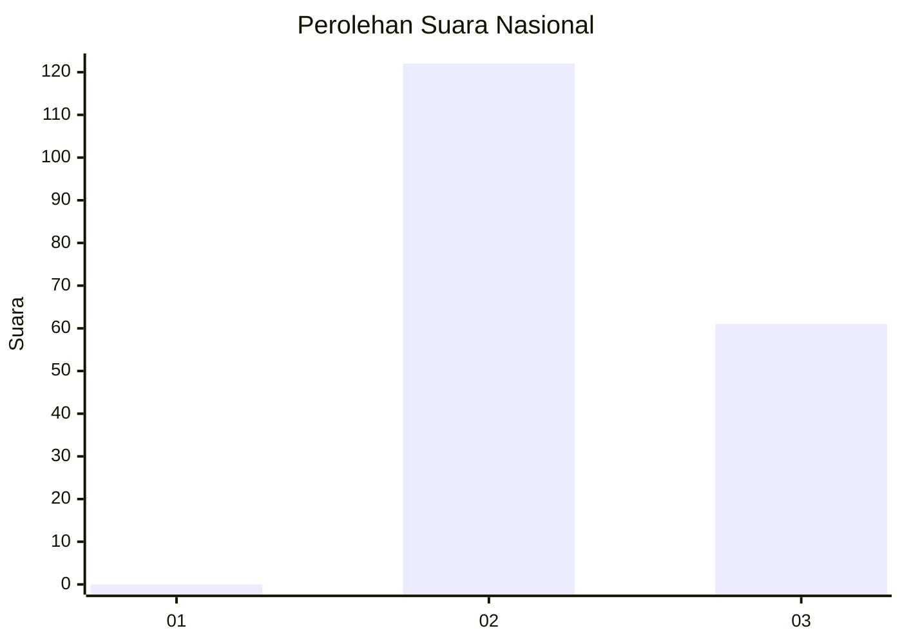
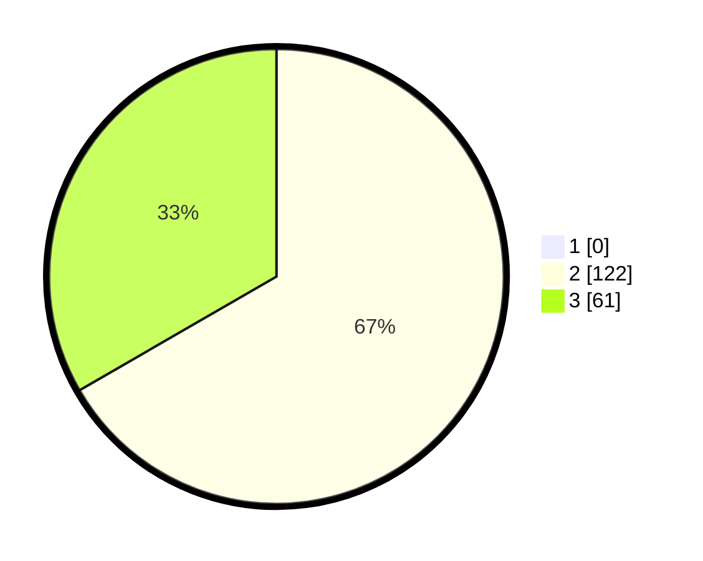

# Hasil

## Grafik

## Tabel

| No. | Nama Paslon    | Suara | Suara (raw) | Persentase |
|:--- |:-------------- | -----:| -----------:| ----------:|
| 1   | ANIES MUHAIMIN | 0     | [0][p-1]    | 0,00       |
| 2   | PRABOWO GIBRAN | 122   | [122][p-2]  | 66,67      |
| 3   | GANJAR MAHFUD  | 61    | [61][p-3]   | 33,33      |

[p-1]: https://github.com/gigit-pemilu/pemilu-2024/blob/main/pilpres/hitung-suara/sub/53-nusa-tenggara-timur/sub/11-sumba-timur/sub/22-mahu/sub/2002-patamawai/sub/001-tps/sub/paslon-1.txt
[p-2]: https://github.com/gigit-pemilu/pemilu-2024/blob/main/pilpres/hitung-suara/sub/53-nusa-tenggara-timur/sub/11-sumba-timur/sub/22-mahu/sub/2002-patamawai/sub/001-tps/sub/paslon-2.txt
[p-3]: https://github.com/gigit-pemilu/pemilu-2024/blob/main/pilpres/hitung-suara/sub/53-nusa-tenggara-timur/sub/11-sumba-timur/sub/22-mahu/sub/2002-patamawai/sub/001-tps/sub/paslon-3.txt

## Foto C Plano

https://sirekap-obj-formc.kpu.go.id/554b/pemilu/ppwp/53/11/22/20/02/5311222002001-20240215-114519--017b1978-a3f4-4d81-957f-7447885f7807.jpg

https://sirekap-obj-formc.kpu.go.id/554b/pemilu/ppwp/53/11/22/20/02/5311222002001-20240214-232235--1655f488-15c6-4632-a82d-b4623ae02d9d.jpg

https://sirekap-obj-formc.kpu.go.id/554b/pemilu/ppwp/53/11/22/20/02/5311222002001-20240215-110422--ae2ebe67-fcd0-43be-a7e2-134baf91244f.jpg

## Metadata

| Key        | Value               |
| ---------- | ------------------- |
| Time Stamp | 2024-02-16 12:51:22 |

