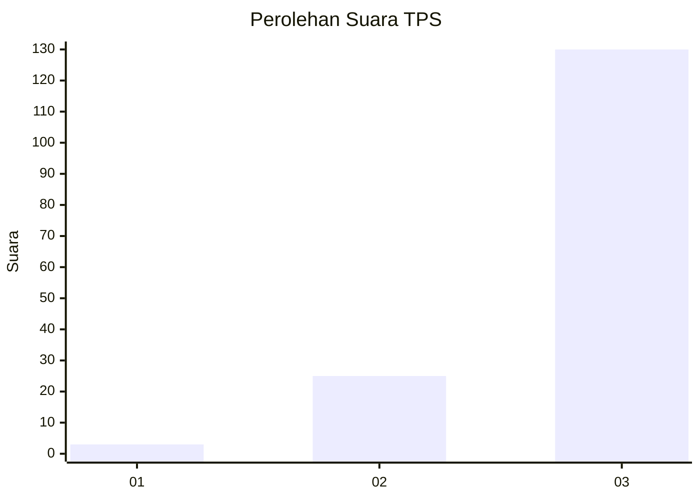
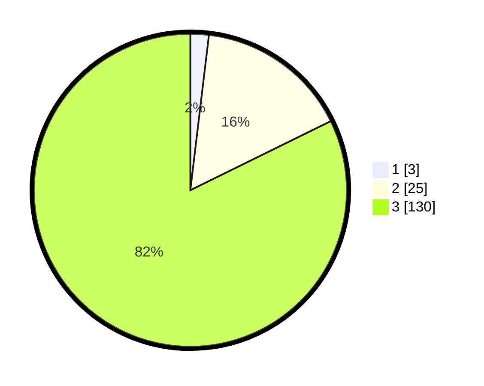

# Hasil

## Grafik

## Tabel

| No. | Nama Paslon    | Suara | Suara (raw) | Persentase |
|:--- |:-------------- | -----:| -----------:| ----------:|
| 1   | ANIES MUHAIMIN | 3     | [3][p-1]    | 1,90       |
| 2   | PRABOWO GIBRAN | 25    | [25][p-2]   | 15,82      |
| 3   | GANJAR MAHFUD  | 130   | [130][p-3]  | 82,28      |

[p-1]: https://github.com/gigit-pemilu/pemilu-2024-53-nusa-tenggara-timur/blob/main/pilpres/hitung-suara/sub/53-nusa-tenggara-timur/sub/11-sumba-timur/sub/22-mahu/sub/2003-wairara/sub/001-tps/sub/paslon-1.txt
[p-2]: https://github.com/gigit-pemilu/pemilu-2024-53-nusa-tenggara-timur/blob/main/pilpres/hitung-suara/sub/53-nusa-tenggara-timur/sub/11-sumba-timur/sub/22-mahu/sub/2003-wairara/sub/001-tps/sub/paslon-2.txt
[p-3]: https://github.com/gigit-pemilu/pemilu-2024-53-nusa-tenggara-timur/blob/main/pilpres/hitung-suara/sub/53-nusa-tenggara-timur/sub/11-sumba-timur/sub/22-mahu/sub/2003-wairara/sub/001-tps/sub/paslon-3.txt

## Foto C Plano

https://sirekap-obj-formc.kpu.go.id/6324/pemilu/ppwp/53/11/22/20/03/5311222003001-20240215-093959--4dc94627-bf6a-478c-b8dd-918d3115572d.jpg

https://sirekap-obj-formc.kpu.go.id/6324/pemilu/ppwp/53/11/22/20/03/5311222003001-20240215-083759--46ccd498-771a-477d-b554-7af6dea8409c.jpg

https://sirekap-obj-formc.kpu.go.id/6324/pemilu/ppwp/53/11/22/20/03/5311222003001-20240215-083839--f3c61bd1-374e-4703-95ad-9fcc2d77fda6.jpg

## Metadata

| Key        | Value               |
| ---------- | ------------------- |
| Time Stamp | 2024-02-25 15:00:00 |

