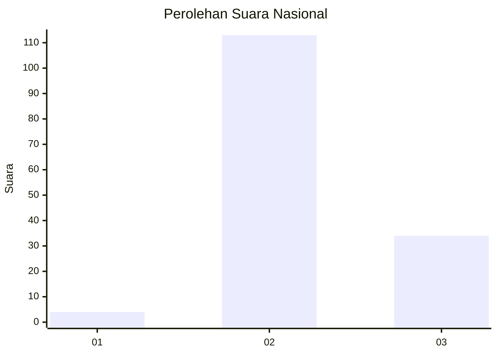
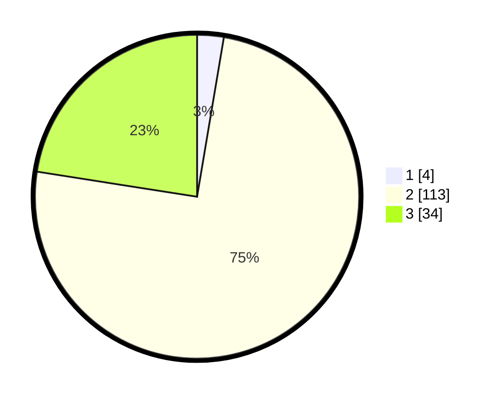

# Hasil

## Grafik

## Tabel

| No. | Nama Paslon    | Suara | Suara (raw) | Persentase |
|:--- |:-------------- | -----:| -----------:| ----------:|
| 1   | ANIES MUHAIMIN | 4     | [4][p-1]    | 2,65       |
| 2   | PRABOWO GIBRAN | 113   | [113][p-2]  | 74,83      |
| 3   | GANJAR MAHFUD  | 34    | [34][p-3]   | 22,52      |

[p-1]: https://github.com/gigit-pemilu/pemilu-2024/blob/main/pilpres/hitung-suara/sub/53-nusa-tenggara-timur/sub/12-sumba-barat/sub/04-tana-righu/sub/2001-loko-ry/sub/003-tps/sub/paslon-1.txt
[p-2]: https://github.com/gigit-pemilu/pemilu-2024/blob/main/pilpres/hitung-suara/sub/53-nusa-tenggara-timur/sub/12-sumba-barat/sub/04-tana-righu/sub/2001-loko-ry/sub/003-tps/sub/paslon-2.txt
[p-3]: https://github.com/gigit-pemilu/pemilu-2024/blob/main/pilpres/hitung-suara/sub/53-nusa-tenggara-timur/sub/12-sumba-barat/sub/04-tana-righu/sub/2001-loko-ry/sub/003-tps/sub/paslon-3.txt

## Foto C Plano

https://sirekap-obj-formc.kpu.go.id/d0c5/pemilu/ppwp/53/12/04/20/01/5312042001003-20240214-191627--ae2848f2-883e-4289-8c6c-72d919de095d.jpg

https://sirekap-obj-formc.kpu.go.id/d0c5/pemilu/ppwp/53/12/04/20/01/5312042001003-20240215-075104--29b33452-0bb2-42ad-8780-fd2c11c7a1e5.jpg

https://sirekap-obj-formc.kpu.go.id/d0c5/pemilu/ppwp/53/12/04/20/01/5312042001003-20240214-190020--b7397ef4-859c-4890-8e86-d544d4d89721.jpg

## Metadata

| Key        | Value               |
| ---------- | ------------------- |
| Time Stamp | 2024-02-19 21:00:00 |

