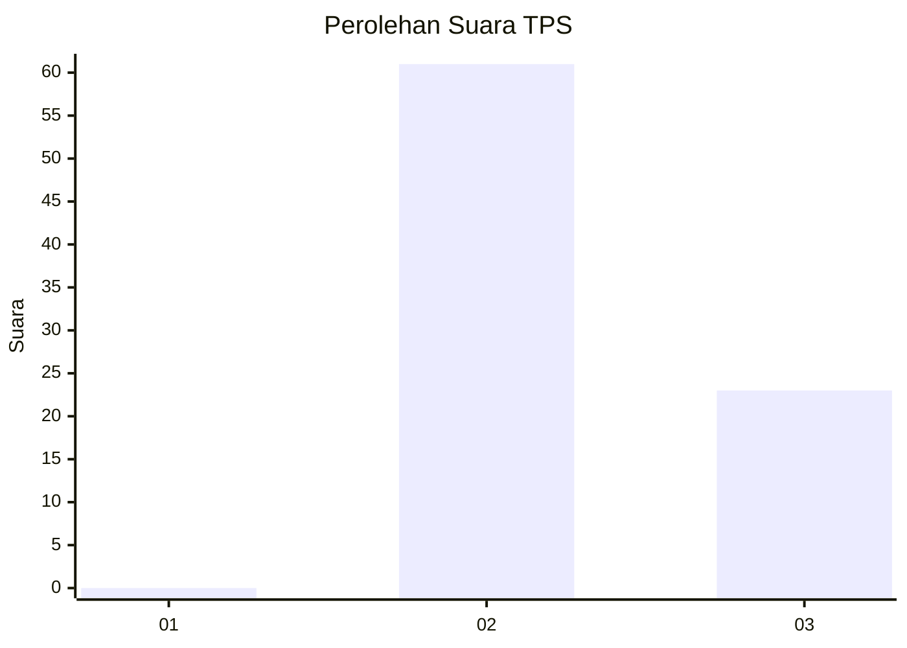
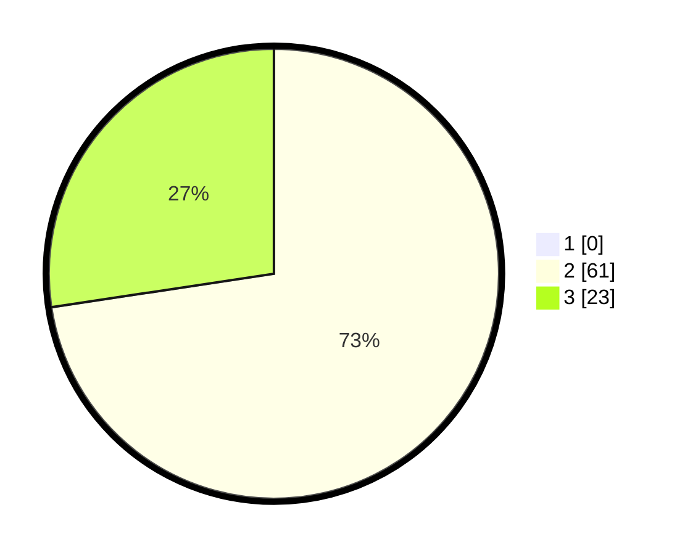

# Hasil

## Grafik

## Tabel

| No. | Nama Paslon    | Suara | Suara (raw) | Persentase |
|:--- |:-------------- | -----:| -----------:| ----------:|
| 1   | ANIES MUHAIMIN | 0     | [0][p-1]    | 0,00       |
| 2   | PRABOWO GIBRAN | 61    | [61][p-2]   | 72,62      |
| 3   | GANJAR MAHFUD  | 23    | [23][p-3]   | 27,38      |

[p-1]: https://github.com/gigit-pemilu/pemilu-2024-53-nusa-tenggara-timur/blob/main/pilpres/hitung-suara/sub/53-nusa-tenggara-timur/sub/12-sumba-barat/sub/10-loli/sub/1007-wee-karou/sub/006-tps/sub/paslon-1.txt
[p-2]: https://github.com/gigit-pemilu/pemilu-2024-53-nusa-tenggara-timur/blob/main/pilpres/hitung-suara/sub/53-nusa-tenggara-timur/sub/12-sumba-barat/sub/10-loli/sub/1007-wee-karou/sub/006-tps/sub/paslon-2.txt
[p-3]: https://github.com/gigit-pemilu/pemilu-2024-53-nusa-tenggara-timur/blob/main/pilpres/hitung-suara/sub/53-nusa-tenggara-timur/sub/12-sumba-barat/sub/10-loli/sub/1007-wee-karou/sub/006-tps/sub/paslon-3.txt

## Foto C Plano

https://sirekap-obj-formc.kpu.go.id/1d98/pemilu/ppwp/53/12/10/10/07/5312101007006-20240215-144545--3e1c1b47-b6cc-459c-bf7f-193300070c82.jpg

https://sirekap-obj-formc.kpu.go.id/1d98/pemilu/ppwp/53/12/10/10/07/5312101007006-20240215-144800--943f8158-77fa-4923-8053-b1f8e24ed946.jpg

https://sirekap-obj-formc.kpu.go.id/1d98/pemilu/ppwp/53/12/10/10/07/5312101007006-20240215-145039--15f51048-e0fe-4fff-96ff-19f2fadd5584.jpg

## Metadata

| Key        | Value               |
| ---------- | ------------------- |
| Time Stamp | 2024-02-15 20:00:44 |

