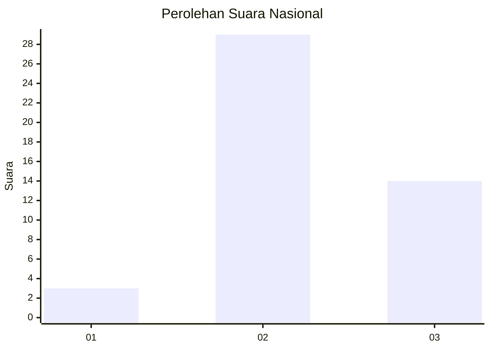
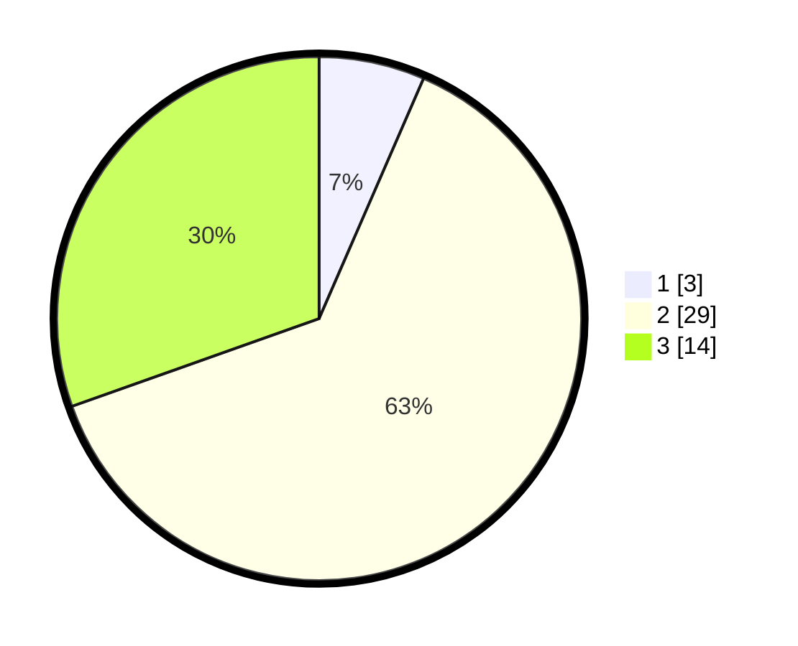

# Hasil

## Grafik

## Tabel

| No. | Nama Paslon    | Suara | Suara (raw) | Persentase |
|:--- |:-------------- | -----:| -----------:| ----------:|
| 1   | ANIES MUHAIMIN | 3     | [3][p-1]    | 6,52       |
| 2   | PRABOWO GIBRAN | 29    | [29][p-2]   | 63,04      |
| 3   | GANJAR MAHFUD  | 14    | [14][p-3]   | 30,43      |

[p-1]: https://github.com/gigit-pemilu/pemilu-2024/blob/main/pilpres/hitung-suara/sub/53-nusa-tenggara-timur/sub/12-sumba-barat/sub/10-loli/sub/2010-ubu-raya/sub/005-tps/sub/paslon-1.txt
[p-2]: https://github.com/gigit-pemilu/pemilu-2024/blob/main/pilpres/hitung-suara/sub/53-nusa-tenggara-timur/sub/12-sumba-barat/sub/10-loli/sub/2010-ubu-raya/sub/005-tps/sub/paslon-2.txt
[p-3]: https://github.com/gigit-pemilu/pemilu-2024/blob/main/pilpres/hitung-suara/sub/53-nusa-tenggara-timur/sub/12-sumba-barat/sub/10-loli/sub/2010-ubu-raya/sub/005-tps/sub/paslon-3.txt

## Foto C Plano

https://sirekap-obj-formc.kpu.go.id/a817/pemilu/ppwp/53/12/10/20/10/5312102010005-20240215-075044--119f6d0d-5fa7-45b4-b1f5-211aead282a4.jpg

https://sirekap-obj-formc.kpu.go.id/a817/pemilu/ppwp/53/12/10/20/10/5312102010005-20240215-075338--10a91762-2054-49cf-8885-7873e1809611.jpg

https://sirekap-obj-formc.kpu.go.id/a817/pemilu/ppwp/53/12/10/20/10/5312102010005-20240215-075946--8a74800e-26d6-40d0-9c64-f0c79b054d3a.jpg

## Metadata

| Key        | Value               |
| ---------- | ------------------- |
| Time Stamp | 2024-02-25 13:00:00 |

