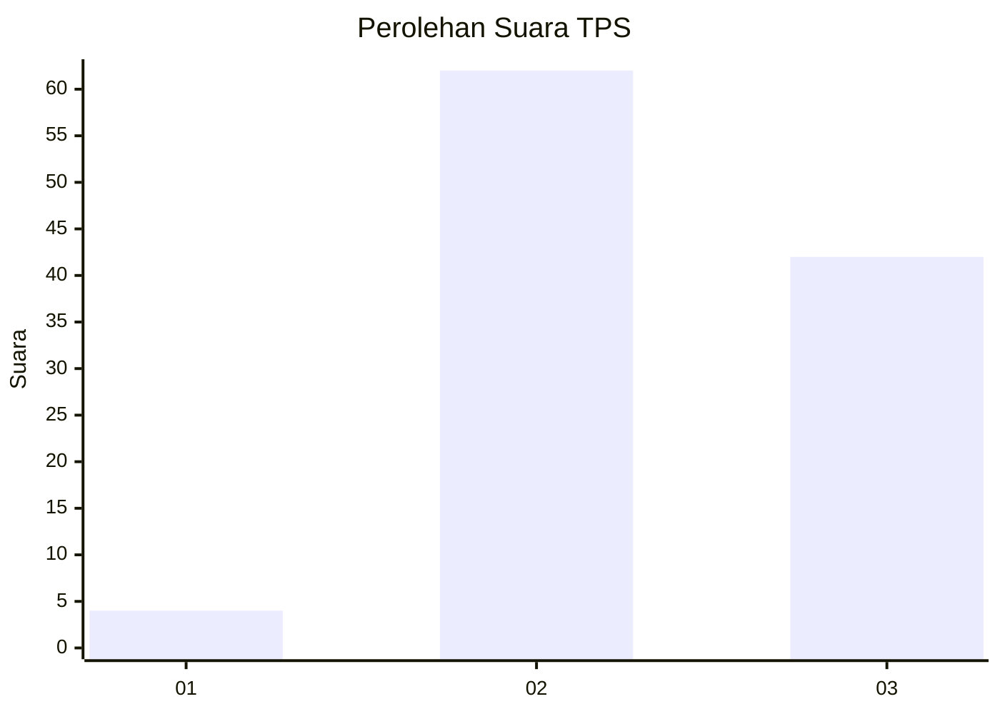
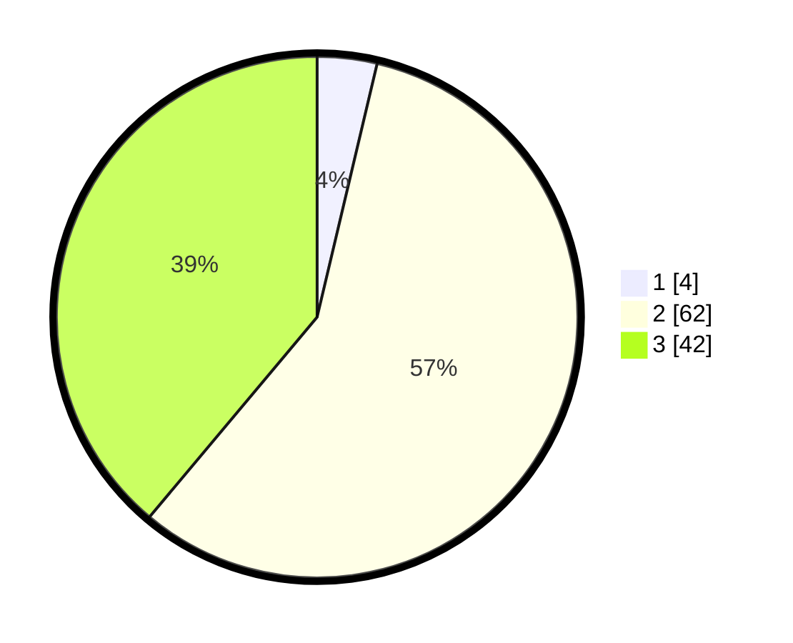

# Hasil

## Grafik

## Tabel

| No. | Nama Paslon    | Suara | Suara (raw) | Persentase |
|:--- |:-------------- | -----:| -----------:| ----------:|
| 1   | ANIES MUHAIMIN | 4     | [4][p-1]    | 3,70       |
| 2   | PRABOWO GIBRAN | 62    | [62][p-2]   | 57,41      |
| 3   | GANJAR MAHFUD  | 42    | [42][p-3]   | 38,89      |

[p-1]: https://github.com/gigit-pemilu/pemilu-2024-53-nusa-tenggara-timur/blob/main/pilpres/hitung-suara/sub/53-nusa-tenggara-timur/sub/12-sumba-barat/sub/11-wanokaka/sub/2001-katiku-loku/sub/002-tps/sub/paslon-1.txt
[p-2]: https://github.com/gigit-pemilu/pemilu-2024-53-nusa-tenggara-timur/blob/main/pilpres/hitung-suara/sub/53-nusa-tenggara-timur/sub/12-sumba-barat/sub/11-wanokaka/sub/2001-katiku-loku/sub/002-tps/sub/paslon-2.txt
[p-3]: https://github.com/gigit-pemilu/pemilu-2024-53-nusa-tenggara-timur/blob/main/pilpres/hitung-suara/sub/53-nusa-tenggara-timur/sub/12-sumba-barat/sub/11-wanokaka/sub/2001-katiku-loku/sub/002-tps/sub/paslon-3.txt

## Foto C Plano

https://sirekap-obj-formc.kpu.go.id/3b72/pemilu/ppwp/53/12/11/20/01/5312112001002-20240215-085429--a2c74a95-fc9f-44fd-af32-a6164ca77a57.jpg

https://sirekap-obj-formc.kpu.go.id/3b72/pemilu/ppwp/53/12/11/20/01/5312112001002-20240215-085728--4d467bd5-d99f-48f0-8a01-351eb68a9c57.jpg

https://sirekap-obj-formc.kpu.go.id/3b72/pemilu/ppwp/53/12/11/20/01/5312112001002-20240215-085935--6fe27980-852e-4aa5-b531-ec5112d66064.jpg

## Metadata

| Key        | Value               |
| ---------- | ------------------- |
| Time Stamp | 2024-02-15 15:00:29 |

