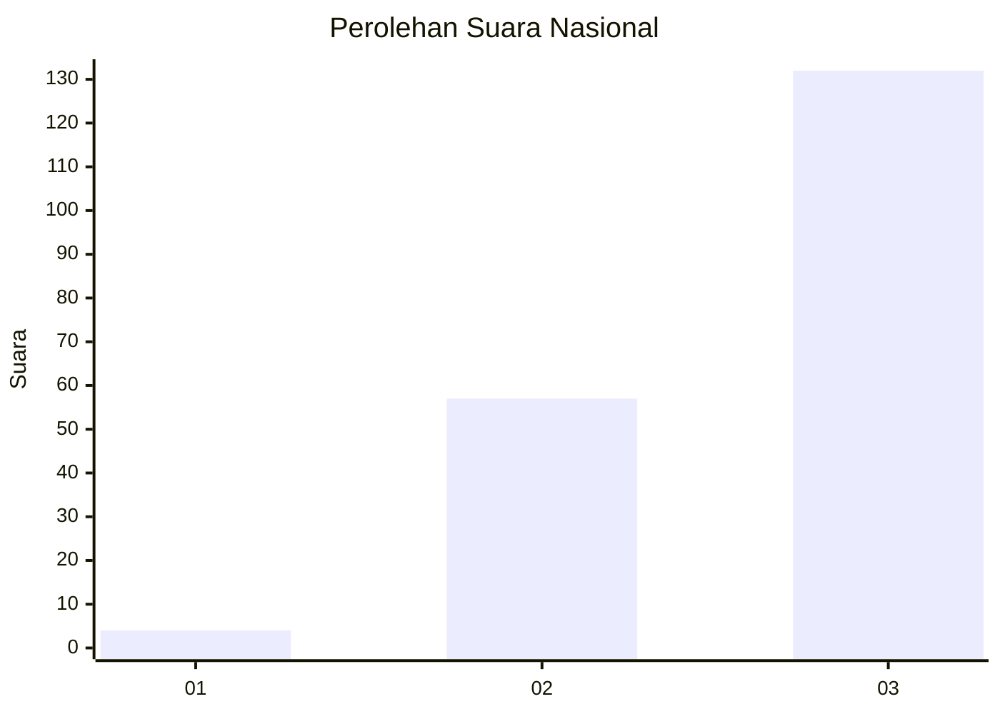
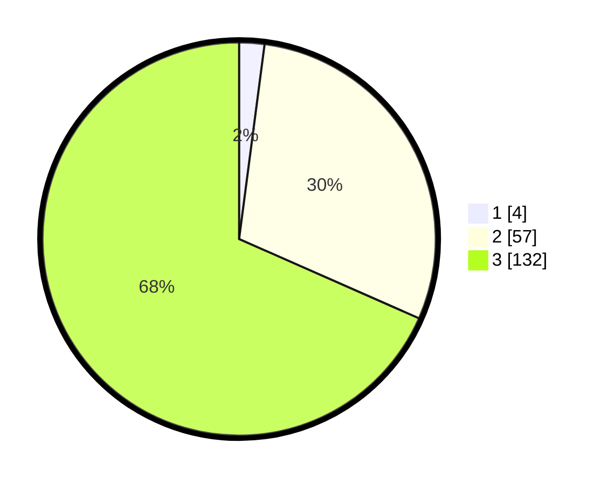

# Hasil

## Grafik

## Tabel

| No. | Nama Paslon    | Suara | Suara (raw) | Persentase |
|:--- |:-------------- | -----:| -----------:| ----------:|
| 1   | ANIES MUHAIMIN | 4     | [4][p-1]    | 2,07       |
| 2   | PRABOWO GIBRAN | 57    | [57][p-2]   | 29,53      |
| 3   | GANJAR MAHFUD  | 132   | [132][p-3]  | 68,39      |

[p-1]: https://github.com/gigit-pemilu/pemilu-2024/blob/main/pilpres/hitung-suara/sub/53-nusa-tenggara-timur/sub/12-sumba-barat/sub/11-wanokaka/sub/2002-hupu-mada/sub/002-tps/sub/paslon-1.txt
[p-2]: https://github.com/gigit-pemilu/pemilu-2024/blob/main/pilpres/hitung-suara/sub/53-nusa-tenggara-timur/sub/12-sumba-barat/sub/11-wanokaka/sub/2002-hupu-mada/sub/002-tps/sub/paslon-2.txt
[p-3]: https://github.com/gigit-pemilu/pemilu-2024/blob/main/pilpres/hitung-suara/sub/53-nusa-tenggara-timur/sub/12-sumba-barat/sub/11-wanokaka/sub/2002-hupu-mada/sub/002-tps/sub/paslon-3.txt

## Foto C Plano

https://sirekap-obj-formc.kpu.go.id/233f/pemilu/ppwp/53/12/11/20/02/5312112002002-20240215-111033--7fd271d7-9d8f-48e4-ba5a-0ff2143efc3e.jpg

https://sirekap-obj-formc.kpu.go.id/233f/pemilu/ppwp/53/12/11/20/02/5312112002002-20240215-111309--988fe9a6-952a-414d-bd84-ed8ffbd840d1.jpg

https://sirekap-obj-formc.kpu.go.id/233f/pemilu/ppwp/53/12/11/20/02/5312112002002-20240215-111707--3c20b19d-0cd4-477e-a900-408c2c73d158.jpg

## Metadata

| Key        | Value               |
| ---------- | ------------------- |
| Time Stamp | 2024-02-24 22:31:28 |

