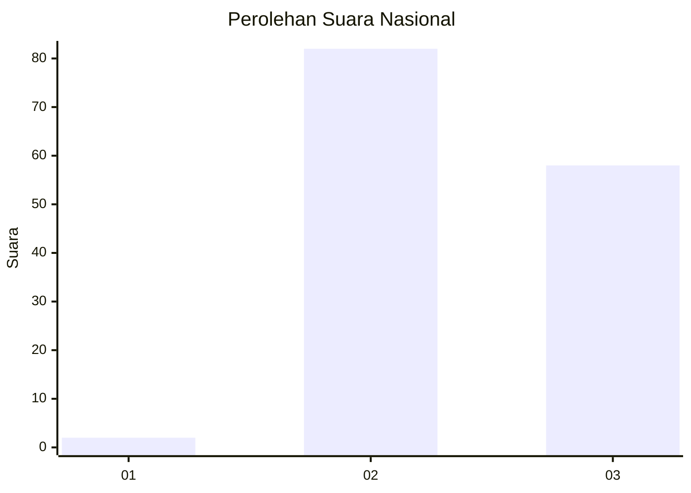
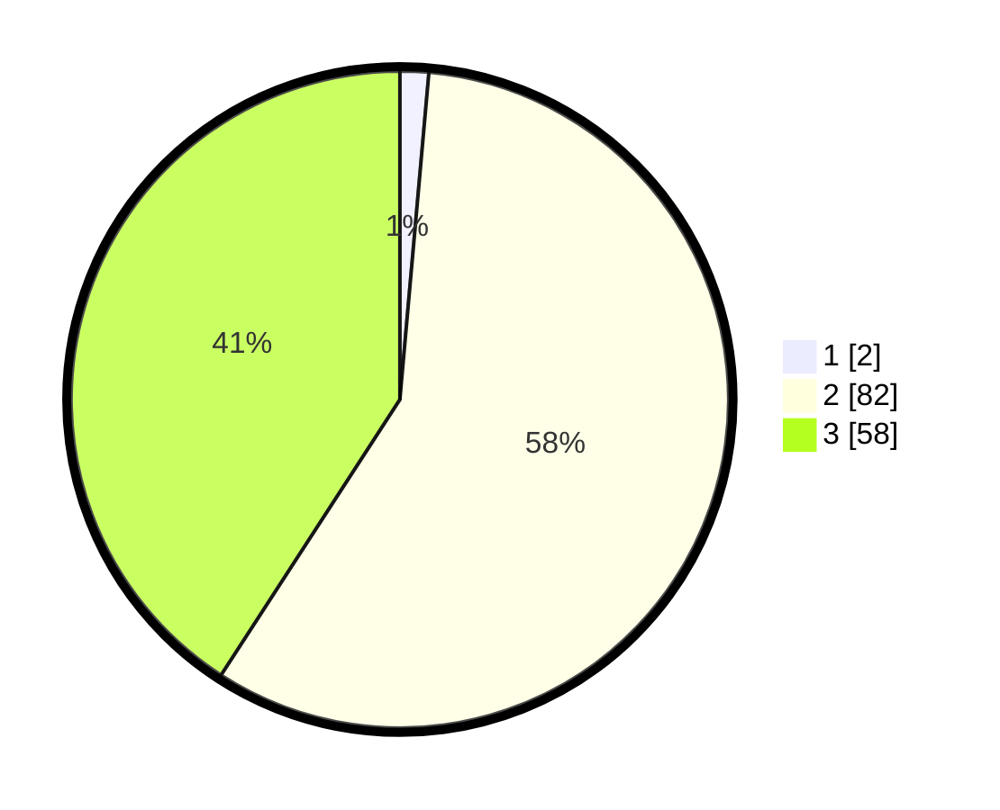

# Hasil

## Grafik

## Tabel

| No. | Nama Paslon    | Suara | Suara (raw) | Persentase |
|:--- |:-------------- | -----:| -----------:| ----------:|
| 1   | ANIES MUHAIMIN | 2     | [2][p-1]    | 1,41       |
| 2   | PRABOWO GIBRAN | 82    | [82][p-2]   | 57,75      |
| 3   | GANJAR MAHFUD  | 58    | [58][p-3]   | 40,85      |

[p-1]: https://github.com/gigit-pemilu/pemilu-2024/blob/main/pilpres/hitung-suara/sub/53-nusa-tenggara-timur/sub/12-sumba-barat/sub/11-wanokaka/sub/2002-hupu-mada/sub/003-tps/sub/paslon-1.txt
[p-2]: https://github.com/gigit-pemilu/pemilu-2024/blob/main/pilpres/hitung-suara/sub/53-nusa-tenggara-timur/sub/12-sumba-barat/sub/11-wanokaka/sub/2002-hupu-mada/sub/003-tps/sub/paslon-2.txt
[p-3]: https://github.com/gigit-pemilu/pemilu-2024/blob/main/pilpres/hitung-suara/sub/53-nusa-tenggara-timur/sub/12-sumba-barat/sub/11-wanokaka/sub/2002-hupu-mada/sub/003-tps/sub/paslon-3.txt

## Foto C Plano

https://sirekap-obj-formc.kpu.go.id/dce7/pemilu/ppwp/53/12/11/20/02/5312112002003-20240220-110414--dd61878d-e713-4e29-b473-fda899333765.jpg

https://sirekap-obj-formc.kpu.go.id/dce7/pemilu/ppwp/53/12/11/20/02/5312112002003-20240220-110516--22bbc94d-ed29-46ed-a075-e4db5234d4c3.jpg

https://sirekap-obj-formc.kpu.go.id/dce7/pemilu/ppwp/53/12/11/20/02/5312112002003-20240220-110612--04428f5c-70e4-4da8-b72f-bff8da1d1c6e.jpg

## Metadata

| Key        | Value               |
| ---------- | ------------------- |
| Time Stamp | 2024-02-24 22:31:28 |

