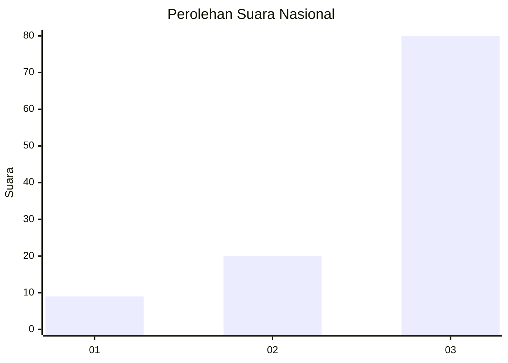
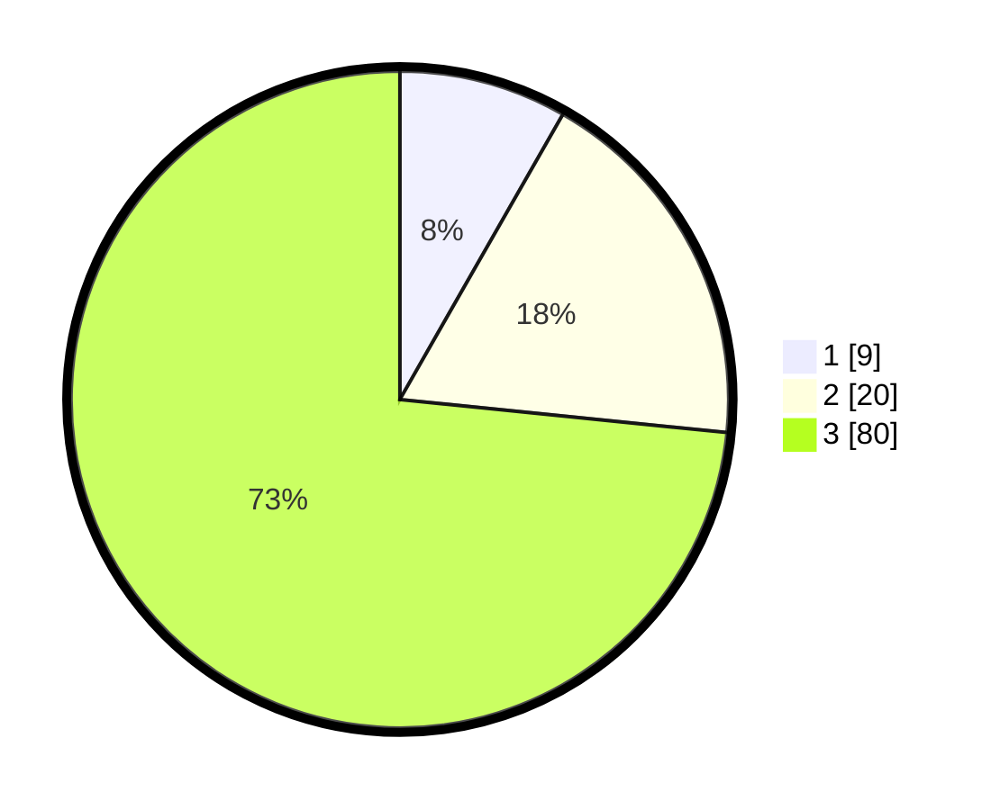

# Hasil

## Grafik

## Tabel

| No. | Nama Paslon    | Suara | Suara (raw) | Persentase |
|:--- |:-------------- | -----:| -----------:| ----------:|
| 1   | ANIES MUHAIMIN | 9     | [9][p-1]    | 8,26       |
| 2   | PRABOWO GIBRAN | 20    | [20][p-2]   | 18,35      |
| 3   | GANJAR MAHFUD  | 80    | [80][p-3]   | 73,39      |

[p-1]: https://github.com/gigit-pemilu/pemilu-2024/blob/main/pilpres/hitung-suara/sub/53-nusa-tenggara-timur/sub/12-sumba-barat/sub/12-lamboya/sub/2010-sodana/sub/002-tps/sub/paslon-1.txt
[p-2]: https://github.com/gigit-pemilu/pemilu-2024/blob/main/pilpres/hitung-suara/sub/53-nusa-tenggara-timur/sub/12-sumba-barat/sub/12-lamboya/sub/2010-sodana/sub/002-tps/sub/paslon-2.txt
[p-3]: https://github.com/gigit-pemilu/pemilu-2024/blob/main/pilpres/hitung-suara/sub/53-nusa-tenggara-timur/sub/12-sumba-barat/sub/12-lamboya/sub/2010-sodana/sub/002-tps/sub/paslon-3.txt

## Foto C Plano

https://sirekap-obj-formc.kpu.go.id/d687/pemilu/ppwp/53/12/12/20/10/5312122010002-20240215-074216--2f177c5d-e808-4ef9-92fe-7844f9feb70a.jpg

https://sirekap-obj-formc.kpu.go.id/d687/pemilu/ppwp/53/12/12/20/10/5312122010002-20240215-074348--b2152872-6266-415e-8c59-3a8a609f2166.jpg

https://sirekap-obj-formc.kpu.go.id/d687/pemilu/ppwp/53/12/12/20/10/5312122010002-20240215-074448--e0ac7573-2bf8-4860-8633-2e600e97e401.jpg

## Metadata

| Key        | Value               |
| ---------- | ------------------- |
| Time Stamp | 2024-02-25 12:00:00 |

