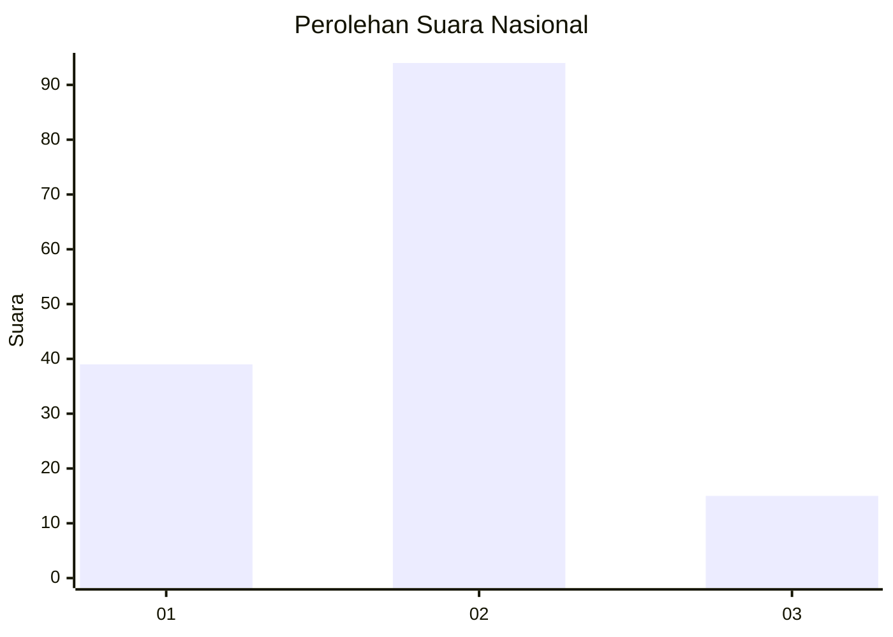
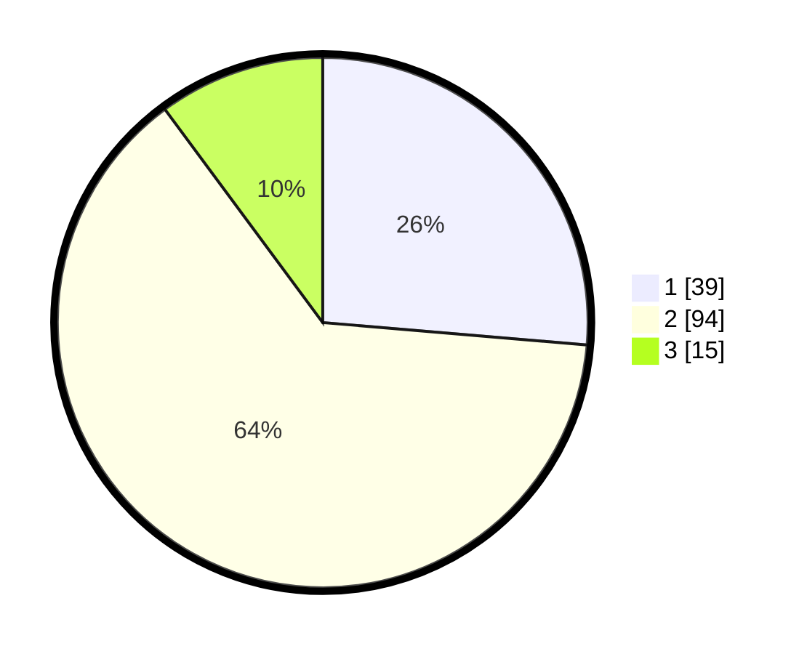

# Hasil

## Grafik

## Tabel

| No. | Nama Paslon    | Suara | Suara (raw) | Persentase |
|:--- |:-------------- | -----:| -----------:| ----------:|
| 1   | ANIES MUHAIMIN | 39    | [39][p-1]   | 26,35      |
| 2   | PRABOWO GIBRAN | 94    | [94][p-2]   | 63,51      |
| 3   | GANJAR MAHFUD  | 15    | [15][p-3]   | 10,14      |

[p-1]: https://github.com/gigit-pemilu/pemilu-2024/blob/main/pilpres/hitung-suara/sub/53-nusa-tenggara-timur/sub/12-sumba-barat/sub/15-kota-waikabubak/sub/1001-wailiang/sub/005-tps/sub/paslon-1.txt
[p-2]: https://github.com/gigit-pemilu/pemilu-2024/blob/main/pilpres/hitung-suara/sub/53-nusa-tenggara-timur/sub/12-sumba-barat/sub/15-kota-waikabubak/sub/1001-wailiang/sub/005-tps/sub/paslon-2.txt
[p-3]: https://github.com/gigit-pemilu/pemilu-2024/blob/main/pilpres/hitung-suara/sub/53-nusa-tenggara-timur/sub/12-sumba-barat/sub/15-kota-waikabubak/sub/1001-wailiang/sub/005-tps/sub/paslon-3.txt

## Foto C Plano

https://sirekap-obj-formc.kpu.go.id/66c8/pemilu/ppwp/53/12/15/10/01/5312151001005-20240215-024517--215e0249-171a-4531-813e-78fd3cfb3ab8.jpg

https://sirekap-obj-formc.kpu.go.id/66c8/pemilu/ppwp/53/12/15/10/01/5312151001005-20240215-114251--f3a3802c-0642-469d-818e-4fe7d7bc8f78.jpg

https://sirekap-obj-formc.kpu.go.id/66c8/pemilu/ppwp/53/12/15/10/01/5312151001005-20240215-114530--d20fd7be-3eb7-4cb0-b526-845c6160c4ad.jpg

## Metadata

| Key        | Value               |
| ---------- | ------------------- |
| Time Stamp | 2024-02-25 14:00:00 |

