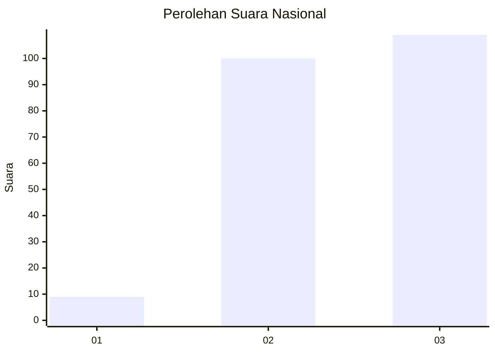
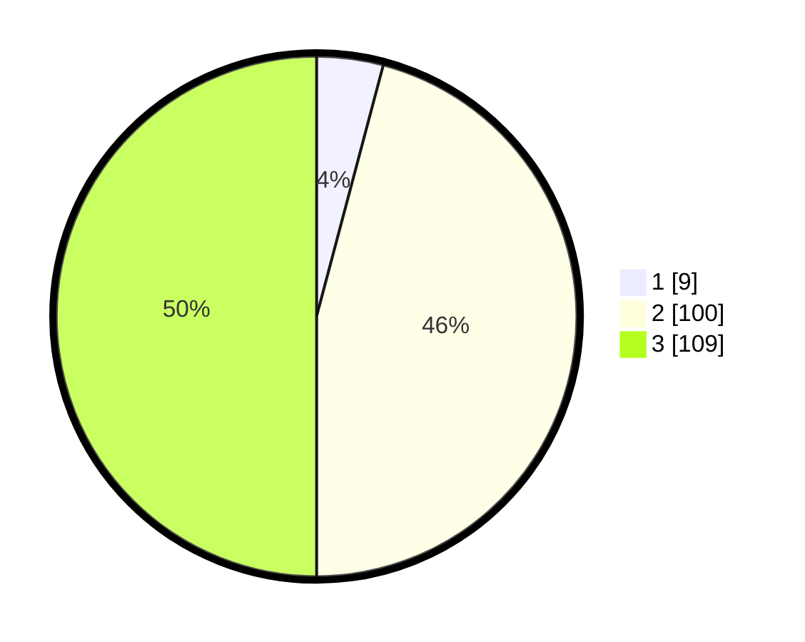

# Hasil

## Grafik

## Tabel

| No. | Nama Paslon    | Suara | Suara (raw) | Persentase |
|:--- |:-------------- | -----:| -----------:| ----------:|
| 1   | ANIES MUHAIMIN | 9     | [9][p-1]    | 4,13       |
| 2   | PRABOWO GIBRAN | 100   | [100][p-2]  | 45,87      |
| 3   | GANJAR MAHFUD  | 109   | [109][p-3]  | 50,00      |

[p-1]: https://github.com/gigit-pemilu/pemilu-2024/blob/main/pilpres/hitung-suara/sub/53-nusa-tenggara-timur/sub/12-sumba-barat/sub/18-laboya-barat/sub/2001-wee-tana/sub/005-tps/sub/paslon-1.txt
[p-2]: https://github.com/gigit-pemilu/pemilu-2024/blob/main/pilpres/hitung-suara/sub/53-nusa-tenggara-timur/sub/12-sumba-barat/sub/18-laboya-barat/sub/2001-wee-tana/sub/005-tps/sub/paslon-2.txt
[p-3]: https://github.com/gigit-pemilu/pemilu-2024/blob/main/pilpres/hitung-suara/sub/53-nusa-tenggara-timur/sub/12-sumba-barat/sub/18-laboya-barat/sub/2001-wee-tana/sub/005-tps/sub/paslon-3.txt

## Foto C Plano

https://sirekap-obj-formc.kpu.go.id/dafc/pemilu/ppwp/53/12/18/20/01/5312182001005-20240215-163024--0d7ed609-854f-493b-b919-ae47c904680c.jpg

https://sirekap-obj-formc.kpu.go.id/dafc/pemilu/ppwp/53/12/18/20/01/5312182001005-20240215-163249--2c0e2a84-2352-4530-b0a2-c5901726458b.jpg

https://sirekap-obj-formc.kpu.go.id/dafc/pemilu/ppwp/53/12/18/20/01/5312182001005-20240215-163450--8dae7981-a9e0-4822-a046-b8ec25a93656.jpg

## Metadata

| Key        | Value               |
| ---------- | ------------------- |
| Time Stamp | 2024-02-25 14:00:00 |

