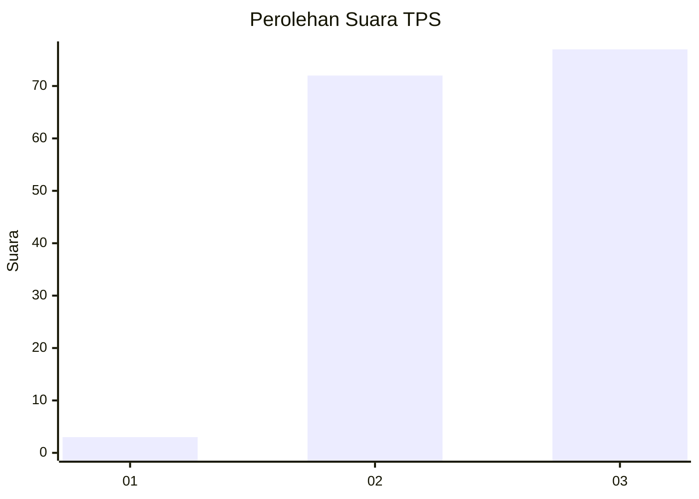
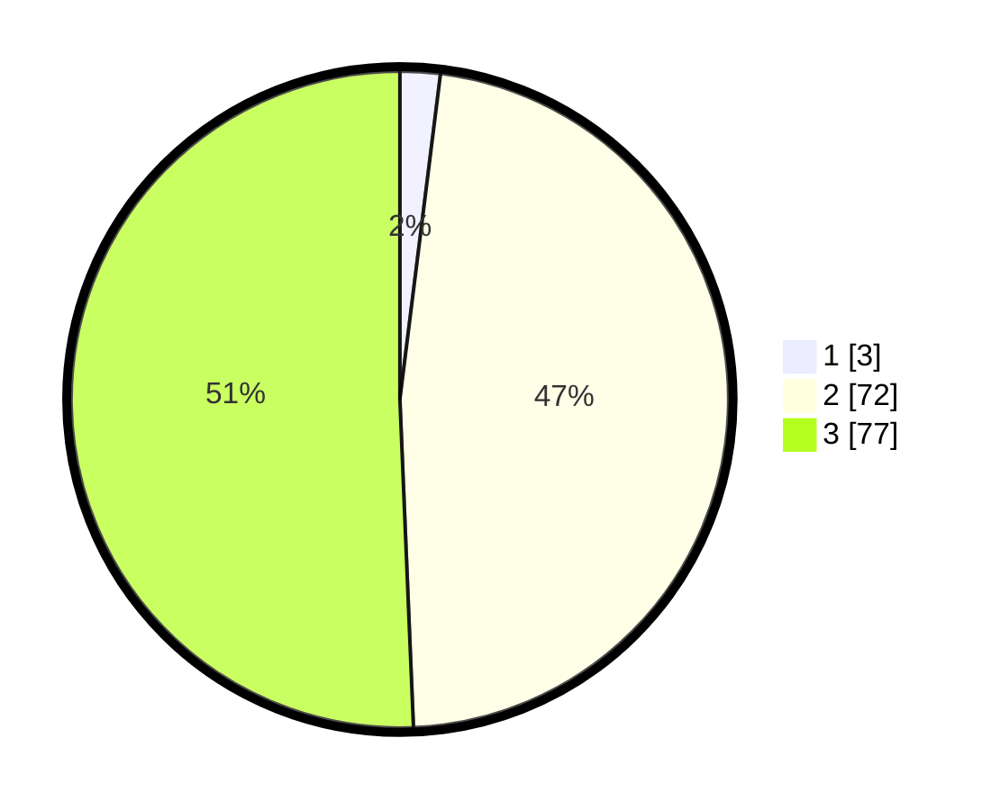

# Hasil

## Grafik

## Tabel

| No. | Nama Paslon    | Suara | Suara (raw) | Persentase |
|:--- |:-------------- | -----:| -----------:| ----------:|
| 1   | ANIES MUHAIMIN | 3     | [3][p-1]    | 1,97       |
| 2   | PRABOWO GIBRAN | 72    | [72][p-2]   | 47,37      |
| 3   | GANJAR MAHFUD  | 77    | [77][p-3]   | 50,66      |

[p-1]: https://github.com/gigit-pemilu/pemilu-2024-53-nusa-tenggara-timur/blob/main/pilpres/hitung-suara/sub/53-nusa-tenggara-timur/sub/12-sumba-barat/sub/18-laboya-barat/sub/2004-harona-kalla/sub/002-tps/sub/paslon-1.txt
[p-2]: https://github.com/gigit-pemilu/pemilu-2024-53-nusa-tenggara-timur/blob/main/pilpres/hitung-suara/sub/53-nusa-tenggara-timur/sub/12-sumba-barat/sub/18-laboya-barat/sub/2004-harona-kalla/sub/002-tps/sub/paslon-2.txt
[p-3]: https://github.com/gigit-pemilu/pemilu-2024-53-nusa-tenggara-timur/blob/main/pilpres/hitung-suara/sub/53-nusa-tenggara-timur/sub/12-sumba-barat/sub/18-laboya-barat/sub/2004-harona-kalla/sub/002-tps/sub/paslon-3.txt

## Foto C Plano

https://sirekap-obj-formc.kpu.go.id/598f/pemilu/ppwp/53/12/18/20/04/5312182004002-20240220-200514--5d85fe79-7df2-41c5-b1e4-83e360abcfd0.jpg

https://sirekap-obj-formc.kpu.go.id/598f/pemilu/ppwp/53/12/18/20/04/5312182004002-20240220-200910--a31ea451-6f2f-4528-9c53-9bf4e0a1905b.jpg

https://sirekap-obj-formc.kpu.go.id/598f/pemilu/ppwp/53/12/18/20/04/5312182004002-20240220-201127--fcad060d-7084-428d-8d72-85a7da210265.jpg

## Metadata

| Key        | Value               |
| ---------- | ------------------- |
| Time Stamp | 2024-02-20 21:00:00 |

## DATA PEMILIH TETAP

Jumlah pemilih dalam DPT: **253**.
 * L: **20**.
 * P: **250**.

## DATA PENGGUNA HAK PILIH

Jumlah pengguna hak pilih dalam DPT: **522**.
 * L: **100**.
 * P: **5**.

Jumlah pengguna hak pilih dalam DPTb: **225**.
 * L: **110**.
 * P: **555**.

Jumlah pengguna hak pilih dalam DPK: **317**.
 * L: **155**.
 * P: **755**.

Jumlah pengguna hak pilih: **51**.
 * L: **755**.
 * P: **530**.

## JUMLAH SUARA SAH DAN TIDAK SAH

JUMLAH SELURUH SUARA SAH: **740**.

JUMLAH SUARA TIDAK SAH: **4**.

JUMLAH SELURUH SUARA SAH DAN SUARA TIDAK SAH: **684**.

