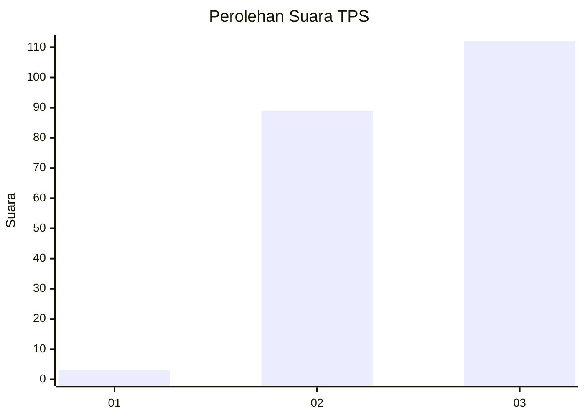
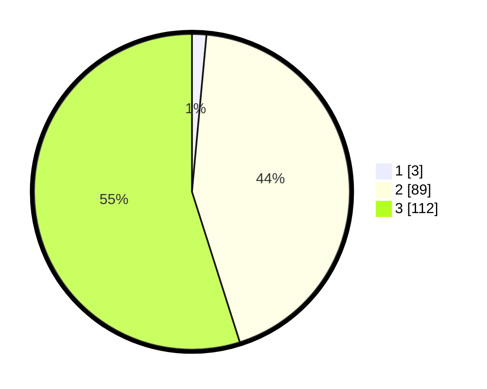

# Hasil

## Grafik

## Tabel

| No. | Nama Paslon    | Suara | Suara (raw) | Persentase |
|:--- |:-------------- | -----:| -----------:| ----------:|
| 1   | ANIES MUHAIMIN | 3     | [3][p-1]    | 1,47       |
| 2   | PRABOWO GIBRAN | 89    | [89][p-2]   | 43,63      |
| 3   | GANJAR MAHFUD  | 112   | [112][p-3]  | 54,90      |

[p-1]: https://github.com/gigit-pemilu/pemilu-2024-53-nusa-tenggara-timur/blob/main/pilpres/hitung-suara/sub/53-nusa-tenggara-timur/sub/13-lembata/sub/05-nubatukan/sub/1001-lewoleba/sub/012-tps/sub/paslon-1.txt
[p-2]: https://github.com/gigit-pemilu/pemilu-2024-53-nusa-tenggara-timur/blob/main/pilpres/hitung-suara/sub/53-nusa-tenggara-timur/sub/13-lembata/sub/05-nubatukan/sub/1001-lewoleba/sub/012-tps/sub/paslon-2.txt
[p-3]: https://github.com/gigit-pemilu/pemilu-2024-53-nusa-tenggara-timur/blob/main/pilpres/hitung-suara/sub/53-nusa-tenggara-timur/sub/13-lembata/sub/05-nubatukan/sub/1001-lewoleba/sub/012-tps/sub/paslon-3.txt

## Foto C Plano

https://sirekap-obj-formc.kpu.go.id/ae84/pemilu/ppwp/53/13/05/10/01/5313051001012-20240221-104257--c5a4e1b7-8ddf-43f5-a57b-ed910530a56c.jpg

https://sirekap-obj-formc.kpu.go.id/ae84/pemilu/ppwp/53/13/05/10/01/5313051001012-20240215-005621--93c66b9b-b898-46cf-a076-0a338d64b601.jpg

https://sirekap-obj-formc.kpu.go.id/ae84/pemilu/ppwp/53/13/05/10/01/5313051001012-20240215-005724--1ebda324-5dfe-49e4-8018-f0acfc1bb652.jpg

## Metadata

| Key        | Value               |
| ---------- | ------------------- |
| Time Stamp | 2024-02-21 11:00:00 |

