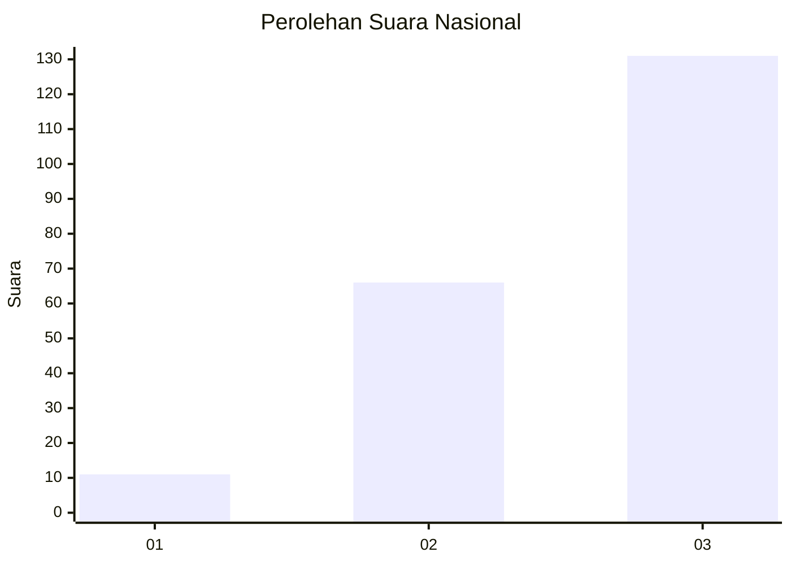
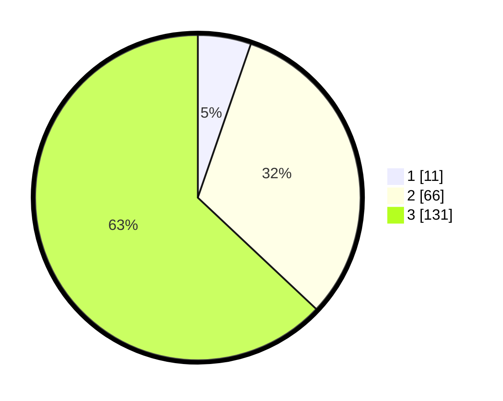

# Hasil

## Grafik

## Tabel

| No. | Nama Paslon    | Suara | Suara (raw) | Persentase |
|:--- |:-------------- | -----:| -----------:| ----------:|
| 1   | ANIES MUHAIMIN | 11    | [11][p-1]   | 5,29       |
| 2   | PRABOWO GIBRAN | 66    | [66][p-2]   | 31,73      |
| 3   | GANJAR MAHFUD  | 131   | [131][p-3]  | 62,98      |

[p-1]: https://github.com/gigit-pemilu/pemilu-2024/blob/main/pilpres/hitung-suara/sub/53-nusa-tenggara-timur/sub/13-lembata/sub/09-ile-ape-timur/sub/2001-todanara/sub/001-tps/sub/paslon-1.txt
[p-2]: https://github.com/gigit-pemilu/pemilu-2024/blob/main/pilpres/hitung-suara/sub/53-nusa-tenggara-timur/sub/13-lembata/sub/09-ile-ape-timur/sub/2001-todanara/sub/001-tps/sub/paslon-2.txt
[p-3]: https://github.com/gigit-pemilu/pemilu-2024/blob/main/pilpres/hitung-suara/sub/53-nusa-tenggara-timur/sub/13-lembata/sub/09-ile-ape-timur/sub/2001-todanara/sub/001-tps/sub/paslon-3.txt

## Foto C Plano

https://sirekap-obj-formc.kpu.go.id/0fc8/pemilu/ppwp/53/13/09/20/01/5313092001001-20240222-181527--16033221-8ade-4546-8179-ebc2f5078c2a.jpg

https://sirekap-obj-formc.kpu.go.id/0fc8/pemilu/ppwp/53/13/09/20/01/5313092001001-20240214-204101--377ec169-ba4c-4060-a726-2d19cd34713a.jpg

https://sirekap-obj-formc.kpu.go.id/0fc8/pemilu/ppwp/53/13/09/20/01/5313092001001-20240214-204301--ed214b3a-afa5-4f53-80f2-de9605072201.jpg

## Metadata

| Key        | Value               |
| ---------- | ------------------- |
| Time Stamp | 2024-02-22 19:00:00 |

