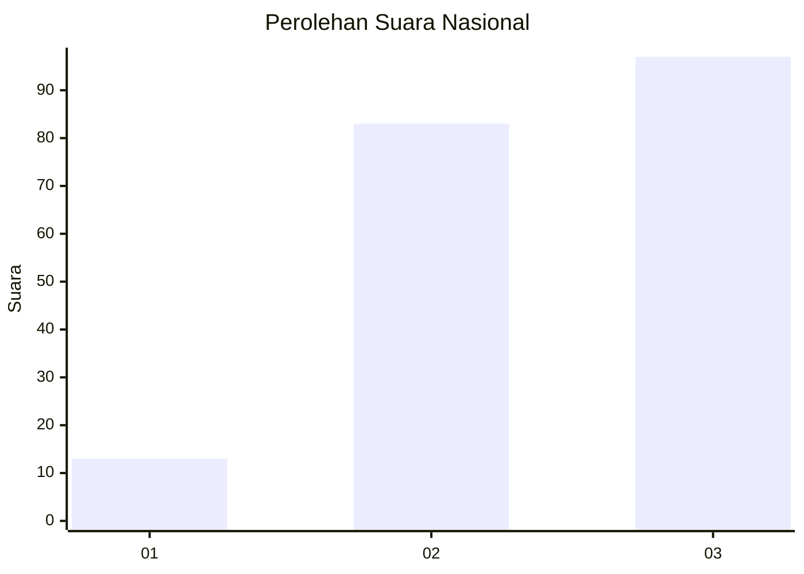
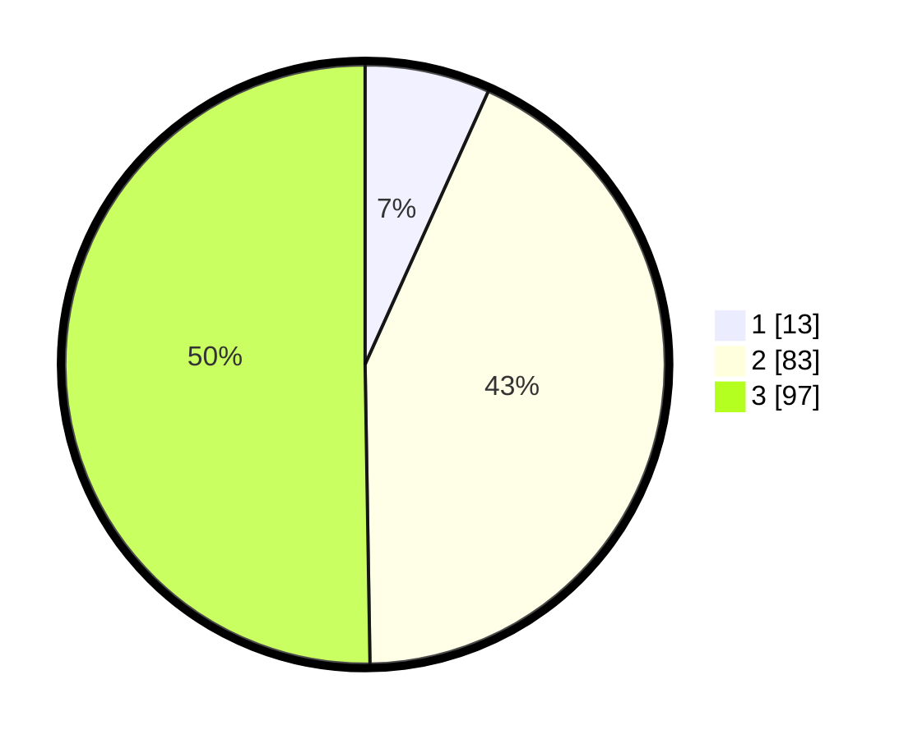

# Hasil

## Grafik

## Tabel

| No. | Nama Paslon    | Suara | Suara (raw) | Persentase |
|:--- |:-------------- | -----:| -----------:| ----------:|
| 1   | ANIES MUHAIMIN | 13    | [13][p-1]   | 6,74       |
| 2   | PRABOWO GIBRAN | 83    | [83][p-2]   | 43,01      |
| 3   | GANJAR MAHFUD  | 97    | [97][p-3]   | 50,26      |

[p-1]: https://github.com/gigit-pemilu/pemilu-2024/blob/main/pilpres/hitung-suara/sub/53-nusa-tenggara-timur/sub/13-lembata/sub/09-ile-ape-timur/sub/2002-jontona/sub/001-tps/sub/paslon-1.txt
[p-2]: https://github.com/gigit-pemilu/pemilu-2024/blob/main/pilpres/hitung-suara/sub/53-nusa-tenggara-timur/sub/13-lembata/sub/09-ile-ape-timur/sub/2002-jontona/sub/001-tps/sub/paslon-2.txt
[p-3]: https://github.com/gigit-pemilu/pemilu-2024/blob/main/pilpres/hitung-suara/sub/53-nusa-tenggara-timur/sub/13-lembata/sub/09-ile-ape-timur/sub/2002-jontona/sub/001-tps/sub/paslon-3.txt

## Foto C Plano

https://sirekap-obj-formc.kpu.go.id/0ccd/pemilu/ppwp/53/13/09/20/02/5313092002001-20240223-011215--b01a075f-a4f2-4210-89bd-05ef9671bb54.jpg

https://sirekap-obj-formc.kpu.go.id/0ccd/pemilu/ppwp/53/13/09/20/02/5313092002001-20240223-011350--c57c56ed-d77c-4485-8b2a-a7dbaa6b7c77.jpg

https://sirekap-obj-formc.kpu.go.id/0ccd/pemilu/ppwp/53/13/09/20/02/5313092002001-20240223-011531--83d70152-82b0-4684-8d01-e7b8bcc877bf.jpg

## Metadata

| Key        | Value               |
| ---------- | ------------------- |
| Time Stamp | 2024-02-24 22:31:28 |

