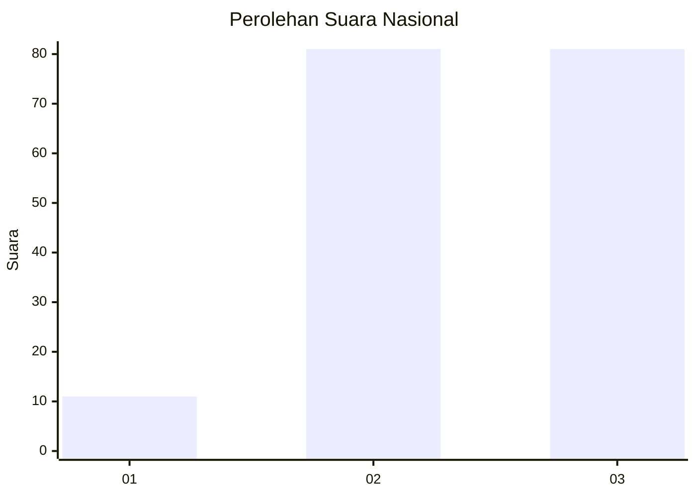
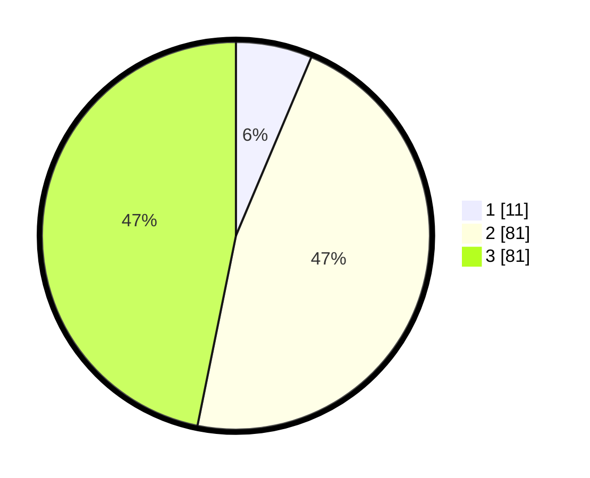

# Hasil

## Grafik

## Tabel

| No. | Nama Paslon    | Suara | Suara (raw) | Persentase |
|:--- |:-------------- | -----:| -----------:| ----------:|
| 1   | ANIES MUHAIMIN | 11    | [11][p-1]   | 6,36       |
| 2   | PRABOWO GIBRAN | 81    | [81][p-2]   | 46,82      |
| 3   | GANJAR MAHFUD  | 81    | [81][p-3]   | 46,82      |

[p-1]: https://github.com/gigit-pemilu/pemilu-2024/blob/main/pilpres/hitung-suara/sub/53-nusa-tenggara-timur/sub/13-lembata/sub/09-ile-ape-timur/sub/2002-jontona/sub/002-tps/sub/paslon-1.txt
[p-2]: https://github.com/gigit-pemilu/pemilu-2024/blob/main/pilpres/hitung-suara/sub/53-nusa-tenggara-timur/sub/13-lembata/sub/09-ile-ape-timur/sub/2002-jontona/sub/002-tps/sub/paslon-2.txt
[p-3]: https://github.com/gigit-pemilu/pemilu-2024/blob/main/pilpres/hitung-suara/sub/53-nusa-tenggara-timur/sub/13-lembata/sub/09-ile-ape-timur/sub/2002-jontona/sub/002-tps/sub/paslon-3.txt

## Foto C Plano

https://sirekap-obj-formc.kpu.go.id/c02d/pemilu/ppwp/53/13/09/20/02/5313092002002-20240223-004751--7a56d48f-f733-4101-aad8-64540c4cad07.jpg

https://sirekap-obj-formc.kpu.go.id/c02d/pemilu/ppwp/53/13/09/20/02/5313092002002-20240222-221658--a69f9a8d-f77c-4dd1-8e47-87ea6dc293c0.jpg

https://sirekap-obj-formc.kpu.go.id/c02d/pemilu/ppwp/53/13/09/20/02/5313092002002-20240222-221835--372f91e4-81bb-4b21-8dbc-ce899d370c72.jpg

## Metadata

| Key        | Value               |
| ---------- | ------------------- |
| Time Stamp | 2024-02-25 15:00:00 |

