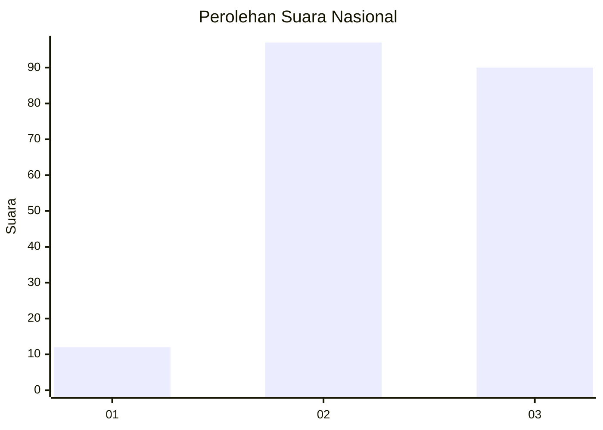
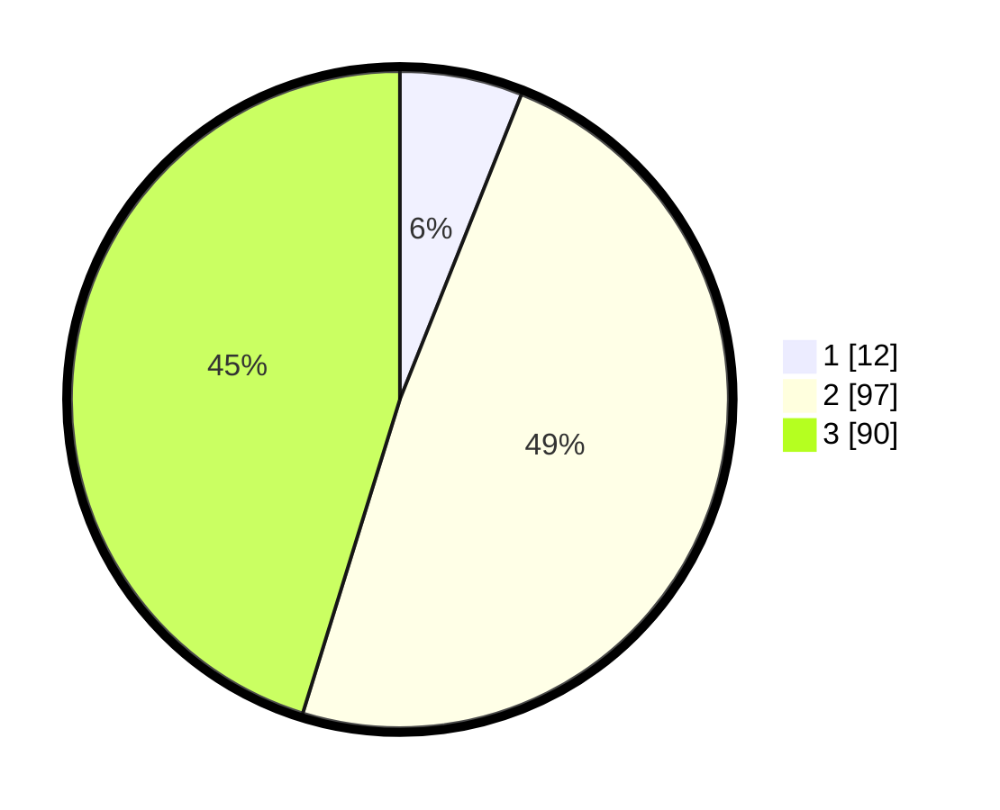

# Hasil

## Grafik

## Tabel

| No. | Nama Paslon    | Suara | Suara (raw) | Persentase |
|:--- |:-------------- | -----:| -----------:| ----------:|
| 1   | ANIES MUHAIMIN | 12    | [12][p-1]   | 6,03       |
| 2   | PRABOWO GIBRAN | 97    | [97][p-2]   | 48,74      |
| 3   | GANJAR MAHFUD  | 90    | [90][p-3]   | 45,23      |

[p-1]: https://github.com/gigit-pemilu/pemilu-2024/blob/main/pilpres/hitung-suara/sub/53-nusa-tenggara-timur/sub/13-lembata/sub/09-ile-ape-timur/sub/2002-jontona/sub/003-tps/sub/paslon-1.txt
[p-2]: https://github.com/gigit-pemilu/pemilu-2024/blob/main/pilpres/hitung-suara/sub/53-nusa-tenggara-timur/sub/13-lembata/sub/09-ile-ape-timur/sub/2002-jontona/sub/003-tps/sub/paslon-2.txt
[p-3]: https://github.com/gigit-pemilu/pemilu-2024/blob/main/pilpres/hitung-suara/sub/53-nusa-tenggara-timur/sub/13-lembata/sub/09-ile-ape-timur/sub/2002-jontona/sub/003-tps/sub/paslon-3.txt

## Foto C Plano

https://sirekap-obj-formc.kpu.go.id/de96/pemilu/ppwp/53/13/09/20/02/5313092002003-20240223-115848--9aff1025-09fe-48b5-b2d7-c9bc6a6a60fb.jpg

https://sirekap-obj-formc.kpu.go.id/de96/pemilu/ppwp/53/13/09/20/02/5313092002003-20240223-120042--e54270a3-d103-450b-9a1f-1d7c02f3560e.jpg

https://sirekap-obj-formc.kpu.go.id/de96/pemilu/ppwp/53/13/09/20/02/5313092002003-20240223-120211--85cd11ce-ac6c-4217-8115-0f0e2f486856.jpg

## Metadata

| Key        | Value               |
| ---------- | ------------------- |
| Time Stamp | 2024-02-26 13:00:00 |

