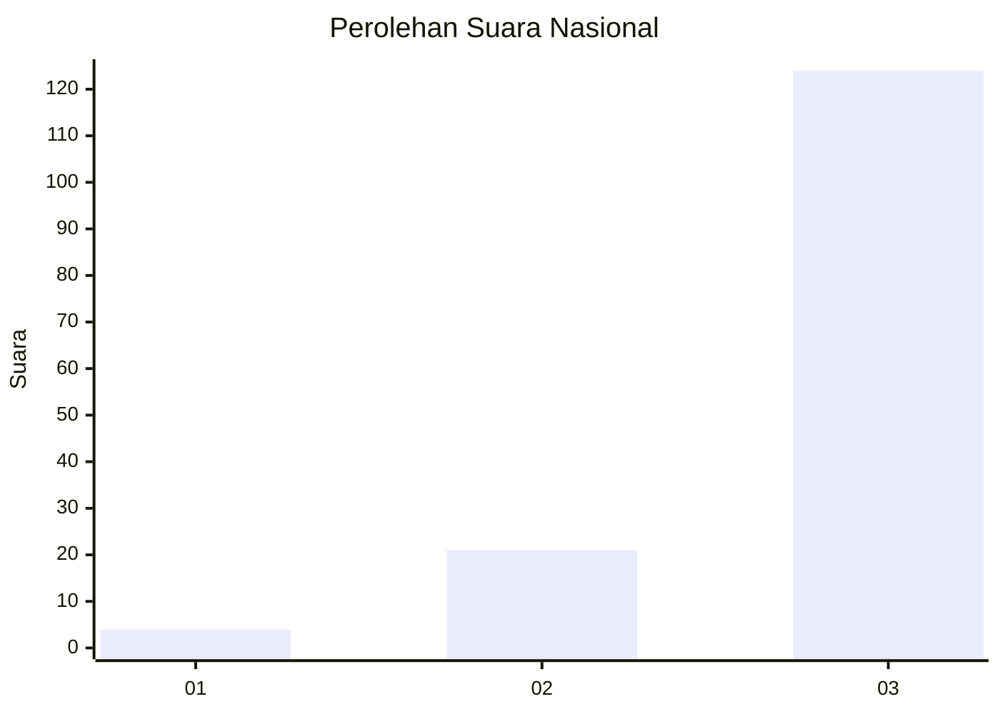
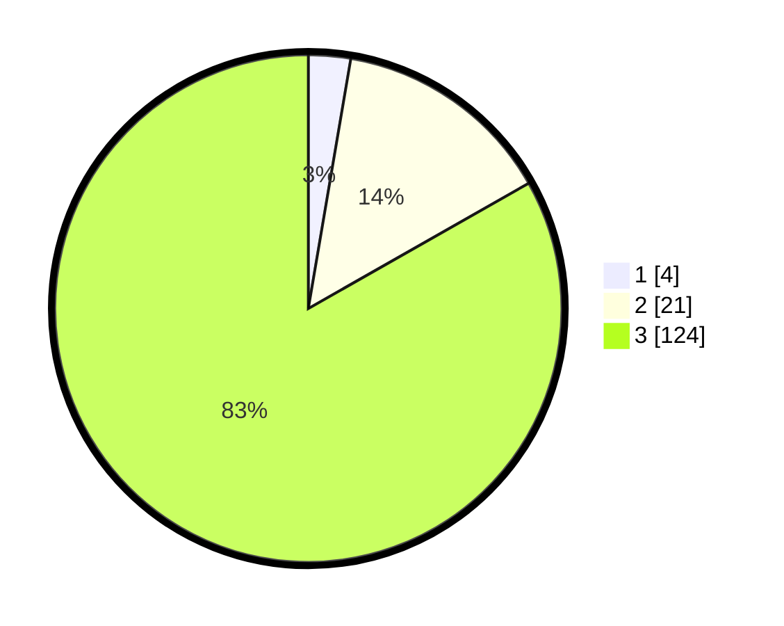

# Hasil

## Grafik

## Tabel

| No. | Nama Paslon    | Suara | Suara (raw) | Persentase |
|:--- |:-------------- | -----:| -----------:| ----------:|
| 1   | ANIES MUHAIMIN | 4     | [4][p-1]    | 2,68       |
| 2   | PRABOWO GIBRAN | 21    | [21][p-2]   | 14,09      |
| 3   | GANJAR MAHFUD  | 124   | [124][p-3]  | 83,22      |

[p-1]: https://github.com/gigit-pemilu/pemilu-2024/blob/main/pilpres/hitung-suara/sub/53-nusa-tenggara-timur/sub/13-lembata/sub/09-ile-ape-timur/sub/2008-waimatan/sub/002-tps/sub/paslon-1.txt
[p-2]: https://github.com/gigit-pemilu/pemilu-2024/blob/main/pilpres/hitung-suara/sub/53-nusa-tenggara-timur/sub/13-lembata/sub/09-ile-ape-timur/sub/2008-waimatan/sub/002-tps/sub/paslon-2.txt
[p-3]: https://github.com/gigit-pemilu/pemilu-2024/blob/main/pilpres/hitung-suara/sub/53-nusa-tenggara-timur/sub/13-lembata/sub/09-ile-ape-timur/sub/2008-waimatan/sub/002-tps/sub/paslon-3.txt

## Foto C Plano

https://sirekap-obj-formc.kpu.go.id/1850/pemilu/ppwp/53/13/09/20/08/5313092008002-20240222-100626--fa46a908-b5e3-4344-b5e5-cb9138a79725.jpg

https://sirekap-obj-formc.kpu.go.id/1850/pemilu/ppwp/53/13/09/20/08/5313092008002-20240222-101121--730bfcb2-0057-42aa-8535-9bab9fd2ac27.jpg

https://sirekap-obj-formc.kpu.go.id/1850/pemilu/ppwp/53/13/09/20/08/5313092008002-20240222-101336--0e8dc0b7-96a5-497c-b315-0ba97e796c7b.jpg

## Metadata

| Key        | Value               |
| ---------- | ------------------- |
| Time Stamp | 2024-02-24 22:31:28 |

