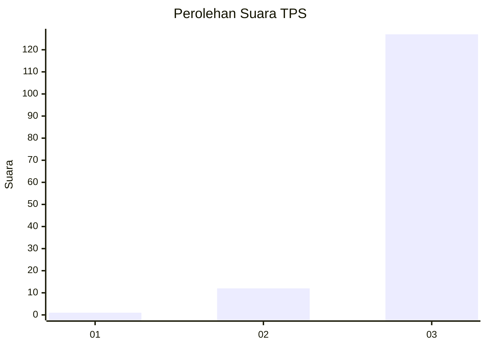
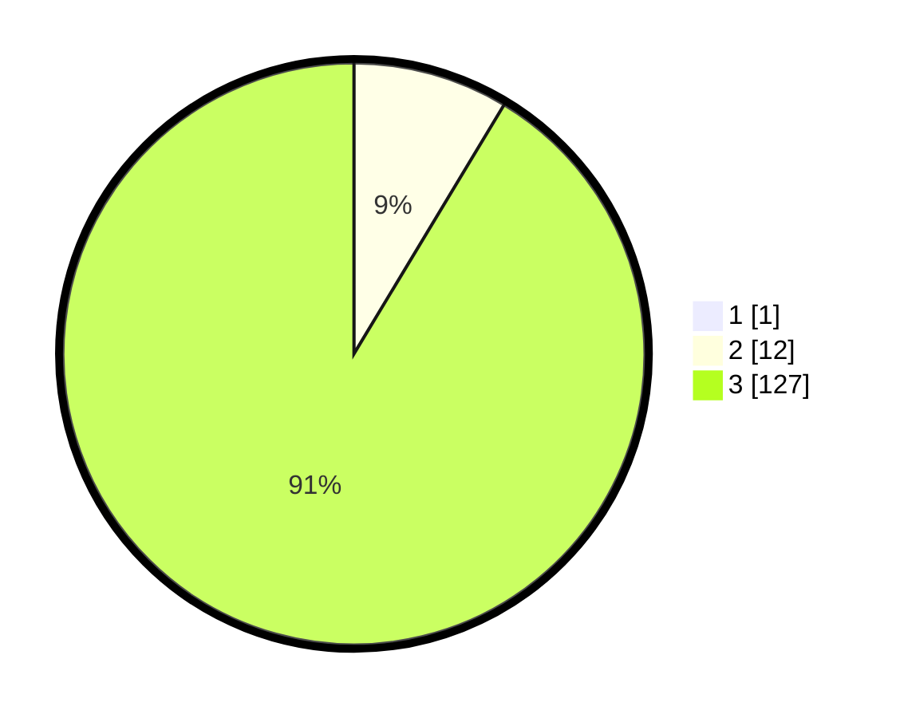

# Hasil

## Grafik

## Tabel

| No. | Nama Paslon    | Suara | Suara (raw) | Persentase |
|:--- |:-------------- | -----:| -----------:| ----------:|
| 1   | ANIES MUHAIMIN | 1     | [1][p-1]    | 0,71       |
| 2   | PRABOWO GIBRAN | 12    | [12][p-2]   | 8,57       |
| 3   | GANJAR MAHFUD  | 127   | [127][p-3]  | 90,71      |

[p-1]: https://github.com/gigit-pemilu/pemilu-2024-53-nusa-tenggara-timur/blob/main/pilpres/hitung-suara/sub/53-nusa-tenggara-timur/sub/13-lembata/sub/09-ile-ape-timur/sub/2009-lamagute/sub/001-tps/sub/paslon-1.txt
[p-2]: https://github.com/gigit-pemilu/pemilu-2024-53-nusa-tenggara-timur/blob/main/pilpres/hitung-suara/sub/53-nusa-tenggara-timur/sub/13-lembata/sub/09-ile-ape-timur/sub/2009-lamagute/sub/001-tps/sub/paslon-2.txt
[p-3]: https://github.com/gigit-pemilu/pemilu-2024-53-nusa-tenggara-timur/blob/main/pilpres/hitung-suara/sub/53-nusa-tenggara-timur/sub/13-lembata/sub/09-ile-ape-timur/sub/2009-lamagute/sub/001-tps/sub/paslon-3.txt

## Foto C Plano

https://sirekap-obj-formc.kpu.go.id/1148/pemilu/ppwp/53/13/09/20/09/5313092009001-20240222-192610--51613fcc-7b77-4207-ae2b-26094fc02e53.jpg

https://sirekap-obj-formc.kpu.go.id/1148/pemilu/ppwp/53/13/09/20/09/5313092009001-20240222-192715--81424f40-a2d5-4fd8-9830-4a4051f18bf8.jpg

https://sirekap-obj-formc.kpu.go.id/1148/pemilu/ppwp/53/13/09/20/09/5313092009001-20240222-193246--214daccd-87e2-47ff-a065-15e34432bec2.jpg

## Metadata

| Key        | Value               |
| ---------- | ------------------- |
| Time Stamp | 2024-02-25 12:00:00 |

