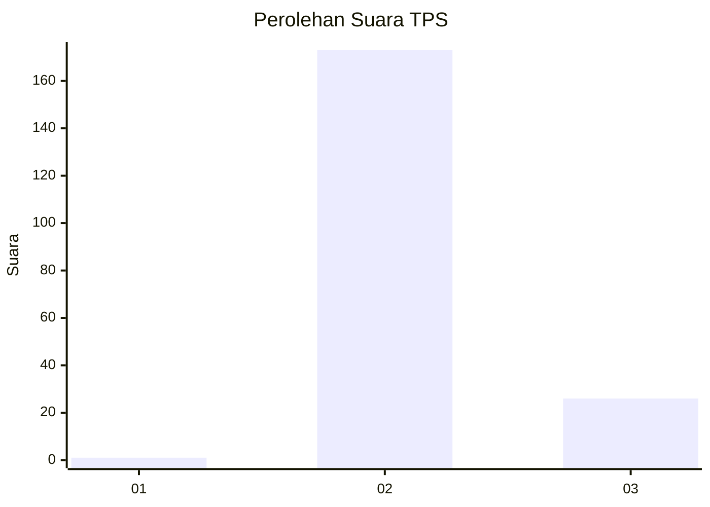
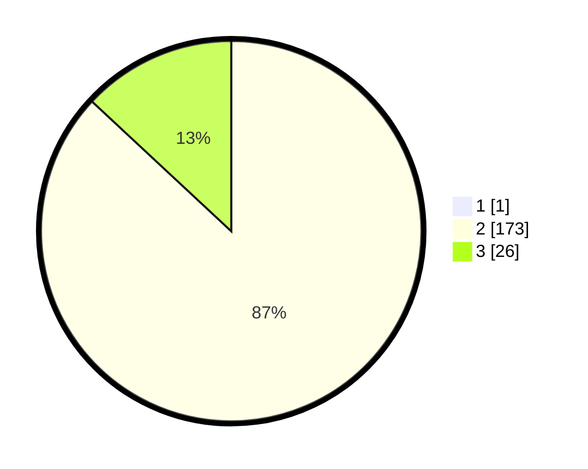

# Hasil

## Grafik

## Tabel

| No. | Nama Paslon    | Suara | Suara (raw) | Persentase |
|:--- |:-------------- | -----:| -----------:| ----------:|
| 1   | ANIES MUHAIMIN | 1     | [1][p-1]    | 0,50       |
| 2   | PRABOWO GIBRAN | 173   | [173][p-2]  | 86,50      |
| 3   | GANJAR MAHFUD  | 26    | [26][p-3]   | 13,00      |

[p-1]: https://github.com/gigit-pemilu/pemilu-2024-53-nusa-tenggara-timur/blob/main/pilpres/hitung-suara/sub/53-nusa-tenggara-timur/sub/14-rote-ndao/sub/01-rote-barat-daya/sub/2005-oeseli/sub/003-tps/sub/paslon-1.txt
[p-2]: https://github.com/gigit-pemilu/pemilu-2024-53-nusa-tenggara-timur/blob/main/pilpres/hitung-suara/sub/53-nusa-tenggara-timur/sub/14-rote-ndao/sub/01-rote-barat-daya/sub/2005-oeseli/sub/003-tps/sub/paslon-2.txt
[p-3]: https://github.com/gigit-pemilu/pemilu-2024-53-nusa-tenggara-timur/blob/main/pilpres/hitung-suara/sub/53-nusa-tenggara-timur/sub/14-rote-ndao/sub/01-rote-barat-daya/sub/2005-oeseli/sub/003-tps/sub/paslon-3.txt

## Foto C Plano

https://sirekap-obj-formc.kpu.go.id/ab9b/pemilu/ppwp/53/14/01/20/05/5314012005003-20240215-101910--5ce4a8b5-475a-4e60-884c-8e94efc4d31e.jpg

https://sirekap-obj-formc.kpu.go.id/ab9b/pemilu/ppwp/53/14/01/20/05/5314012005003-20240215-072043--45e17589-ee6d-499e-b70f-df4d56af7757.jpg

https://sirekap-obj-formc.kpu.go.id/ab9b/pemilu/ppwp/53/14/01/20/05/5314012005003-20240215-072146--25933d3c-5d64-4863-ad74-8a9cc8a8e89a.jpg

## Metadata

| Key        | Value               |
| ---------- | ------------------- |
| Time Stamp | 2024-02-15 19:30:26 |

