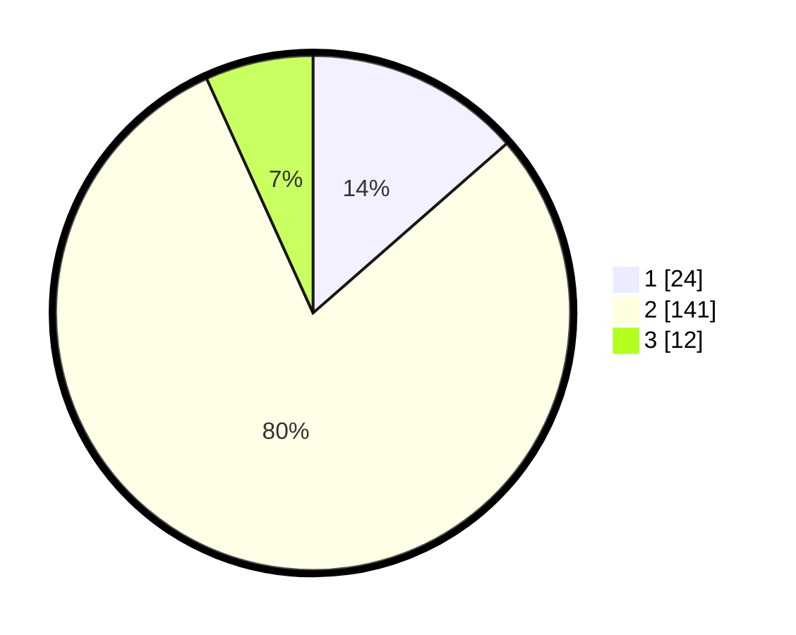

# Hasil

## Grafik

## Tabel

| No. | Nama Paslon    | Suara | Suara (raw) | Persentase |
|:--- |:-------------- | -----:| -----------:| ----------:|
| 1   | ANIES MUHAIMIN | 24    | [24][p-1]   | 13,56      |
| 2   | PRABOWO GIBRAN | 141   | [141][p-2]  | 79,66      |
| 3   | GANJAR MAHFUD  | 12    | [12][p-3]   | 6,78       |

[p-1]: https://github.com/gigit-pemilu/pemilu-2024-53-nusa-tenggara-timur/blob/main/pilpres/hitung-suara/sub/53-nusa-tenggara-timur/sub/14-rote-ndao/sub/01-rote-barat-daya/sub/2005-oeseli/sub/005-tps/sub/paslon-1.txt
[p-2]: https://github.com/gigit-pemilu/pemilu-2024-53-nusa-tenggara-timur/blob/main/pilpres/hitung-suara/sub/53-nusa-tenggara-timur/sub/14-rote-ndao/sub/01-rote-barat-daya/sub/2005-oeseli/sub/005-tps/sub/paslon-2.txt
[p-3]: https://github.com/gigit-pemilu/pemilu-2024-53-nusa-tenggara-timur/blob/main/pilpres/hitung-suara/sub/53-nusa-tenggara-timur/sub/14-rote-ndao/sub/01-rote-barat-daya/sub/2005-oeseli/sub/005-tps/sub/paslon-3.txt

## Foto C Plano

https://sirekap-obj-formc.kpu.go.id/5054/pemilu/ppwp/53/14/01/20/05/5314012005005-20240215-041824--459c9e49-27dc-4e09-a9b5-a38a11b4bd1c.jpg

https://sirekap-obj-formc.kpu.go.id/5054/pemilu/ppwp/53/14/01/20/05/5314012005005-20240215-041609--8495f02a-d253-43a4-a20e-e05eaf803509.jpg

https://sirekap-obj-formc.kpu.go.id/5054/pemilu/ppwp/53/14/01/20/05/5314012005005-20240215-035536--dcdfa401-e7ea-460e-89eb-6db985b8f7d4.jpg

## Metadata

| Key        | Value               |
| ---------- | ------------------- |
| Time Stamp | 2024-02-15 19:30:26 |

