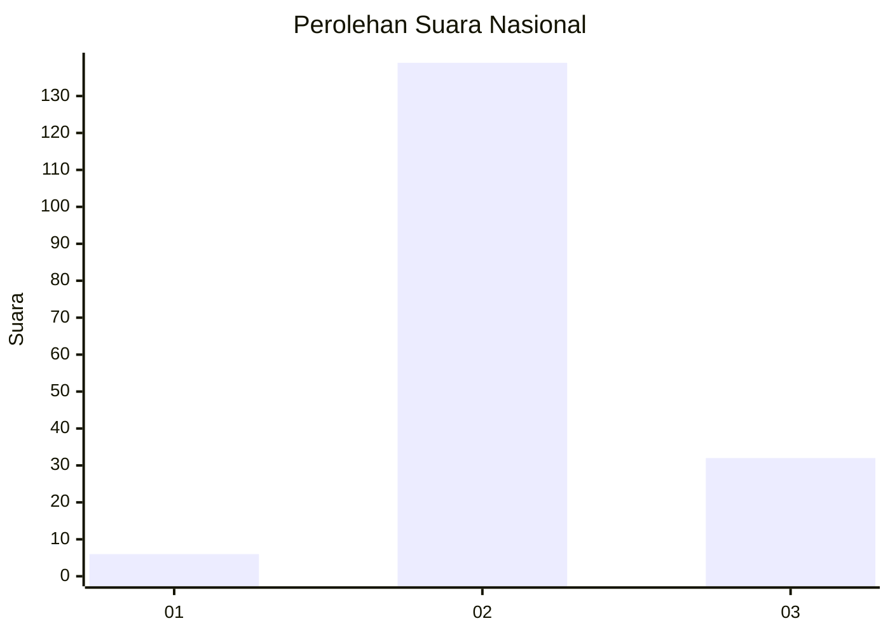

# Hasil

## Grafik

## Tabel

| No. | Nama Paslon    | Suara | Suara (raw) | Persentase |
|:--- |:-------------- | -----:| -----------:| ----------:|
| 1   | ANIES MUHAIMIN | 6     | [6][p-1]    | 3,39       |
| 2   | PRABOWO GIBRAN | 139   | [139][p-2]  | 78,53      |
| 3   | GANJAR MAHFUD  | 32    | [32][p-3]   | 18,08      |

[p-1]: https://github.com/gigit-pemilu/pemilu-2024/blob/main/pilpres/hitung-suara/sub/53-nusa-tenggara-timur/sub/14-rote-ndao/sub/02-rote-barat-laut/sub/1008-busalangga/sub/001-tps/sub/paslon-1.txt
[p-2]: https://github.com/gigit-pemilu/pemilu-2024/blob/main/pilpres/hitung-suara/sub/53-nusa-tenggara-timur/sub/14-rote-ndao/sub/02-rote-barat-laut/sub/1008-busalangga/sub/001-tps/sub/paslon-2.txt
[p-3]: https://github.com/gigit-pemilu/pemilu-2024/blob/main/pilpres/hitung-suara/sub/53-nusa-tenggara-timur/sub/14-rote-ndao/sub/02-rote-barat-laut/sub/1008-busalangga/sub/001-tps/sub/paslon-3.txt

## Foto C Plano

https://sirekap-obj-formc.kpu.go.id/ae82/pemilu/ppwp/53/14/02/10/08/5314021008001-20240215-033757--42c8fd4c-abb2-4281-b51e-451d45dc49f2.jpg

https://sirekap-obj-formc.kpu.go.id/ae82/pemilu/ppwp/53/14/02/10/08/5314021008001-20240215-034114--881decc6-5935-490f-8680-ac587b9ab83a.jpg

https://sirekap-obj-formc.kpu.go.id/ae82/pemilu/ppwp/53/14/02/10/08/5314021008001-20240215-034438--ebc9ba71-0b0f-46d4-ad89-85ff718bfaaf.jpg

## Metadata

| Key        | Value               |
| ---------- | ------------------- |
| Time Stamp | 2024-02-15 12:00:28 |

