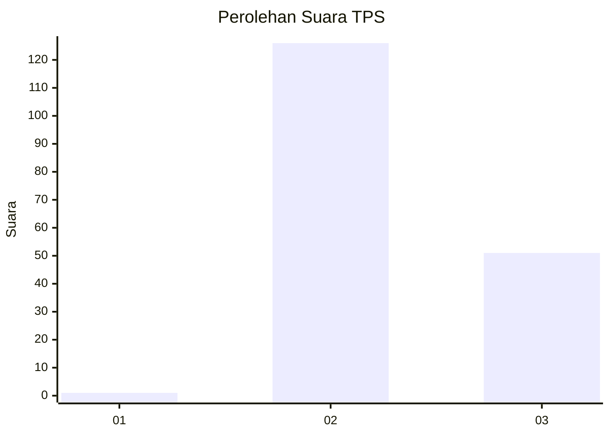
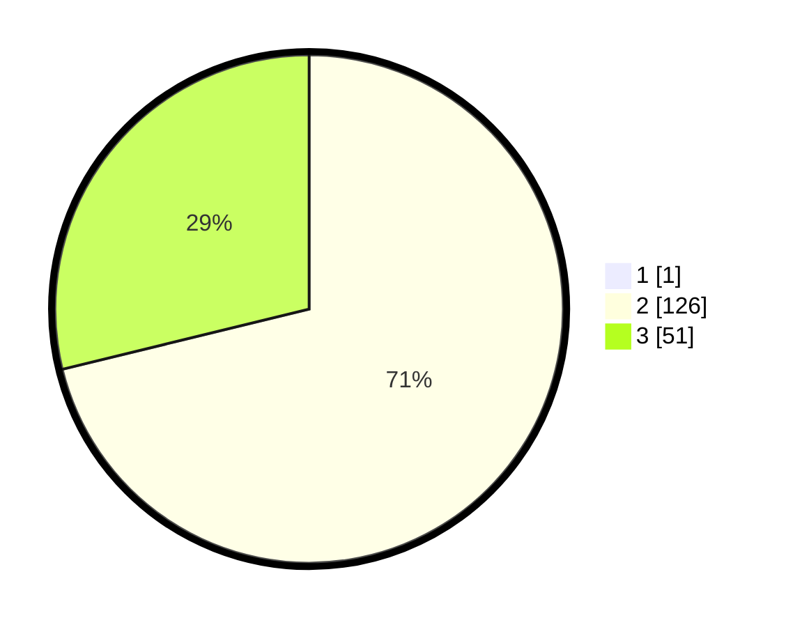

# Hasil

## Grafik

## Tabel

| No. | Nama Paslon    | Suara | Suara (raw) | Persentase |
|:--- |:-------------- | -----:| -----------:| ----------:|
| 1   | ANIES MUHAIMIN | 1     | [1][p-1]    | 0,56       |
| 2   | PRABOWO GIBRAN | 126   | [126][p-2]  | 70,79      |
| 3   | GANJAR MAHFUD  | 51    | [51][p-3]   | 28,65      |

[p-1]: https://github.com/gigit-pemilu/pemilu-2024-53-nusa-tenggara-timur/blob/main/pilpres/hitung-suara/sub/53-nusa-tenggara-timur/sub/14-rote-ndao/sub/02-rote-barat-laut/sub/1008-busalangga/sub/003-tps/sub/paslon-1.txt
[p-2]: https://github.com/gigit-pemilu/pemilu-2024-53-nusa-tenggara-timur/blob/main/pilpres/hitung-suara/sub/53-nusa-tenggara-timur/sub/14-rote-ndao/sub/02-rote-barat-laut/sub/1008-busalangga/sub/003-tps/sub/paslon-2.txt
[p-3]: https://github.com/gigit-pemilu/pemilu-2024-53-nusa-tenggara-timur/blob/main/pilpres/hitung-suara/sub/53-nusa-tenggara-timur/sub/14-rote-ndao/sub/02-rote-barat-laut/sub/1008-busalangga/sub/003-tps/sub/paslon-3.txt

## Foto C Plano

https://sirekap-obj-formc.kpu.go.id/7bb8/pemilu/ppwp/53/14/02/10/08/5314021008003-20240215-080645--df10a47b-d28e-4898-b45a-14c961338ae2.jpg

https://sirekap-obj-formc.kpu.go.id/7bb8/pemilu/ppwp/53/14/02/10/08/5314021008003-20240215-081315--b5f0dd9f-10e3-4174-928e-5db638576a94.jpg

https://sirekap-obj-formc.kpu.go.id/7bb8/pemilu/ppwp/53/14/02/10/08/5314021008003-20240215-081515--15ade805-67cb-492f-afbd-10cb5d6b9de9.jpg

## Metadata

| Key        | Value               |
| ---------- | ------------------- |
| Time Stamp | 2024-02-15 16:00:26 |

