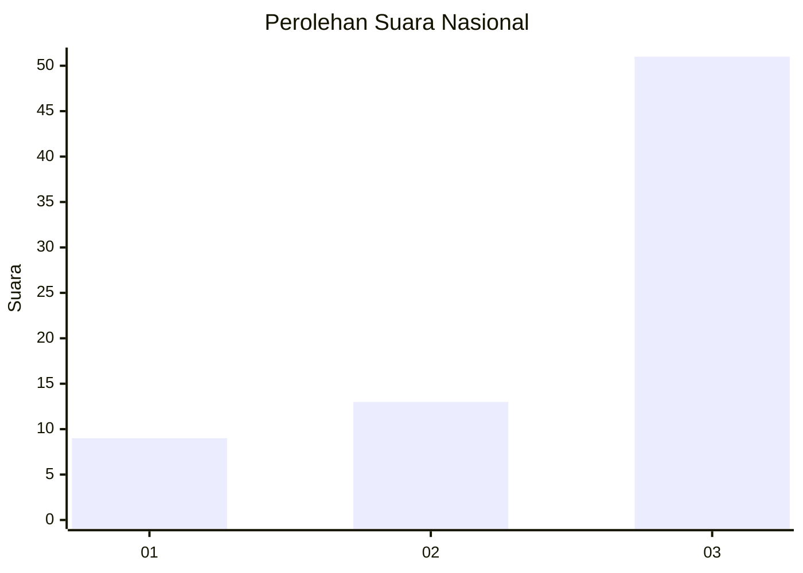
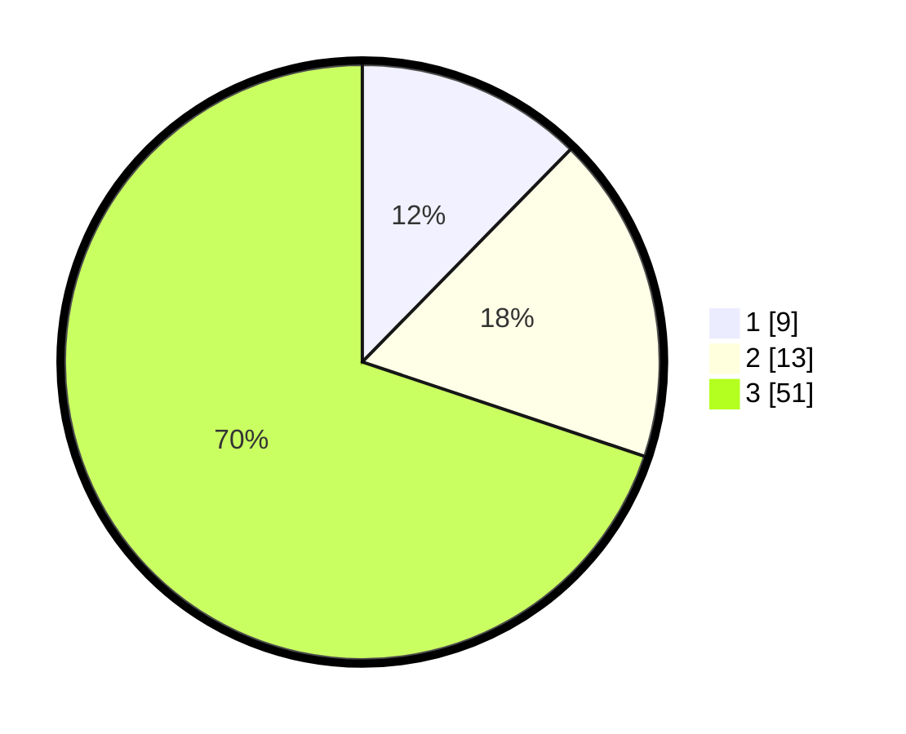

# Hasil

## Grafik

## Tabel

| No. | Nama Paslon    | Suara | Suara (raw) | Persentase |
|:--- |:-------------- | -----:| -----------:| ----------:|
| 1   | ANIES MUHAIMIN | 9     | [9][p-1]    | 12,33      |
| 2   | PRABOWO GIBRAN | 13    | [13][p-2]   | 17,81      |
| 3   | GANJAR MAHFUD  | 51    | [51][p-3]   | 69,86      |

[p-1]: https://github.com/gigit-pemilu/pemilu-2024/blob/main/pilpres/hitung-suara/sub/53-nusa-tenggara-timur/sub/14-rote-ndao/sub/06-rote-timur/sub/2005-serubeba/sub/002-tps/sub/paslon-1.txt
[p-2]: https://github.com/gigit-pemilu/pemilu-2024/blob/main/pilpres/hitung-suara/sub/53-nusa-tenggara-timur/sub/14-rote-ndao/sub/06-rote-timur/sub/2005-serubeba/sub/002-tps/sub/paslon-2.txt
[p-3]: https://github.com/gigit-pemilu/pemilu-2024/blob/main/pilpres/hitung-suara/sub/53-nusa-tenggara-timur/sub/14-rote-ndao/sub/06-rote-timur/sub/2005-serubeba/sub/002-tps/sub/paslon-3.txt

## Foto C Plano

https://sirekap-obj-formc.kpu.go.id/3ca3/pemilu/ppwp/53/14/06/20/05/5314062005002-20240215-065746--fac3e8d0-d852-4376-9ac6-1b17f9723121.jpg

https://sirekap-obj-formc.kpu.go.id/3ca3/pemilu/ppwp/53/14/06/20/05/5314062005002-20240215-065846--eca8bfc7-1210-4380-b257-fb1c37449071.jpg

https://sirekap-obj-formc.kpu.go.id/3ca3/pemilu/ppwp/53/14/06/20/05/5314062005002-20240215-065934--64670c90-fdda-444e-b3a8-508666d73f01.jpg

## Metadata

| Key        | Value               |
| ---------- | ------------------- |
| Time Stamp | 2024-02-15 15:30:25 |

