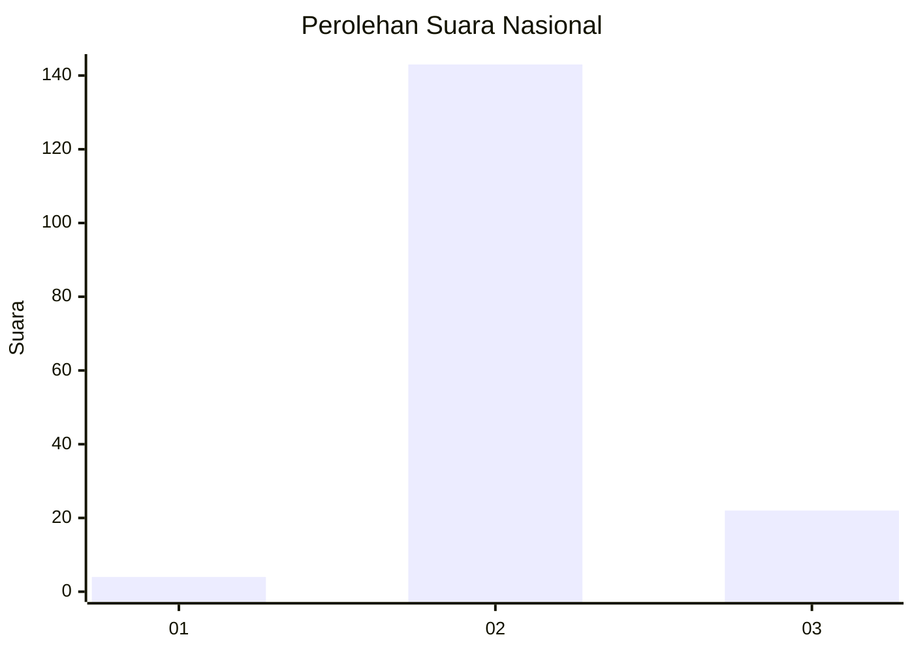
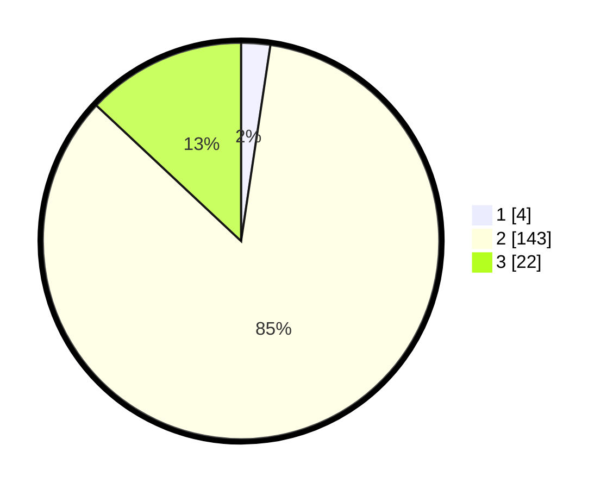

# Hasil

## Grafik

## Tabel

| No. | Nama Paslon    | Suara | Suara (raw) | Persentase |
|:--- |:-------------- | -----:| -----------:| ----------:|
| 1   | ANIES MUHAIMIN | 4     | [4][p-1]    | 2,37       |
| 2   | PRABOWO GIBRAN | 143   | [143][p-2]  | 84,62      |
| 3   | GANJAR MAHFUD  | 22    | [22][p-3]   | 13,02      |

[p-1]: https://github.com/gigit-pemilu/pemilu-2024/blob/main/pilpres/hitung-suara/sub/53-nusa-tenggara-timur/sub/14-rote-ndao/sub/07-rote-barat/sub/2001-sedeoen/sub/002-tps/sub/paslon-1.txt
[p-2]: https://github.com/gigit-pemilu/pemilu-2024/blob/main/pilpres/hitung-suara/sub/53-nusa-tenggara-timur/sub/14-rote-ndao/sub/07-rote-barat/sub/2001-sedeoen/sub/002-tps/sub/paslon-2.txt
[p-3]: https://github.com/gigit-pemilu/pemilu-2024/blob/main/pilpres/hitung-suara/sub/53-nusa-tenggara-timur/sub/14-rote-ndao/sub/07-rote-barat/sub/2001-sedeoen/sub/002-tps/sub/paslon-3.txt

## Foto C Plano

https://sirekap-obj-formc.kpu.go.id/1053/pemilu/ppwp/53/14/07/20/01/5314072001002-20240214-221312--8e45cb05-a0f5-462b-b404-8f74b4a593ba.jpg

https://sirekap-obj-formc.kpu.go.id/1053/pemilu/ppwp/53/14/07/20/01/5314072001002-20240215-012919--2f16764b-55e3-40b7-ac78-cc2b3bebb520.jpg

https://sirekap-obj-formc.kpu.go.id/1053/pemilu/ppwp/53/14/07/20/01/5314072001002-20240215-013020--9e692069-e21b-45f0-a7ce-a1542a665c22.jpg

## Metadata

| Key        | Value               |
| ---------- | ------------------- |
| Time Stamp | 2024-02-15 22:30:27 |

