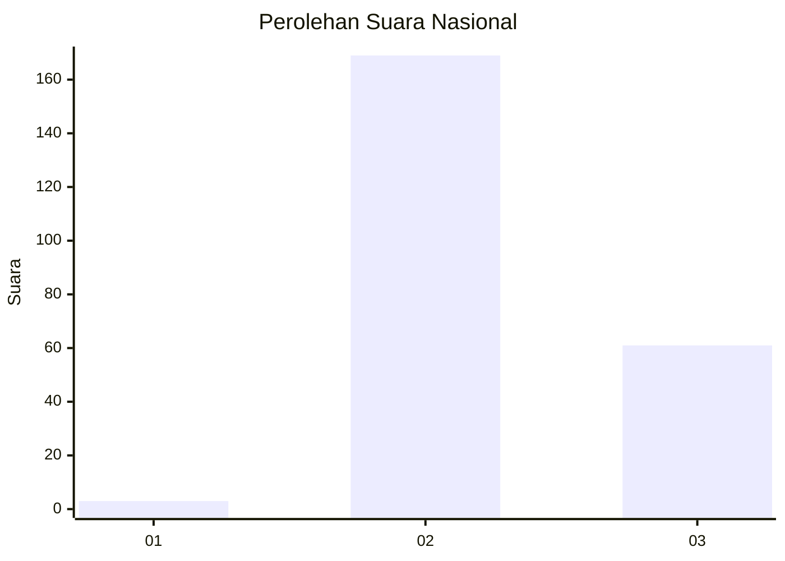
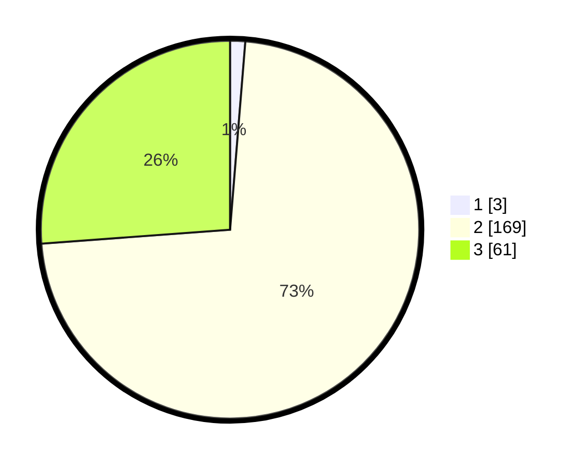

# Hasil

## Grafik

## Tabel

| No. | Nama Paslon    | Suara | Suara (raw) | Persentase |
|:--- |:-------------- | -----:| -----------:| ----------:|
| 1   | ANIES MUHAIMIN | 3     | [3][p-1]    | 1,29       |
| 2   | PRABOWO GIBRAN | 169   | [169][p-2]  | 72,53      |
| 3   | GANJAR MAHFUD  | 61    | [61][p-3]   | 26,18      |

[p-1]: https://github.com/gigit-pemilu/pemilu-2024/blob/main/pilpres/hitung-suara/sub/53-nusa-tenggara-timur/sub/14-rote-ndao/sub/07-rote-barat/sub/2001-sedeoen/sub/004-tps/sub/paslon-1.txt
[p-2]: https://github.com/gigit-pemilu/pemilu-2024/blob/main/pilpres/hitung-suara/sub/53-nusa-tenggara-timur/sub/14-rote-ndao/sub/07-rote-barat/sub/2001-sedeoen/sub/004-tps/sub/paslon-2.txt
[p-3]: https://github.com/gigit-pemilu/pemilu-2024/blob/main/pilpres/hitung-suara/sub/53-nusa-tenggara-timur/sub/14-rote-ndao/sub/07-rote-barat/sub/2001-sedeoen/sub/004-tps/sub/paslon-3.txt

## Foto C Plano

https://sirekap-obj-formc.kpu.go.id/248d/pemilu/ppwp/53/14/07/20/01/5314072001004-20240214-225842--d84c8d4d-366b-404f-b96f-75f7668d9776.jpg

https://sirekap-obj-formc.kpu.go.id/248d/pemilu/ppwp/53/14/07/20/01/5314072001004-20240214-230017--2560e459-8c17-4466-a69c-844073d44fa4.jpg

https://sirekap-obj-formc.kpu.go.id/248d/pemilu/ppwp/53/14/07/20/01/5314072001004-20240214-230147--11fd3b39-8633-446a-972e-d37b6a1c0979.jpg

## Metadata

| Key        | Value               |
| ---------- | ------------------- |
| Time Stamp | 2024-02-25 11:00:00 |

