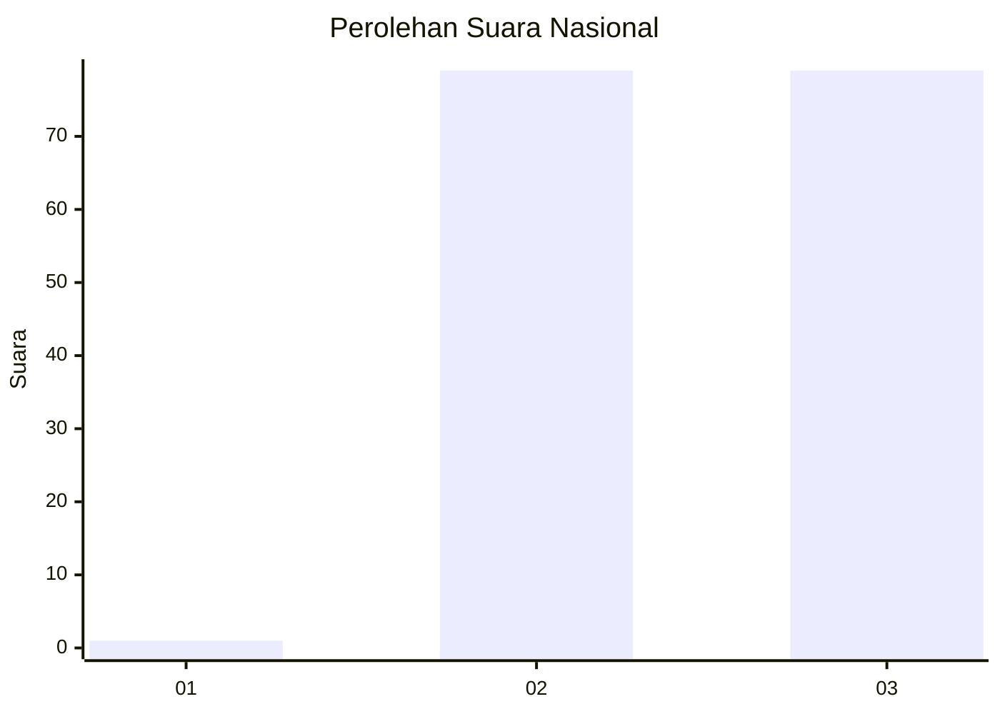
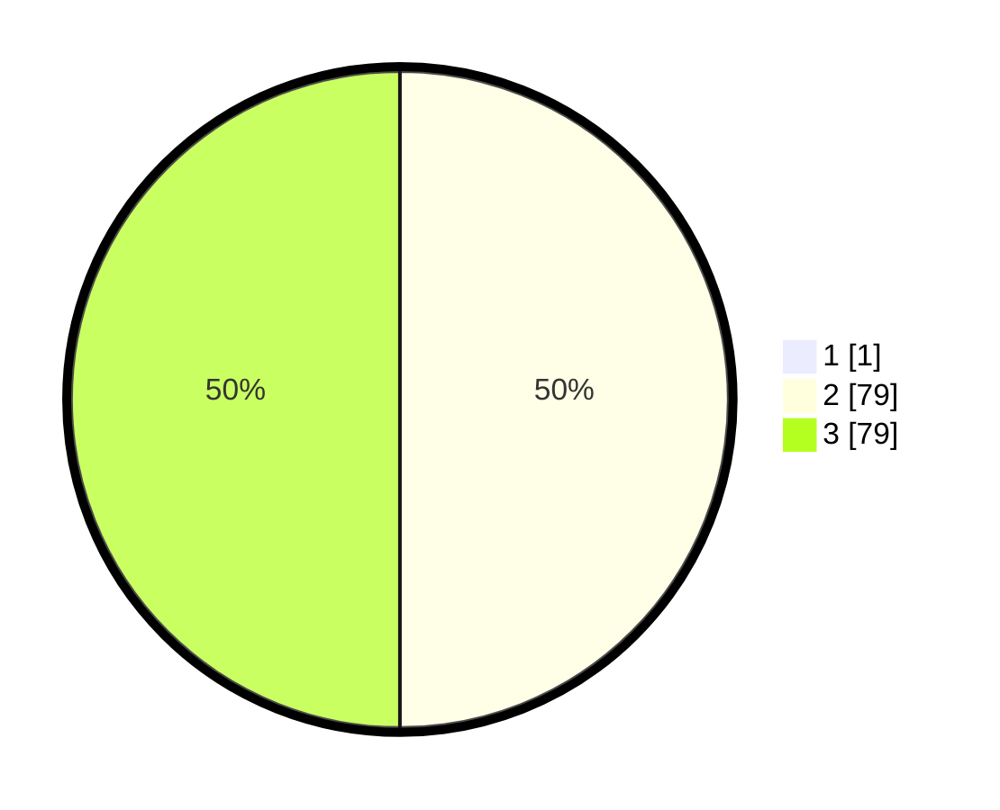

# Hasil

## Grafik

## Tabel

| No. | Nama Paslon    | Suara | Suara (raw) | Persentase |
|:--- |:-------------- | -----:| -----------:| ----------:|
| 1   | ANIES MUHAIMIN | 1     | [1][p-1]    | 0,63       |
| 2   | PRABOWO GIBRAN | 79    | [79][p-2]   | 49,69      |
| 3   | GANJAR MAHFUD  | 79    | [79][p-3]   | 49,69      |

[p-1]: https://github.com/gigit-pemilu/pemilu-2024/blob/main/pilpres/hitung-suara/sub/53-nusa-tenggara-timur/sub/14-rote-ndao/sub/09-ndao-nuse/sub/2001-mbali-lendeiki/sub/002-tps/sub/paslon-1.txt
[p-2]: https://github.com/gigit-pemilu/pemilu-2024/blob/main/pilpres/hitung-suara/sub/53-nusa-tenggara-timur/sub/14-rote-ndao/sub/09-ndao-nuse/sub/2001-mbali-lendeiki/sub/002-tps/sub/paslon-2.txt
[p-3]: https://github.com/gigit-pemilu/pemilu-2024/blob/main/pilpres/hitung-suara/sub/53-nusa-tenggara-timur/sub/14-rote-ndao/sub/09-ndao-nuse/sub/2001-mbali-lendeiki/sub/002-tps/sub/paslon-3.txt

## Foto C Plano

https://sirekap-obj-formc.kpu.go.id/4b4f/pemilu/ppwp/53/14/09/20/01/5314092001002-20240215-155533--26710369-a73d-4940-9d6c-1bcd27687436.jpg

https://sirekap-obj-formc.kpu.go.id/4b4f/pemilu/ppwp/53/14/09/20/01/5314092001002-20240215-155626--07db6cef-70fe-48be-95be-4e586c4df334.jpg

https://sirekap-obj-formc.kpu.go.id/4b4f/pemilu/ppwp/53/14/09/20/01/5314092001002-20240215-155710--17deddef-43a2-4abb-af1f-a2ef1fedcff5.jpg

## Metadata

| Key        | Value               |
| ---------- | ------------------- |
| Time Stamp | 2024-02-15 21:01:18 |

