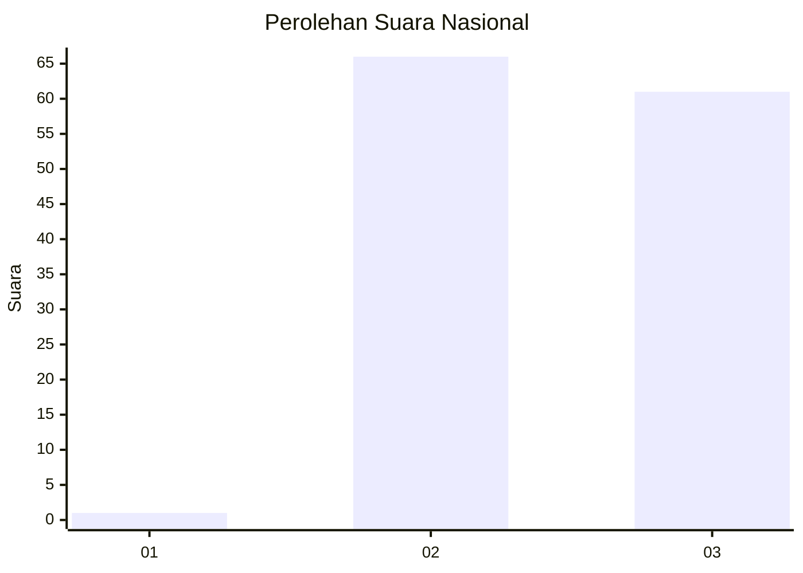
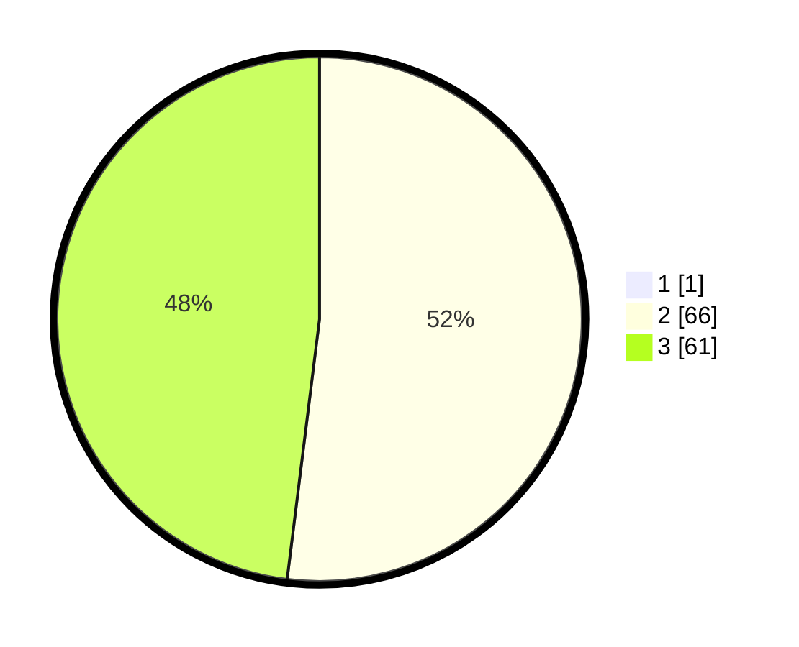

# Hasil

## Grafik

## Tabel

| No. | Nama Paslon    | Suara | Suara (raw) | Persentase |
|:--- |:-------------- | -----:| -----------:| ----------:|
| 1   | ANIES MUHAIMIN | 1     | [1][p-1]    | 0,78       |
| 2   | PRABOWO GIBRAN | 66    | [66][p-2]   | 51,56      |
| 3   | GANJAR MAHFUD  | 61    | [61][p-3]   | 47,66      |

[p-1]: https://github.com/gigit-pemilu/pemilu-2024/blob/main/pilpres/hitung-suara/sub/53-nusa-tenggara-timur/sub/14-rote-ndao/sub/09-ndao-nuse/sub/2001-mbali-lendeiki/sub/003-tps/sub/paslon-1.txt
[p-2]: https://github.com/gigit-pemilu/pemilu-2024/blob/main/pilpres/hitung-suara/sub/53-nusa-tenggara-timur/sub/14-rote-ndao/sub/09-ndao-nuse/sub/2001-mbali-lendeiki/sub/003-tps/sub/paslon-2.txt
[p-3]: https://github.com/gigit-pemilu/pemilu-2024/blob/main/pilpres/hitung-suara/sub/53-nusa-tenggara-timur/sub/14-rote-ndao/sub/09-ndao-nuse/sub/2001-mbali-lendeiki/sub/003-tps/sub/paslon-3.txt

## Foto C Plano

https://sirekap-obj-formc.kpu.go.id/8042/pemilu/ppwp/53/14/09/20/01/5314092001003-20240215-124623--fa7f9f43-a064-4c31-a889-ad704cb09bf8.jpg

https://sirekap-obj-formc.kpu.go.id/8042/pemilu/ppwp/53/14/09/20/01/5314092001003-20240215-124725--0fcdf5a0-f9cd-4a82-9ee5-2a751905174c.jpg

https://sirekap-obj-formc.kpu.go.id/8042/pemilu/ppwp/53/14/09/20/01/5314092001003-20240215-124811--729e5612-e02f-4455-9e33-90261379a385.jpg

## Metadata

| Key        | Value               |
| ---------- | ------------------- |
| Time Stamp | 2024-02-15 21:01:18 |

