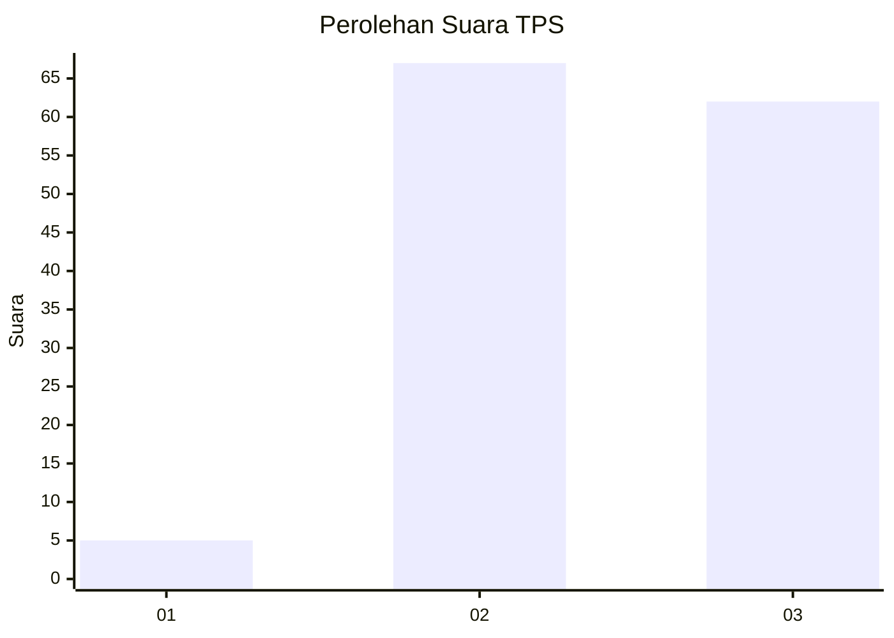
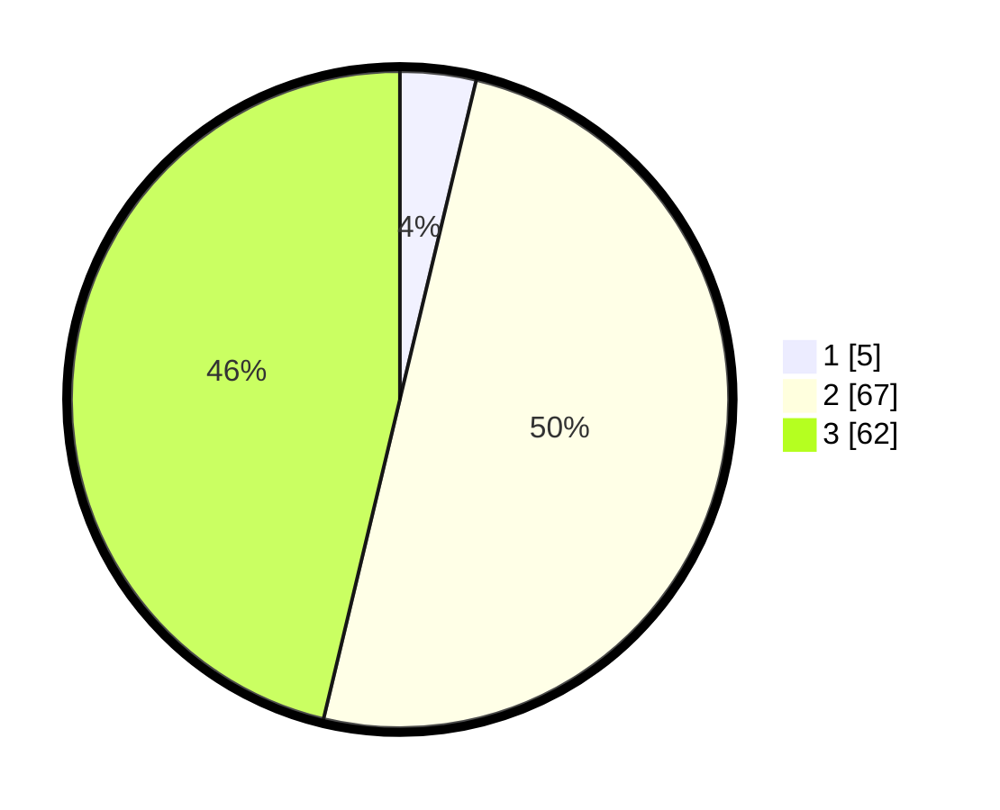

# Hasil

## Grafik

## Tabel

| No. | Nama Paslon    | Suara | Suara (raw) | Persentase |
|:--- |:-------------- | -----:| -----------:| ----------:|
| 1   | ANIES MUHAIMIN | 5     | [5][p-1]    | 3,73       |
| 2   | PRABOWO GIBRAN | 67    | [67][p-2]   | 50,00      |
| 3   | GANJAR MAHFUD  | 62    | [62][p-3]   | 46,27      |

[p-1]: https://github.com/gigit-pemilu/pemilu-2024-53-nusa-tenggara-timur/blob/main/pilpres/hitung-suara/sub/53-nusa-tenggara-timur/sub/14-rote-ndao/sub/09-ndao-nuse/sub/2002-anarae/sub/002-tps/sub/paslon-1.txt
[p-2]: https://github.com/gigit-pemilu/pemilu-2024-53-nusa-tenggara-timur/blob/main/pilpres/hitung-suara/sub/53-nusa-tenggara-timur/sub/14-rote-ndao/sub/09-ndao-nuse/sub/2002-anarae/sub/002-tps/sub/paslon-2.txt
[p-3]: https://github.com/gigit-pemilu/pemilu-2024-53-nusa-tenggara-timur/blob/main/pilpres/hitung-suara/sub/53-nusa-tenggara-timur/sub/14-rote-ndao/sub/09-ndao-nuse/sub/2002-anarae/sub/002-tps/sub/paslon-3.txt

## Foto C Plano

https://sirekap-obj-formc.kpu.go.id/8f85/pemilu/ppwp/53/14/09/20/02/5314092002002-20240215-164254--9bad4f70-e320-41b9-90f9-0bd61cf1e576.jpg

https://sirekap-obj-formc.kpu.go.id/8f85/pemilu/ppwp/53/14/09/20/02/5314092002002-20240215-164234--215d7d10-494c-4605-93de-d2c5b732f3a5.jpg

https://sirekap-obj-formc.kpu.go.id/8f85/pemilu/ppwp/53/14/09/20/02/5314092002002-20240215-164209--6acaaec6-021e-426b-a2f8-1836686f6fdc.jpg

## Metadata

| Key        | Value               |
| ---------- | ------------------- |
| Time Stamp | 2024-02-15 23:29:50 |

