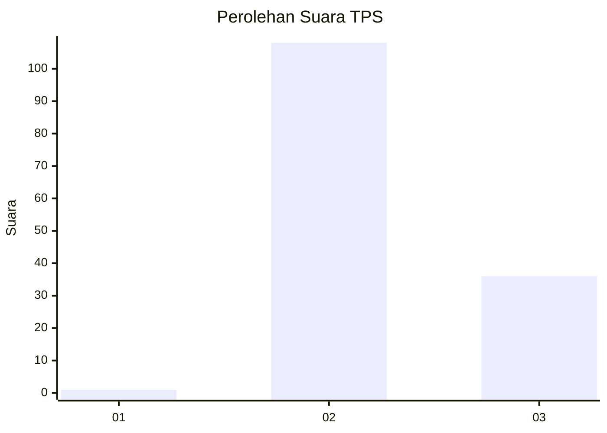
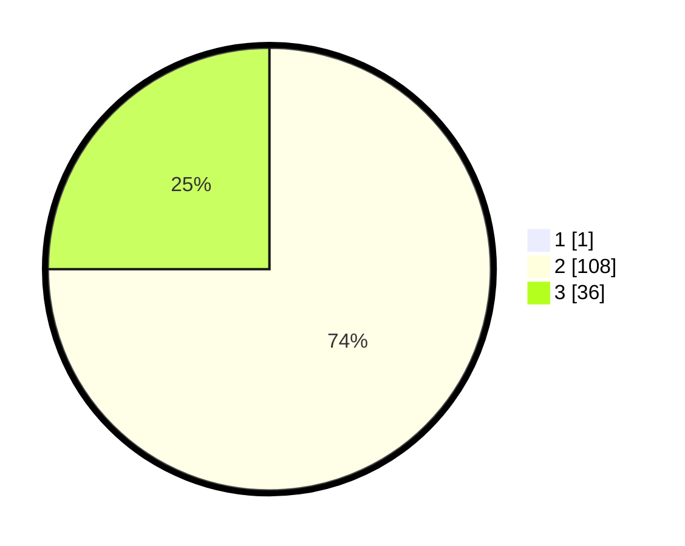

# Hasil

## Grafik

## Tabel

| No. | Nama Paslon    | Suara | Suara (raw) | Persentase |
|:--- |:-------------- | -----:| -----------:| ----------:|
| 1   | ANIES MUHAIMIN | 1     | [1][p-1]    | 0,69       |
| 2   | PRABOWO GIBRAN | 108   | [108][p-2]  | 74,48      |
| 3   | GANJAR MAHFUD  | 36    | [36][p-3]   | 24,83      |

[p-1]: https://github.com/gigit-pemilu/pemilu-2024-53-nusa-tenggara-timur/blob/main/pilpres/hitung-suara/sub/53-nusa-tenggara-timur/sub/14-rote-ndao/sub/10-landu-leko/sub/2003-sotimori/sub/002-tps/sub/paslon-1.txt
[p-2]: https://github.com/gigit-pemilu/pemilu-2024-53-nusa-tenggara-timur/blob/main/pilpres/hitung-suara/sub/53-nusa-tenggara-timur/sub/14-rote-ndao/sub/10-landu-leko/sub/2003-sotimori/sub/002-tps/sub/paslon-2.txt
[p-3]: https://github.com/gigit-pemilu/pemilu-2024-53-nusa-tenggara-timur/blob/main/pilpres/hitung-suara/sub/53-nusa-tenggara-timur/sub/14-rote-ndao/sub/10-landu-leko/sub/2003-sotimori/sub/002-tps/sub/paslon-3.txt

## Foto C Plano

https://sirekap-obj-formc.kpu.go.id/5037/pemilu/ppwp/53/14/10/20/03/5314102003002-20240215-105217--4697ae00-7f88-4375-bd0b-85cae96a9721.jpg

https://sirekap-obj-formc.kpu.go.id/5037/pemilu/ppwp/53/14/10/20/03/5314102003002-20240215-104942--dca10060-b2e0-4d06-a9eb-c8f7c5209ab6.jpg

https://sirekap-obj-formc.kpu.go.id/5037/pemilu/ppwp/53/14/10/20/03/5314102003002-20240215-105106--ca74191d-767a-4929-9fac-e8f3ba96270e.jpg

## Metadata

| Key        | Value               |
| ---------- | ------------------- |
| Time Stamp | 2024-02-15 17:30:25 |

