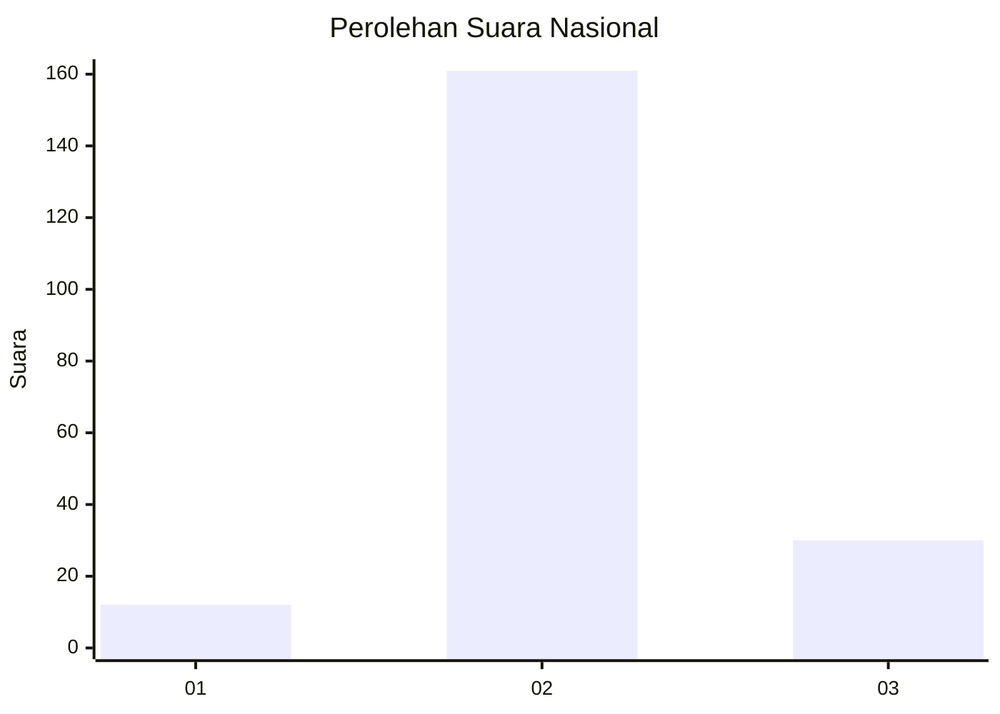

# Hasil

## Grafik

## Tabel

| No. | Nama Paslon    | Suara | Suara (raw) | Persentase |
|:--- |:-------------- | -----:| -----------:| ----------:|
| 1   | ANIES MUHAIMIN | 12    | [12][p-1]   | 5,91       |
| 2   | PRABOWO GIBRAN | 161   | [161][p-2]  | 79,31      |
| 3   | GANJAR MAHFUD  | 30    | [30][p-3]   | 14,78      |

[p-1]: https://github.com/gigit-pemilu/pemilu-2024/blob/main/pilpres/hitung-suara/sub/53-nusa-tenggara-timur/sub/14-rote-ndao/sub/10-landu-leko/sub/2004-daeurendale/sub/001-tps/sub/paslon-1.txt
[p-2]: https://github.com/gigit-pemilu/pemilu-2024/blob/main/pilpres/hitung-suara/sub/53-nusa-tenggara-timur/sub/14-rote-ndao/sub/10-landu-leko/sub/2004-daeurendale/sub/001-tps/sub/paslon-2.txt
[p-3]: https://github.com/gigit-pemilu/pemilu-2024/blob/main/pilpres/hitung-suara/sub/53-nusa-tenggara-timur/sub/14-rote-ndao/sub/10-landu-leko/sub/2004-daeurendale/sub/001-tps/sub/paslon-3.txt

## Foto C Plano

https://sirekap-obj-formc.kpu.go.id/fd48/pemilu/ppwp/53/14/10/20/04/5314102004001-20240215-065412--43e51827-2bf0-458a-b2e5-7a608bdd5fb5.jpg

https://sirekap-obj-formc.kpu.go.id/fd48/pemilu/ppwp/53/14/10/20/04/5314102004001-20240215-065606--2ec9f28f-7376-450b-9fab-d3d514112af0.jpg

https://sirekap-obj-formc.kpu.go.id/fd48/pemilu/ppwp/53/14/10/20/04/5314102004001-20240215-065741--06639512-3814-4a8c-bd9d-562f73bfc703.jpg

## Metadata

| Key        | Value               |
| ---------- | ------------------- |
| Time Stamp | 2024-02-15 16:30:25 |

