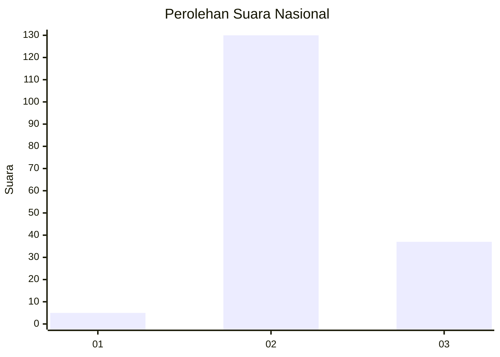

# Hasil

## Grafik

## Tabel

| No. | Nama Paslon    | Suara | Suara (raw) | Persentase |
|:--- |:-------------- | -----:| -----------:| ----------:|
| 1   | ANIES MUHAIMIN | 5     | [5][p-1]    | 2,91       |
| 2   | PRABOWO GIBRAN | 130   | [130][p-2]  | 75,58      |
| 3   | GANJAR MAHFUD  | 37    | [37][p-3]   | 21,51      |

[p-1]: https://github.com/gigit-pemilu/pemilu-2024/blob/main/pilpres/hitung-suara/sub/53-nusa-tenggara-timur/sub/14-rote-ndao/sub/11-loaholu/sub/2001-oelua/sub/001-tps/sub/paslon-1.txt
[p-2]: https://github.com/gigit-pemilu/pemilu-2024/blob/main/pilpres/hitung-suara/sub/53-nusa-tenggara-timur/sub/14-rote-ndao/sub/11-loaholu/sub/2001-oelua/sub/001-tps/sub/paslon-2.txt
[p-3]: https://github.com/gigit-pemilu/pemilu-2024/blob/main/pilpres/hitung-suara/sub/53-nusa-tenggara-timur/sub/14-rote-ndao/sub/11-loaholu/sub/2001-oelua/sub/001-tps/sub/paslon-3.txt

## Foto C Plano

https://sirekap-obj-formc.kpu.go.id/3dd8/pemilu/ppwp/53/14/11/20/01/5314112001001-20240215-095846--6120de17-8815-40cf-9e9e-848240f73746.jpg

https://sirekap-obj-formc.kpu.go.id/3dd8/pemilu/ppwp/53/14/11/20/01/5314112001001-20240215-095854--e9c95895-b112-499f-b900-c9cdc8094dfb.jpg

https://sirekap-obj-formc.kpu.go.id/3dd8/pemilu/ppwp/53/14/11/20/01/5314112001001-20240215-095900--d460199f-c1d2-4360-84a8-d78ec349de64.jpg

## Metadata

| Key        | Value               |
| ---------- | ------------------- |
| Time Stamp | 2024-02-15 22:30:27 |

