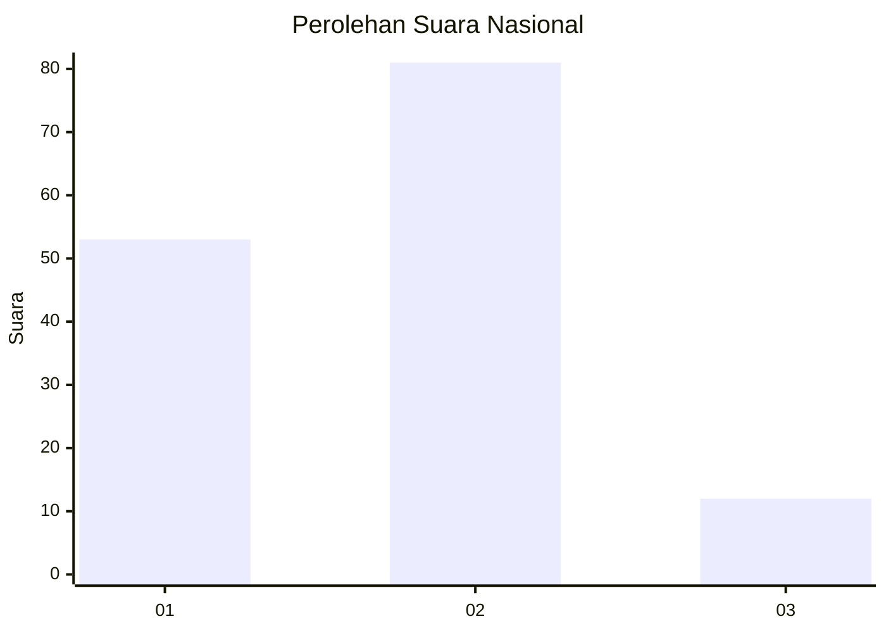
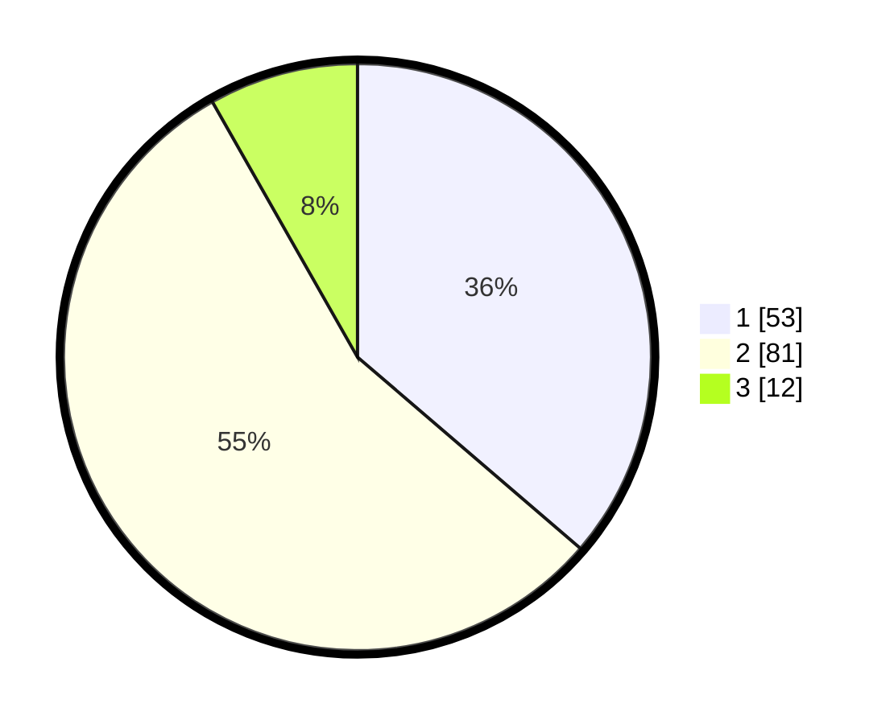

# Hasil

## Grafik

## Tabel

| No. | Nama Paslon    | Suara | Suara (raw) | Persentase |
|:--- |:-------------- | -----:| -----------:| ----------:|
| 1   | ANIES MUHAIMIN | 53    | [53][p-1]   | 36,30      |
| 2   | PRABOWO GIBRAN | 81    | [81][p-2]   | 55,48      |
| 3   | GANJAR MAHFUD  | 12    | [12][p-3]   | 8,22       |

[p-1]: https://github.com/gigit-pemilu/pemilu-2024/blob/main/pilpres/hitung-suara/sub/53-nusa-tenggara-timur/sub/14-rote-ndao/sub/11-loaholu/sub/2001-oelua/sub/003-tps/sub/paslon-1.txt
[p-2]: https://github.com/gigit-pemilu/pemilu-2024/blob/main/pilpres/hitung-suara/sub/53-nusa-tenggara-timur/sub/14-rote-ndao/sub/11-loaholu/sub/2001-oelua/sub/003-tps/sub/paslon-2.txt
[p-3]: https://github.com/gigit-pemilu/pemilu-2024/blob/main/pilpres/hitung-suara/sub/53-nusa-tenggara-timur/sub/14-rote-ndao/sub/11-loaholu/sub/2001-oelua/sub/003-tps/sub/paslon-3.txt

## Foto C Plano

https://sirekap-obj-formc.kpu.go.id/d636/pemilu/ppwp/53/14/11/20/01/5314112001003-20240215-065022--2da1a186-8ed8-4652-a1dd-0a25bcdd716b.jpg

https://sirekap-obj-formc.kpu.go.id/d636/pemilu/ppwp/53/14/11/20/01/5314112001003-20240215-065353--6de8f087-bbe1-4ecc-b65e-6bd5787f0efa.jpg

https://sirekap-obj-formc.kpu.go.id/d636/pemilu/ppwp/53/14/11/20/01/5314112001003-20240215-065502--88b62e99-3ead-4faf-b488-a24ff425111e.jpg

## Metadata

| Key        | Value               |
| ---------- | ------------------- |
| Time Stamp | 2024-02-15 17:00:25 |

