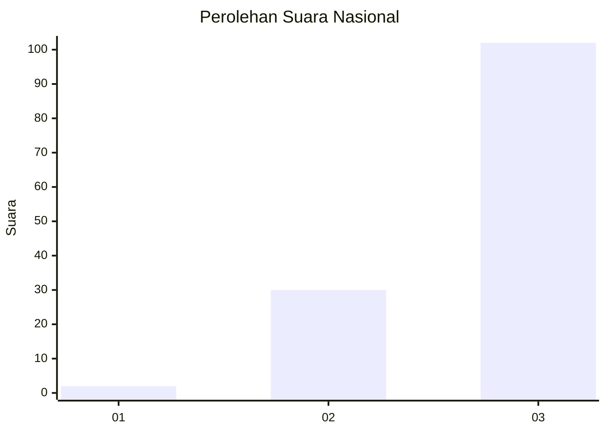
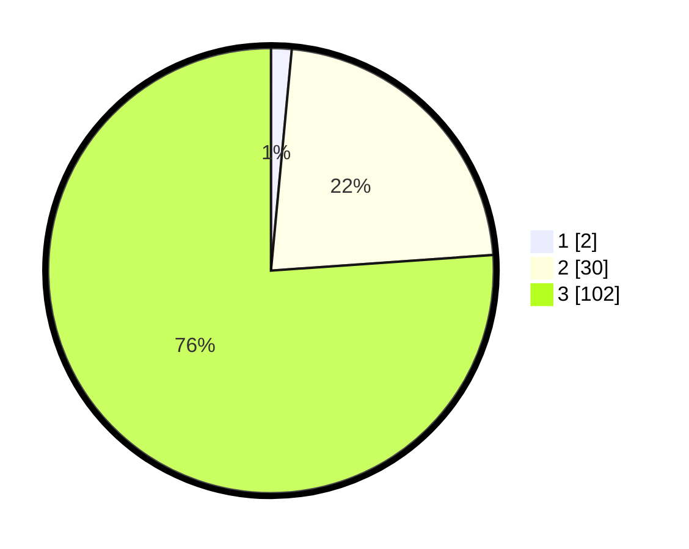

# Hasil

## Grafik

## Tabel

| No. | Nama Paslon    | Suara | Suara (raw) | Persentase |
|:--- |:-------------- | -----:| -----------:| ----------:|
| 1   | ANIES MUHAIMIN | 2     | [2][p-1]    | 1,49       |
| 2   | PRABOWO GIBRAN | 30    | [30][p-2]   | 22,39      |
| 3   | GANJAR MAHFUD  | 102   | [102][p-3]  | 76,12      |

[p-1]: https://github.com/gigit-pemilu/pemilu-2024/blob/main/pilpres/hitung-suara/sub/53-nusa-tenggara-timur/sub/14-rote-ndao/sub/11-loaholu/sub/2007-balaoli/sub/001-tps/sub/paslon-1.txt
[p-2]: https://github.com/gigit-pemilu/pemilu-2024/blob/main/pilpres/hitung-suara/sub/53-nusa-tenggara-timur/sub/14-rote-ndao/sub/11-loaholu/sub/2007-balaoli/sub/001-tps/sub/paslon-2.txt
[p-3]: https://github.com/gigit-pemilu/pemilu-2024/blob/main/pilpres/hitung-suara/sub/53-nusa-tenggara-timur/sub/14-rote-ndao/sub/11-loaholu/sub/2007-balaoli/sub/001-tps/sub/paslon-3.txt

## Foto C Plano

https://sirekap-obj-formc.kpu.go.id/4543/pemilu/ppwp/53/14/11/20/07/5314112007001-20240215-063917--2ce89a58-6e7b-4631-830a-fea7d00d8028.jpg

https://sirekap-obj-formc.kpu.go.id/4543/pemilu/ppwp/53/14/11/20/07/5314112007001-20240215-064058--b427ea50-f135-4a02-b0a1-38d76530542f.jpg

https://sirekap-obj-formc.kpu.go.id/4543/pemilu/ppwp/53/14/11/20/07/5314112007001-20240215-064207--8f5420ac-0260-40b8-b3db-a2adb6e68522.jpg

## Metadata

| Key        | Value               |
| ---------- | ------------------- |
| Time Stamp | 2024-02-15 19:30:26 |

