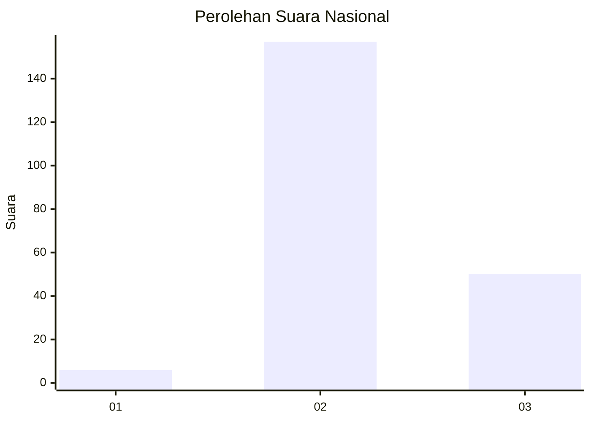
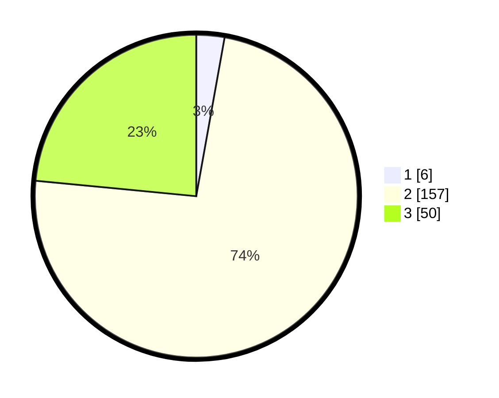

# Hasil

## Grafik

## Tabel

| No. | Nama Paslon    | Suara | Suara (raw) | Persentase |
|:--- |:-------------- | -----:| -----------:| ----------:|
| 1   | ANIES MUHAIMIN | 6     | [6][p-1]    | 2,82       |
| 2   | PRABOWO GIBRAN | 157   | [157][p-2]  | 73,71      |
| 3   | GANJAR MAHFUD  | 50    | [50][p-3]   | 23,47      |

[p-1]: https://github.com/gigit-pemilu/pemilu-2024/blob/main/pilpres/hitung-suara/sub/53-nusa-tenggara-timur/sub/15-manggarai-barat/sub/01-macang-pacar/sub/2001-bari/sub/001-tps/sub/paslon-1.txt
[p-2]: https://github.com/gigit-pemilu/pemilu-2024/blob/main/pilpres/hitung-suara/sub/53-nusa-tenggara-timur/sub/15-manggarai-barat/sub/01-macang-pacar/sub/2001-bari/sub/001-tps/sub/paslon-2.txt
[p-3]: https://github.com/gigit-pemilu/pemilu-2024/blob/main/pilpres/hitung-suara/sub/53-nusa-tenggara-timur/sub/15-manggarai-barat/sub/01-macang-pacar/sub/2001-bari/sub/001-tps/sub/paslon-3.txt

## Foto C Plano

https://sirekap-obj-formc.kpu.go.id/f871/pemilu/ppwp/53/15/01/20/01/5315012001001-20240225-162038--4bc6ef6f-954c-4290-bccc-fc25901523c6.jpg

https://sirekap-obj-formc.kpu.go.id/f871/pemilu/ppwp/53/15/01/20/01/5315012001001-20240225-162055--43e5aea0-5f09-4f1e-a9fe-4f52405906cf.jpg

https://sirekap-obj-formc.kpu.go.id/f871/pemilu/ppwp/53/15/01/20/01/5315012001001-20240225-162149--f6278517-97aa-404e-82a2-9eada58363ce.jpg

## Metadata

| Key        | Value               |
| ---------- | ------------------- |
| Time Stamp | 2024-02-26 17:00:04 |

