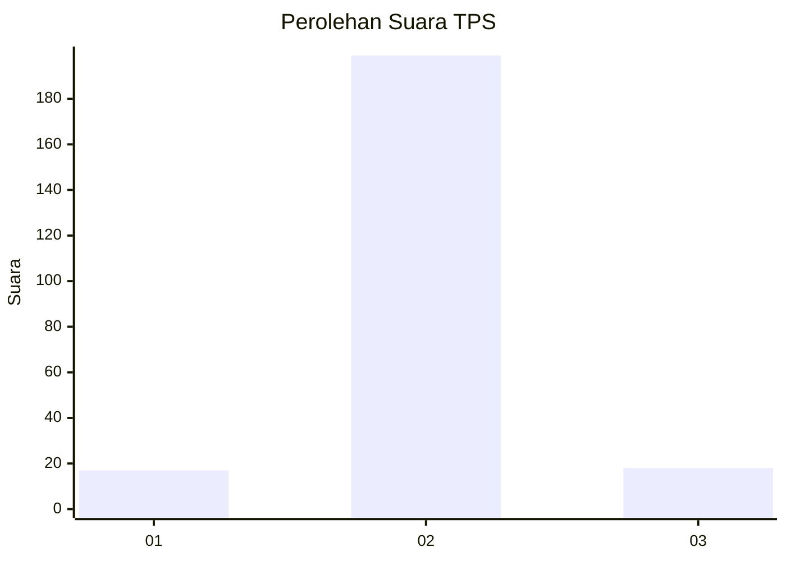
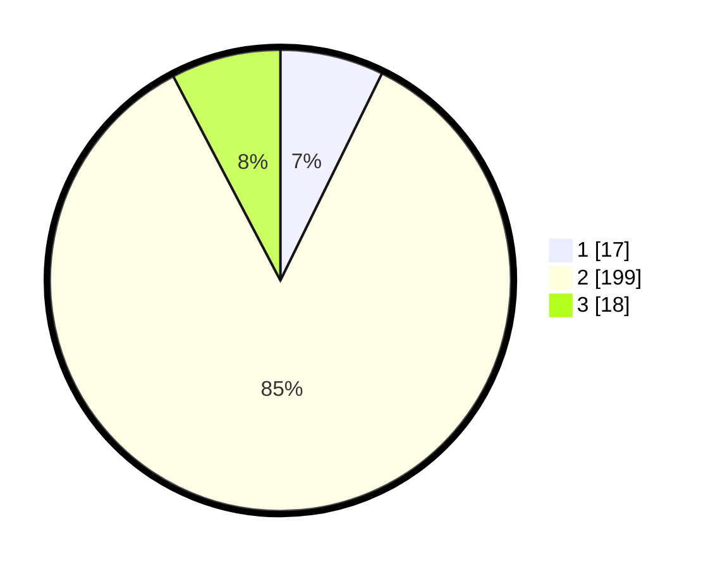

# Hasil

## Grafik

## Tabel

| No. | Nama Paslon    | Suara | Suara (raw) | Persentase |
|:--- |:-------------- | -----:| -----------:| ----------:|
| 1   | ANIES MUHAIMIN | 17    | [17][p-1]   | 7,26       |
| 2   | PRABOWO GIBRAN | 199   | [199][p-2]  | 85,04      |
| 3   | GANJAR MAHFUD  | 18    | [18][p-3]   | 7,69       |

[p-1]: https://github.com/gigit-pemilu/pemilu-2024-53-nusa-tenggara-timur/blob/main/pilpres/hitung-suara/sub/53-nusa-tenggara-timur/sub/15-manggarai-barat/sub/01-macang-pacar/sub/2001-bari/sub/002-tps/sub/paslon-1.txt
[p-2]: https://github.com/gigit-pemilu/pemilu-2024-53-nusa-tenggara-timur/blob/main/pilpres/hitung-suara/sub/53-nusa-tenggara-timur/sub/15-manggarai-barat/sub/01-macang-pacar/sub/2001-bari/sub/002-tps/sub/paslon-2.txt
[p-3]: https://github.com/gigit-pemilu/pemilu-2024-53-nusa-tenggara-timur/blob/main/pilpres/hitung-suara/sub/53-nusa-tenggara-timur/sub/15-manggarai-barat/sub/01-macang-pacar/sub/2001-bari/sub/002-tps/sub/paslon-3.txt

## Foto C Plano

https://sirekap-obj-formc.kpu.go.id/2ddb/pemilu/ppwp/53/15/01/20/01/5315012001002-20240226-083017--d092cc6a-6e0e-4426-8b7f-e684e6e866de.jpg

https://sirekap-obj-formc.kpu.go.id/2ddb/pemilu/ppwp/53/15/01/20/01/5315012001002-20240226-083048--1954fc9f-bdca-46ee-a658-81ee2f384daf.jpg

https://sirekap-obj-formc.kpu.go.id/2ddb/pemilu/ppwp/53/15/01/20/01/5315012001002-20240226-083104--ea2aedab-19d3-4ff9-88da-76e58e18daf9.jpg

## Metadata

| Key        | Value               |
| ---------- | ------------------- |
| Time Stamp | 2024-02-26 17:00:04 |

