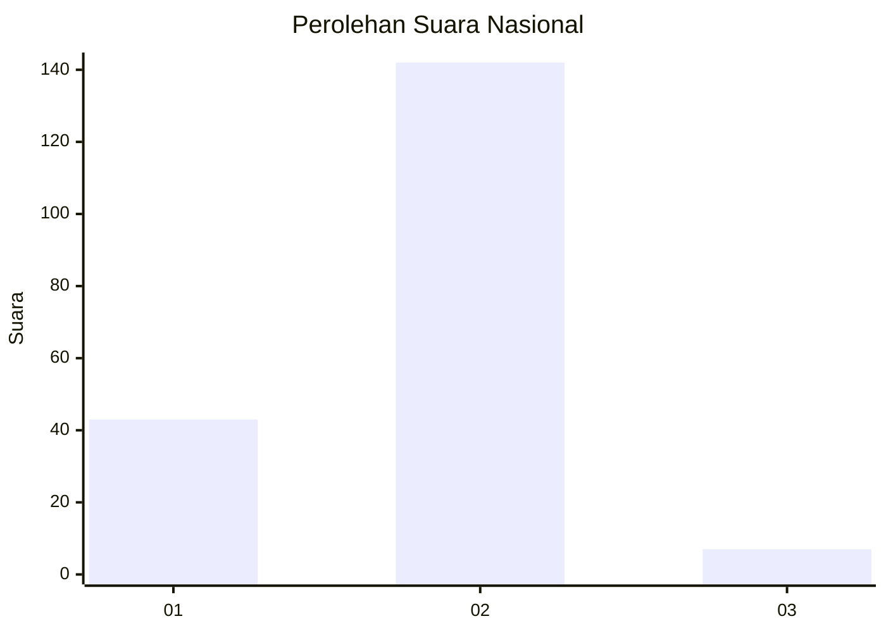

# Hasil

## Grafik

## Tabel

| No. | Nama Paslon    | Suara | Suara (raw) | Persentase |
|:--- |:-------------- | -----:| -----------:| ----------:|
| 1   | ANIES MUHAIMIN | 43    | [43][p-1]   | 22,40      |
| 2   | PRABOWO GIBRAN | 142   | [142][p-2]  | 73,96      |
| 3   | GANJAR MAHFUD  | 7     | [7][p-3]    | 3,65       |

[p-1]: https://github.com/gigit-pemilu/pemilu-2024/blob/main/pilpres/hitung-suara/sub/53-nusa-tenggara-timur/sub/15-manggarai-barat/sub/01-macang-pacar/sub/2001-bari/sub/004-tps/sub/paslon-1.txt
[p-2]: https://github.com/gigit-pemilu/pemilu-2024/blob/main/pilpres/hitung-suara/sub/53-nusa-tenggara-timur/sub/15-manggarai-barat/sub/01-macang-pacar/sub/2001-bari/sub/004-tps/sub/paslon-2.txt
[p-3]: https://github.com/gigit-pemilu/pemilu-2024/blob/main/pilpres/hitung-suara/sub/53-nusa-tenggara-timur/sub/15-manggarai-barat/sub/01-macang-pacar/sub/2001-bari/sub/004-tps/sub/paslon-3.txt

## Foto C Plano

https://sirekap-obj-formc.kpu.go.id/a568/pemilu/ppwp/53/15/01/20/01/5315012001004-20240226-121240--551157bf-14e6-494e-aac2-914e6067116f.jpg

https://sirekap-obj-formc.kpu.go.id/a568/pemilu/ppwp/53/15/01/20/01/5315012001004-20240226-121251--d1bf4239-3abf-4117-b436-022dc6392d05.jpg

https://sirekap-obj-formc.kpu.go.id/a568/pemilu/ppwp/53/15/01/20/01/5315012001004-20240226-121301--2f98dc90-94bb-4148-a71b-5e3b7cf239ef.jpg

## Metadata

| Key        | Value               |
| ---------- | ------------------- |
| Time Stamp | 2024-02-26 13:00:00 |

