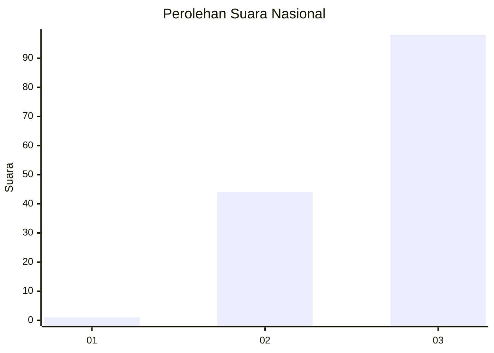
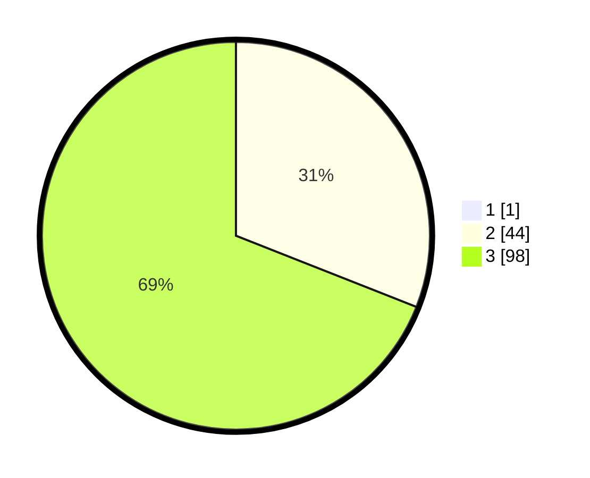

# Hasil

## Grafik

## Tabel

| No. | Nama Paslon    | Suara | Suara (raw) | Persentase |
|:--- |:-------------- | -----:| -----------:| ----------:|
| 1   | ANIES MUHAIMIN | 1     | [1][p-1]    | 0,70       |
| 2   | PRABOWO GIBRAN | 44    | [44][p-2]   | 30,77      |
| 3   | GANJAR MAHFUD  | 98    | [98][p-3]   | 68,53      |

[p-1]: https://github.com/gigit-pemilu/pemilu-2024/blob/main/pilpres/hitung-suara/sub/53-nusa-tenggara-timur/sub/15-manggarai-barat/sub/01-macang-pacar/sub/2002-rokap/sub/002-tps/sub/paslon-1.txt
[p-2]: https://github.com/gigit-pemilu/pemilu-2024/blob/main/pilpres/hitung-suara/sub/53-nusa-tenggara-timur/sub/15-manggarai-barat/sub/01-macang-pacar/sub/2002-rokap/sub/002-tps/sub/paslon-2.txt
[p-3]: https://github.com/gigit-pemilu/pemilu-2024/blob/main/pilpres/hitung-suara/sub/53-nusa-tenggara-timur/sub/15-manggarai-barat/sub/01-macang-pacar/sub/2002-rokap/sub/002-tps/sub/paslon-3.txt

## Foto C Plano

https://sirekap-obj-formc.kpu.go.id/989a/pemilu/ppwp/53/15/01/20/02/5315012002002-20240215-103924--70cb6ca9-7e21-41db-b715-46c362331cf6.jpg

https://sirekap-obj-formc.kpu.go.id/989a/pemilu/ppwp/53/15/01/20/02/5315012002002-20240215-104012--ed665827-fb14-42ca-a9a4-6d1c97ab0ad3.jpg

https://sirekap-obj-formc.kpu.go.id/989a/pemilu/ppwp/53/15/01/20/02/5315012002002-20240215-104201--41adb3d8-854c-42e6-82a6-7e77da2a1461.jpg

## Metadata

| Key        | Value               |
| ---------- | ------------------- |
| Time Stamp | 2024-02-16 22:30:00 |

