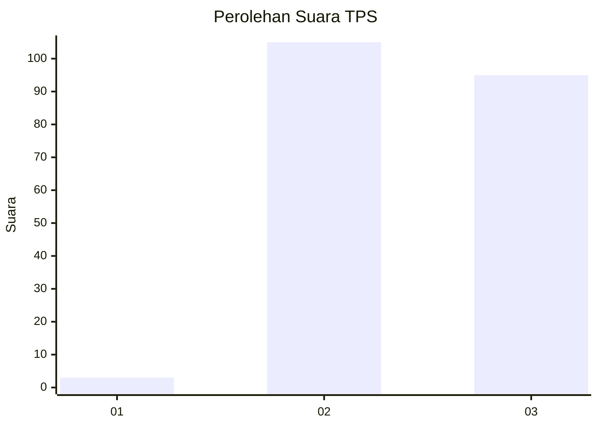
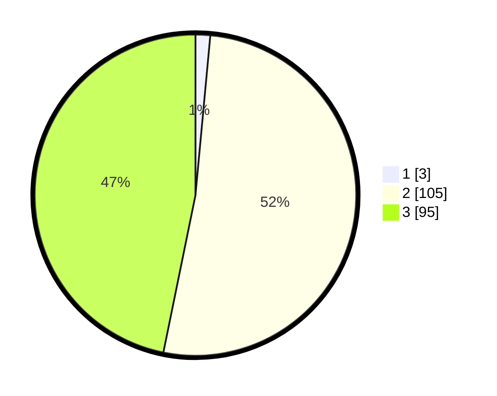

# Hasil

## Grafik

## Tabel

| No. | Nama Paslon    | Suara | Suara (raw) | Persentase |
|:--- |:-------------- | -----:| -----------:| ----------:|
| 1   | ANIES MUHAIMIN | 3     | [3][p-1]    | 1,48       |
| 2   | PRABOWO GIBRAN | 105   | [105][p-2]  | 51,72      |
| 3   | GANJAR MAHFUD  | 95    | [95][p-3]   | 46,80      |

[p-1]: https://github.com/gigit-pemilu/pemilu-2024-53-nusa-tenggara-timur/blob/main/pilpres/hitung-suara/sub/53-nusa-tenggara-timur/sub/15-manggarai-barat/sub/02-kuwus/sub/1022-golo-ru'u/sub/003-tps/sub/paslon-1.txt
[p-2]: https://github.com/gigit-pemilu/pemilu-2024-53-nusa-tenggara-timur/blob/main/pilpres/hitung-suara/sub/53-nusa-tenggara-timur/sub/15-manggarai-barat/sub/02-kuwus/sub/1022-golo-ru'u/sub/003-tps/sub/paslon-2.txt
[p-3]: https://github.com/gigit-pemilu/pemilu-2024-53-nusa-tenggara-timur/blob/main/pilpres/hitung-suara/sub/53-nusa-tenggara-timur/sub/15-manggarai-barat/sub/02-kuwus/sub/1022-golo-ru'u/sub/003-tps/sub/paslon-3.txt

## Foto C Plano

https://sirekap-obj-formc.kpu.go.id/6efc/pemilu/ppwp/53/15/02/10/22/5315021022003-20240214-231802--a9745b33-3b80-45ea-8d7c-363a547b0cb9.jpg

https://sirekap-obj-formc.kpu.go.id/6efc/pemilu/ppwp/53/15/02/10/22/5315021022003-20240214-233049--0ad0a338-7647-45ec-aaab-2f862b13f0ac.jpg

https://sirekap-obj-formc.kpu.go.id/6efc/pemilu/ppwp/53/15/02/10/22/5315021022003-20240214-233758--7bfa5f5c-654d-4bd9-acd7-c61532f51df2.jpg

## Metadata

| Key        | Value               |
| ---------- | ------------------- |
| Time Stamp | 2024-02-15 20:00:44 |

