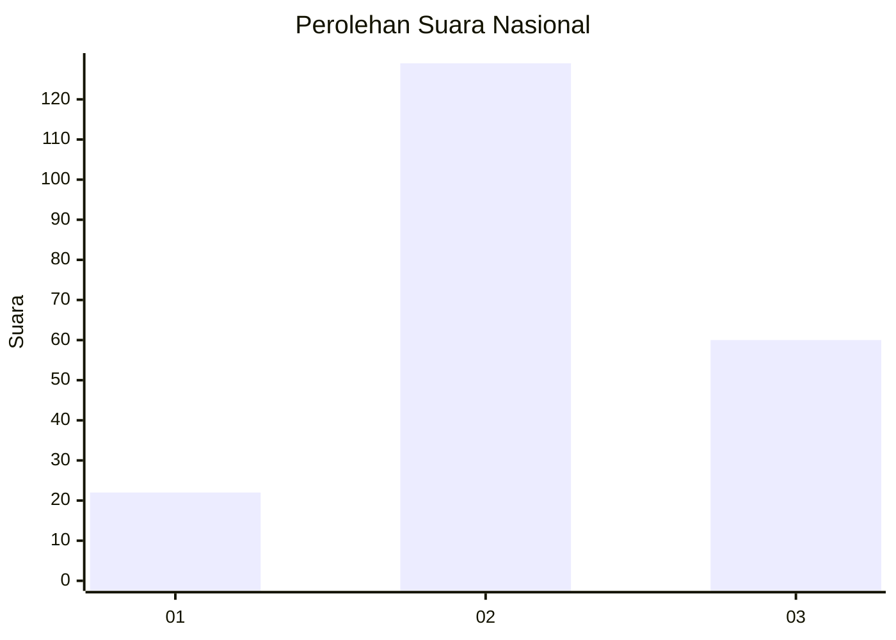
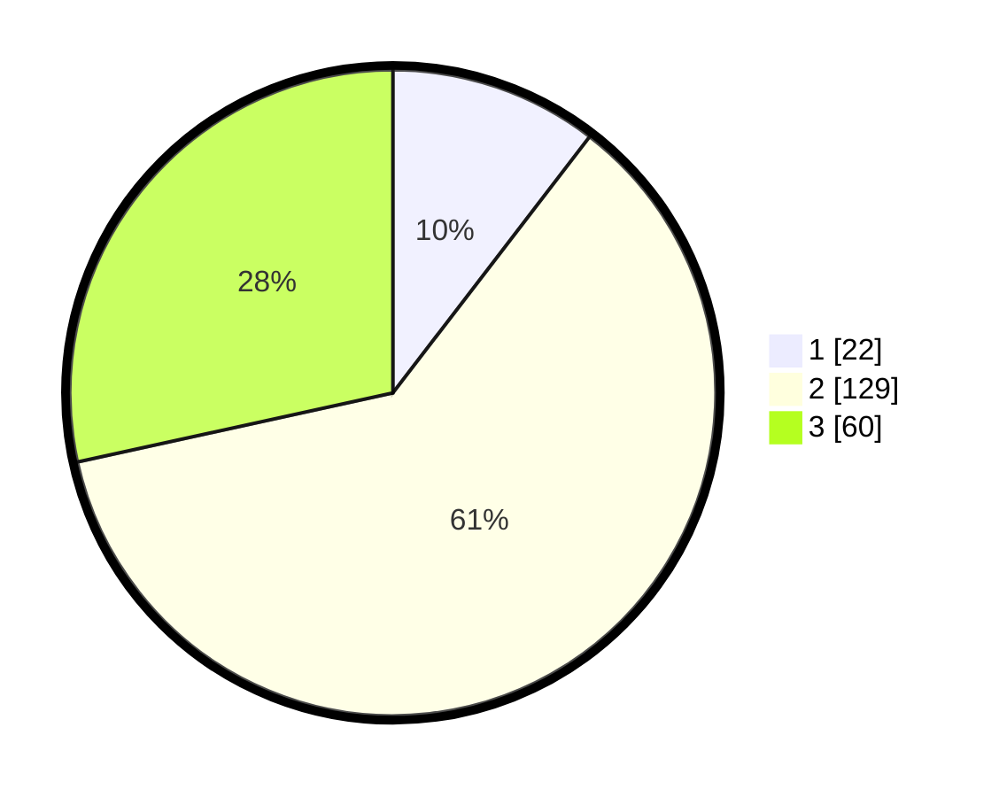

# Hasil

## Grafik

## Tabel

| No. | Nama Paslon    | Suara | Suara (raw) | Persentase |
|:--- |:-------------- | -----:| -----------:| ----------:|
| 1   | ANIES MUHAIMIN | 22    | [22][p-1]   | 10,43      |
| 2   | PRABOWO GIBRAN | 129   | [129][p-2]  | 61,14      |
| 3   | GANJAR MAHFUD  | 60    | [60][p-3]   | 28,44      |

[p-1]: https://github.com/gigit-pemilu/pemilu-2024/blob/main/pilpres/hitung-suara/sub/53-nusa-tenggara-timur/sub/15-manggarai-barat/sub/03-lembor/sub/1032-tangge/sub/001-tps/sub/paslon-1.txt
[p-2]: https://github.com/gigit-pemilu/pemilu-2024/blob/main/pilpres/hitung-suara/sub/53-nusa-tenggara-timur/sub/15-manggarai-barat/sub/03-lembor/sub/1032-tangge/sub/001-tps/sub/paslon-2.txt
[p-3]: https://github.com/gigit-pemilu/pemilu-2024/blob/main/pilpres/hitung-suara/sub/53-nusa-tenggara-timur/sub/15-manggarai-barat/sub/03-lembor/sub/1032-tangge/sub/001-tps/sub/paslon-3.txt

## Foto C Plano

https://sirekap-obj-formc.kpu.go.id/8bf5/pemilu/ppwp/53/15/03/10/32/5315031032001-20240215-084640--152b340a-cbfd-4922-a4d0-e94ba7c7df1e.jpg

https://sirekap-obj-formc.kpu.go.id/8bf5/pemilu/ppwp/53/15/03/10/32/5315031032001-20240215-084756--35e98558-6af3-49b8-976f-4e8839bcdae5.jpg

https://sirekap-obj-formc.kpu.go.id/8bf5/pemilu/ppwp/53/15/03/10/32/5315031032001-20240215-084857--27049462-6276-4530-b4f0-fb9ae254eedf.jpg

## Metadata

| Key        | Value               |
| ---------- | ------------------- |
| Time Stamp | 2024-02-15 21:30:27 |

