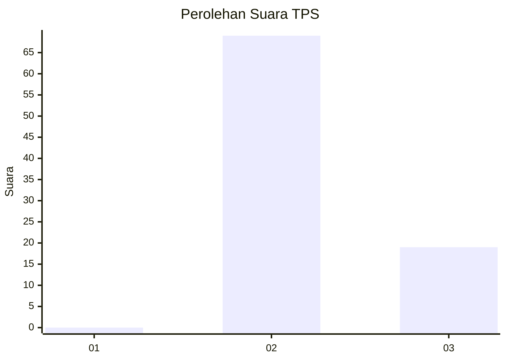
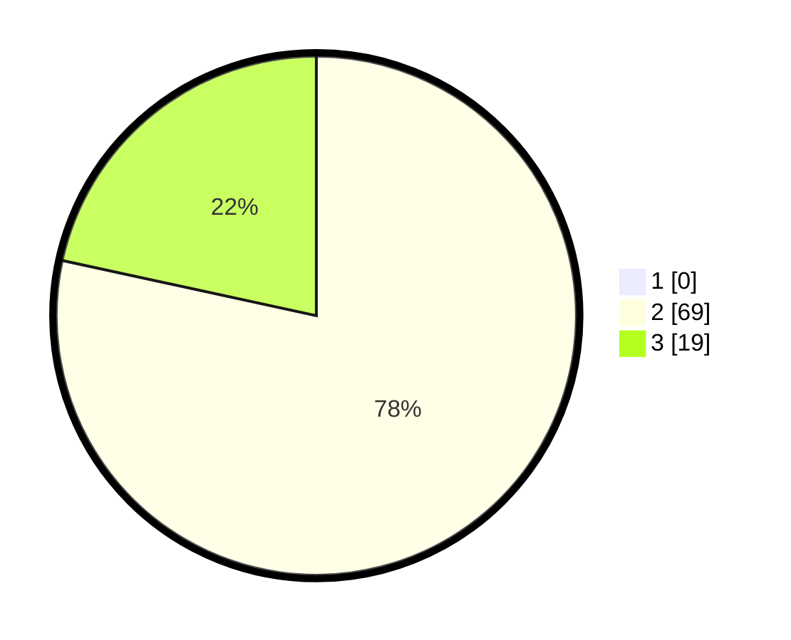

# Hasil

## Grafik

## Tabel

| No. | Nama Paslon    | Suara | Suara (raw) | Persentase |
|:--- |:-------------- | -----:| -----------:| ----------:|
| 1   | ANIES MUHAIMIN | 0     | [0][p-1]    | 0,00       |
| 2   | PRABOWO GIBRAN | 69    | [69][p-2]   | 78,41      |
| 3   | GANJAR MAHFUD  | 19    | [19][p-3]   | 21,59      |

[p-1]: https://github.com/gigit-pemilu/pemilu-2024-53-nusa-tenggara-timur/blob/main/pilpres/hitung-suara/sub/53-nusa-tenggara-timur/sub/15-manggarai-barat/sub/04-sano-nggoang/sub/2001-golo-ndaring/sub/004-tps/sub/paslon-1.txt
[p-2]: https://github.com/gigit-pemilu/pemilu-2024-53-nusa-tenggara-timur/blob/main/pilpres/hitung-suara/sub/53-nusa-tenggara-timur/sub/15-manggarai-barat/sub/04-sano-nggoang/sub/2001-golo-ndaring/sub/004-tps/sub/paslon-2.txt
[p-3]: https://github.com/gigit-pemilu/pemilu-2024-53-nusa-tenggara-timur/blob/main/pilpres/hitung-suara/sub/53-nusa-tenggara-timur/sub/15-manggarai-barat/sub/04-sano-nggoang/sub/2001-golo-ndaring/sub/004-tps/sub/paslon-3.txt

## Foto C Plano

https://sirekap-obj-formc.kpu.go.id/2a7c/pemilu/ppwp/53/15/04/20/01/5315042001004-20240215-080048--f8d8e300-e16b-4696-8c0c-6f1d0f47f7c8.jpg

https://sirekap-obj-formc.kpu.go.id/2a7c/pemilu/ppwp/53/15/04/20/01/5315042001004-20240215-014712--a796f40b-1cef-461f-9e12-32175d8cf76a.jpg

https://sirekap-obj-formc.kpu.go.id/2a7c/pemilu/ppwp/53/15/04/20/01/5315042001004-20240215-014745--6d7bd23d-d48f-4e25-8f0c-d07e773b1594.jpg

## Metadata

| Key        | Value               |
| ---------- | ------------------- |
| Time Stamp | 2024-02-16 10:30:29 |

