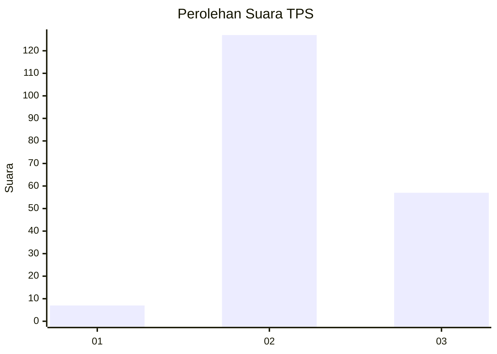

# Hasil

## Grafik

## Tabel

| No. | Nama Paslon    | Suara | Suara (raw) | Persentase |
|:--- |:-------------- | -----:| -----------:| ----------:|
| 1   | ANIES MUHAIMIN | 7     | [7][p-1]    | 3,66       |
| 2   | PRABOWO GIBRAN | 127   | [127][p-2]  | 66,49      |
| 3   | GANJAR MAHFUD  | 57    | [57][p-3]   | 29,84      |

[p-1]: https://github.com/gigit-pemilu/pemilu-2024-53-nusa-tenggara-timur/blob/main/pilpres/hitung-suara/sub/53-nusa-tenggara-timur/sub/15-manggarai-barat/sub/04-sano-nggoang/sub/2005-golo-kempo/sub/002-tps/sub/paslon-1.txt
[p-2]: https://github.com/gigit-pemilu/pemilu-2024-53-nusa-tenggara-timur/blob/main/pilpres/hitung-suara/sub/53-nusa-tenggara-timur/sub/15-manggarai-barat/sub/04-sano-nggoang/sub/2005-golo-kempo/sub/002-tps/sub/paslon-2.txt
[p-3]: https://github.com/gigit-pemilu/pemilu-2024-53-nusa-tenggara-timur/blob/main/pilpres/hitung-suara/sub/53-nusa-tenggara-timur/sub/15-manggarai-barat/sub/04-sano-nggoang/sub/2005-golo-kempo/sub/002-tps/sub/paslon-3.txt

## Foto C Plano

https://sirekap-obj-formc.kpu.go.id/a0cf/pemilu/ppwp/53/15/04/20/05/5315042005002-20240215-022850--004e3d2b-dd47-4150-83be-fd029ae854d1.jpg

https://sirekap-obj-formc.kpu.go.id/a0cf/pemilu/ppwp/53/15/04/20/05/5315042005002-20240215-022906--e0b8605b-9bfa-48b3-a9fe-b4c0995a6d1e.jpg

https://sirekap-obj-formc.kpu.go.id/a0cf/pemilu/ppwp/53/15/04/20/05/5315042005002-20240215-022921--870532a6-a8c7-4f81-9eda-ca13f9c070da.jpg

## Metadata

| Key        | Value               |
| ---------- | ------------------- |
| Time Stamp | 2024-02-15 21:30:27 |

