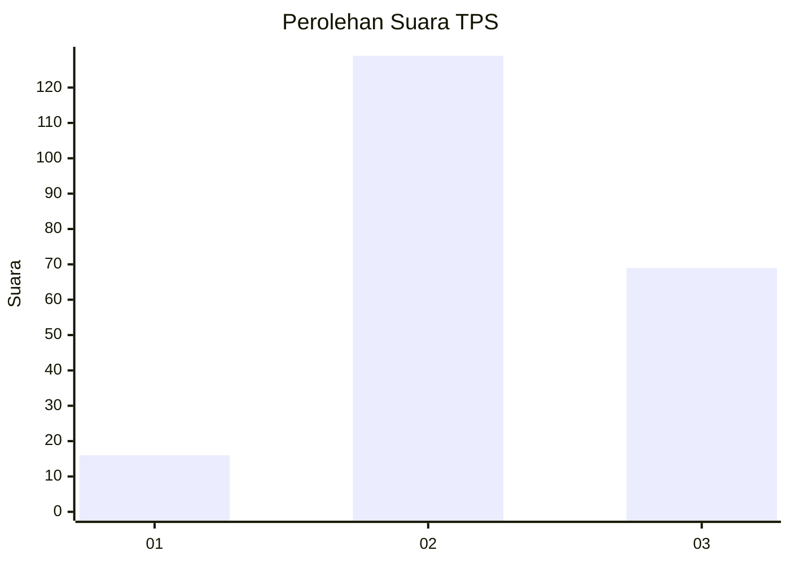
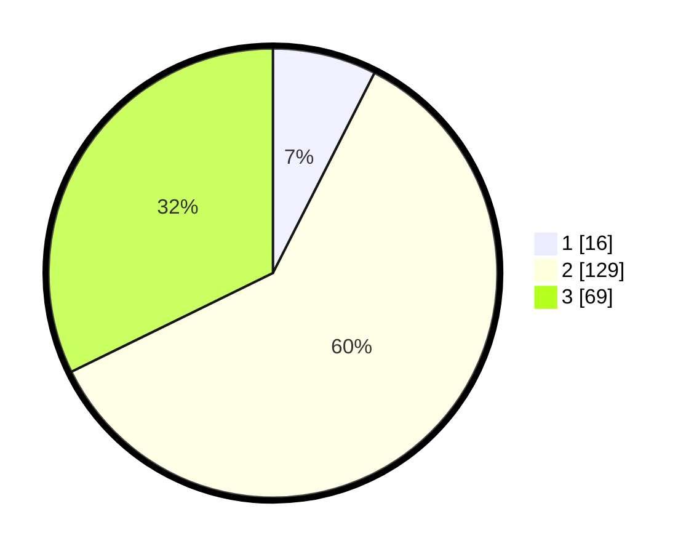

# Hasil

## Grafik

## Tabel

| No. | Nama Paslon    | Suara | Suara (raw) | Persentase |
|:--- |:-------------- | -----:| -----------:| ----------:|
| 1   | ANIES MUHAIMIN | 16    | [16][p-1]   | 7,48       |
| 2   | PRABOWO GIBRAN | 129   | [129][p-2]  | 60,28      |
| 3   | GANJAR MAHFUD  | 69    | [69][p-3]   | 32,24      |

[p-1]: https://github.com/gigit-pemilu/pemilu-2024-53-nusa-tenggara-timur/blob/main/pilpres/hitung-suara/sub/53-nusa-tenggara-timur/sub/15-manggarai-barat/sub/04-sano-nggoang/sub/2008-golo-manting/sub/003-tps/sub/paslon-1.txt
[p-2]: https://github.com/gigit-pemilu/pemilu-2024-53-nusa-tenggara-timur/blob/main/pilpres/hitung-suara/sub/53-nusa-tenggara-timur/sub/15-manggarai-barat/sub/04-sano-nggoang/sub/2008-golo-manting/sub/003-tps/sub/paslon-2.txt
[p-3]: https://github.com/gigit-pemilu/pemilu-2024-53-nusa-tenggara-timur/blob/main/pilpres/hitung-suara/sub/53-nusa-tenggara-timur/sub/15-manggarai-barat/sub/04-sano-nggoang/sub/2008-golo-manting/sub/003-tps/sub/paslon-3.txt

## Foto C Plano

https://sirekap-obj-formc.kpu.go.id/2616/pemilu/ppwp/53/15/04/20/08/5315042008003-20240214-195821--fb552904-0a55-42f0-ac61-8c90ae9f1c12.jpg

https://sirekap-obj-formc.kpu.go.id/2616/pemilu/ppwp/53/15/04/20/08/5315042008003-20240214-200426--dda24f4b-b44d-494b-9dda-cae2a58d5855.jpg

https://sirekap-obj-formc.kpu.go.id/2616/pemilu/ppwp/53/15/04/20/08/5315042008003-20240214-200631--d8c962f3-a326-4dd9-a545-df30e46f8eb9.jpg

## Metadata

| Key        | Value               |
| ---------- | ------------------- |
| Time Stamp | 2024-02-15 15:00:29 |

