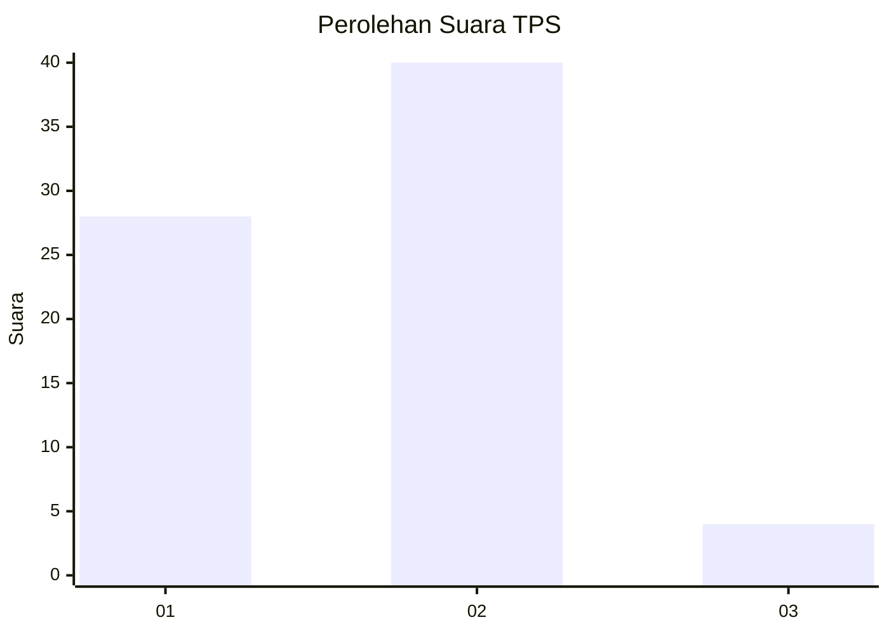
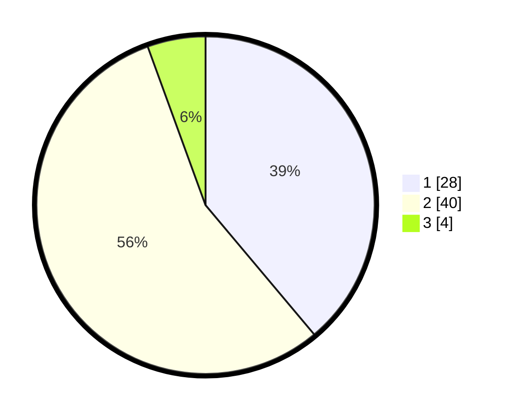

# Hasil

## Grafik

## Tabel

| No. | Nama Paslon    | Suara | Suara (raw) | Persentase |
|:--- |:-------------- | -----:| -----------:| ----------:|
| 1   | ANIES MUHAIMIN | 28    | [28][p-1]   | 38,89      |
| 2   | PRABOWO GIBRAN | 40    | [40][p-2]   | 55,56      |
| 3   | GANJAR MAHFUD  | 4     | [4][p-3]    | 5,56       |

[p-1]: https://github.com/gigit-pemilu/pemilu-2024-53-nusa-tenggara-timur/blob/main/pilpres/hitung-suara/sub/53-nusa-tenggara-timur/sub/15-manggarai-barat/sub/04-sano-nggoang/sub/2009-matawae/sub/006-tps/sub/paslon-1.txt
[p-2]: https://github.com/gigit-pemilu/pemilu-2024-53-nusa-tenggara-timur/blob/main/pilpres/hitung-suara/sub/53-nusa-tenggara-timur/sub/15-manggarai-barat/sub/04-sano-nggoang/sub/2009-matawae/sub/006-tps/sub/paslon-2.txt
[p-3]: https://github.com/gigit-pemilu/pemilu-2024-53-nusa-tenggara-timur/blob/main/pilpres/hitung-suara/sub/53-nusa-tenggara-timur/sub/15-manggarai-barat/sub/04-sano-nggoang/sub/2009-matawae/sub/006-tps/sub/paslon-3.txt

## Foto C Plano

https://sirekap-obj-formc.kpu.go.id/a33d/pemilu/ppwp/53/15/04/20/09/5315042009006-20240214-232019--6f8d867e-1789-40f1-9050-eb42e7b3c2a7.jpg

https://sirekap-obj-formc.kpu.go.id/a33d/pemilu/ppwp/53/15/04/20/09/5315042009006-20240214-233215--4d046f1b-9465-4003-9837-07d96f8fcf8e.jpg

https://sirekap-obj-formc.kpu.go.id/a33d/pemilu/ppwp/53/15/04/20/09/5315042009006-20240214-224726--1742f948-619f-4356-a390-2c6a333f910a.jpg

## Metadata

| Key        | Value               |
| ---------- | ------------------- |
| Time Stamp | 2024-02-16 10:30:29 |

