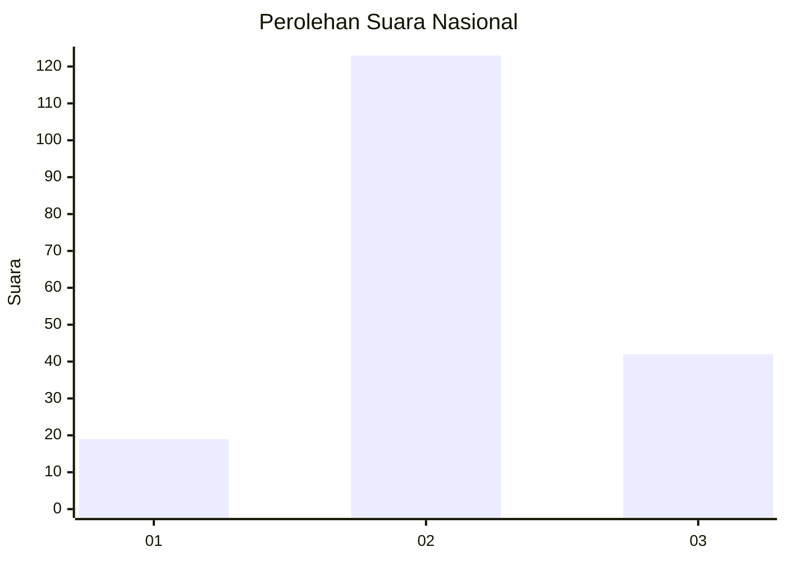
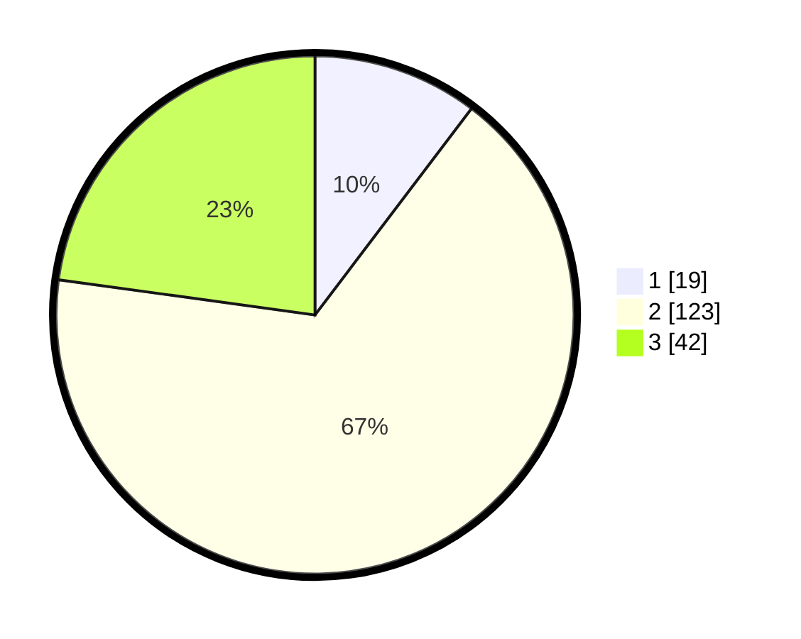

# Hasil

## Grafik

## Tabel

| No. | Nama Paslon    | Suara | Suara (raw) | Persentase |
|:--- |:-------------- | -----:| -----------:| ----------:|
| 1   | ANIES MUHAIMIN | 19    | [19][p-1]   | 10,33      |
| 2   | PRABOWO GIBRAN | 123   | [123][p-2]  | 66,85      |
| 3   | GANJAR MAHFUD  | 42    | [42][p-3]   | 22,83      |

[p-1]: https://github.com/gigit-pemilu/pemilu-2024/blob/main/pilpres/hitung-suara/sub/53-nusa-tenggara-timur/sub/15-manggarai-barat/sub/05-komodo/sub/1024-wae-kelambu/sub/005-tps/sub/paslon-1.txt
[p-2]: https://github.com/gigit-pemilu/pemilu-2024/blob/main/pilpres/hitung-suara/sub/53-nusa-tenggara-timur/sub/15-manggarai-barat/sub/05-komodo/sub/1024-wae-kelambu/sub/005-tps/sub/paslon-2.txt
[p-3]: https://github.com/gigit-pemilu/pemilu-2024/blob/main/pilpres/hitung-suara/sub/53-nusa-tenggara-timur/sub/15-manggarai-barat/sub/05-komodo/sub/1024-wae-kelambu/sub/005-tps/sub/paslon-3.txt

## Foto C Plano

https://sirekap-obj-formc.kpu.go.id/bd2f/pemilu/ppwp/53/15/05/10/24/5315051024005-20240215-035854--266ef131-f8f2-46ce-9bd5-49bfd25f5b7d.jpg

https://sirekap-obj-formc.kpu.go.id/bd2f/pemilu/ppwp/53/15/05/10/24/5315051024005-20240215-040228--8bf1e550-b3b0-4c83-8844-3979e026ab2b.jpg

https://sirekap-obj-formc.kpu.go.id/bd2f/pemilu/ppwp/53/15/05/10/24/5315051024005-20240215-040700--a90f0209-fa34-48a4-9bb5-ba14e6efd5ca.jpg

## Metadata

| Key        | Value               |
| ---------- | ------------------- |
| Time Stamp | 2024-02-15 17:00:25 |

