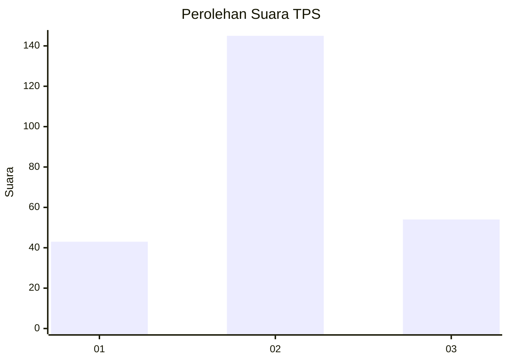
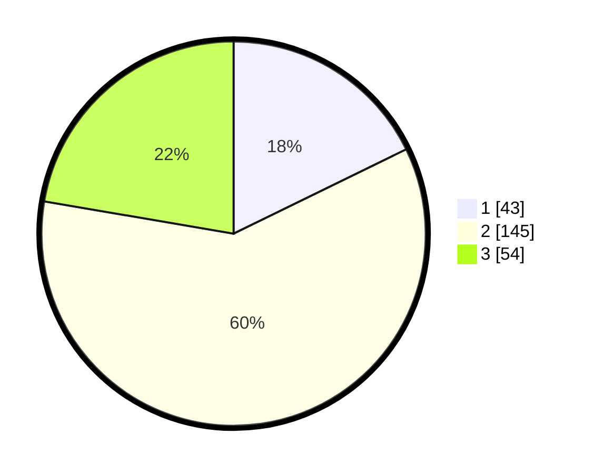

# Hasil

## Grafik

## Tabel

| No. | Nama Paslon    | Suara | Suara (raw) | Persentase |
|:--- |:-------------- | -----:| -----------:| ----------:|
| 1   | ANIES MUHAIMIN | 43    | [43][p-1]   | 17,77      |
| 2   | PRABOWO GIBRAN | 145   | [145][p-2]  | 59,92      |
| 3   | GANJAR MAHFUD  | 54    | [54][p-3]   | 22,31      |

[p-1]: https://github.com/gigit-pemilu/pemilu-2024-53-nusa-tenggara-timur/blob/main/pilpres/hitung-suara/sub/53-nusa-tenggara-timur/sub/15-manggarai-barat/sub/05-komodo/sub/1024-wae-kelambu/sub/006-tps/sub/paslon-1.txt
[p-2]: https://github.com/gigit-pemilu/pemilu-2024-53-nusa-tenggara-timur/blob/main/pilpres/hitung-suara/sub/53-nusa-tenggara-timur/sub/15-manggarai-barat/sub/05-komodo/sub/1024-wae-kelambu/sub/006-tps/sub/paslon-2.txt
[p-3]: https://github.com/gigit-pemilu/pemilu-2024-53-nusa-tenggara-timur/blob/main/pilpres/hitung-suara/sub/53-nusa-tenggara-timur/sub/15-manggarai-barat/sub/05-komodo/sub/1024-wae-kelambu/sub/006-tps/sub/paslon-3.txt

## Foto C Plano

https://sirekap-obj-formc.kpu.go.id/ef78/pemilu/ppwp/53/15/05/10/24/5315051024006-20240215-020646--a02dd4c2-a9b0-4fad-93aa-fc134679f82c.jpg

https://sirekap-obj-formc.kpu.go.id/ef78/pemilu/ppwp/53/15/05/10/24/5315051024006-20240215-020439--02961f8d-ca99-425d-87ef-da7f64665ebf.jpg

https://sirekap-obj-formc.kpu.go.id/ef78/pemilu/ppwp/53/15/05/10/24/5315051024006-20240215-020525--52bdec67-6bb8-4b9e-ad73-a2ea17afccab.jpg

## Metadata

| Key        | Value               |
| ---------- | ------------------- |
| Time Stamp | 2024-02-15 15:00:29 |

