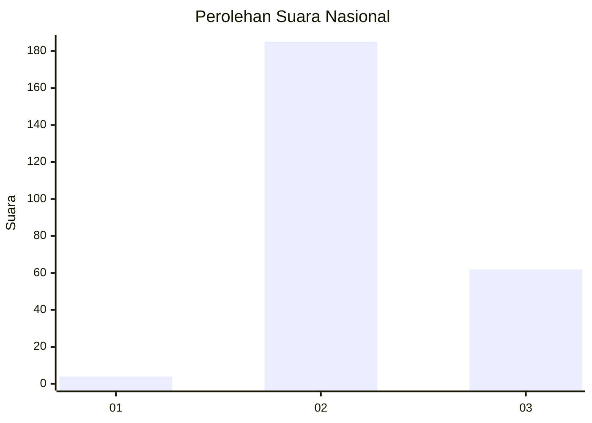
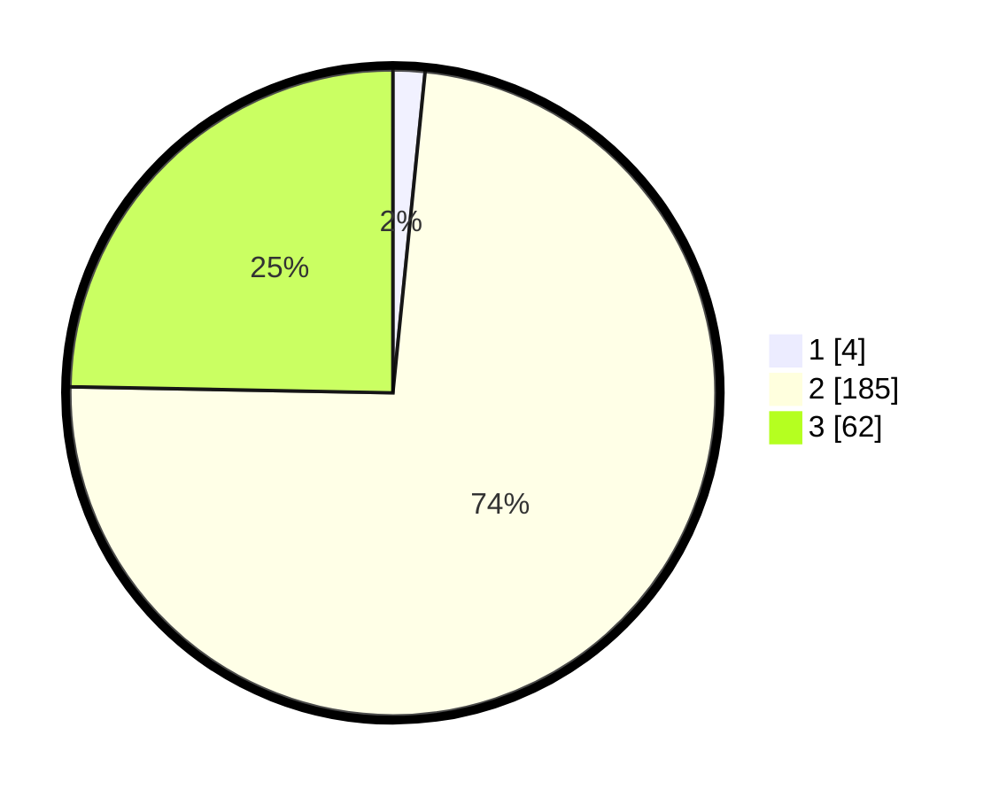

# Hasil

## Grafik

## Tabel

| No. | Nama Paslon    | Suara | Suara (raw) | Persentase |
|:--- |:-------------- | -----:| -----------:| ----------:|
| 1   | ANIES MUHAIMIN | 4     | [4][p-1]    | 1,59       |
| 2   | PRABOWO GIBRAN | 185   | [185][p-2]  | 73,71      |
| 3   | GANJAR MAHFUD  | 62    | [62][p-3]   | 24,70      |

[p-1]: https://github.com/gigit-pemilu/pemilu-2024/blob/main/pilpres/hitung-suara/sub/53-nusa-tenggara-timur/sub/15-manggarai-barat/sub/05-komodo/sub/1024-wae-kelambu/sub/010-tps/sub/paslon-1.txt
[p-2]: https://github.com/gigit-pemilu/pemilu-2024/blob/main/pilpres/hitung-suara/sub/53-nusa-tenggara-timur/sub/15-manggarai-barat/sub/05-komodo/sub/1024-wae-kelambu/sub/010-tps/sub/paslon-2.txt
[p-3]: https://github.com/gigit-pemilu/pemilu-2024/blob/main/pilpres/hitung-suara/sub/53-nusa-tenggara-timur/sub/15-manggarai-barat/sub/05-komodo/sub/1024-wae-kelambu/sub/010-tps/sub/paslon-3.txt

## Foto C Plano

https://sirekap-obj-formc.kpu.go.id/df99/pemilu/ppwp/53/15/05/10/24/5315051024010-20240215-022119--c0e78e03-b277-4613-807e-e5a5bb8b24e4.jpg

https://sirekap-obj-formc.kpu.go.id/df99/pemilu/ppwp/53/15/05/10/24/5315051024010-20240215-030811--92db6bae-ac8e-4521-a6e8-cf289f0f6074.jpg

https://sirekap-obj-formc.kpu.go.id/df99/pemilu/ppwp/53/15/05/10/24/5315051024010-20240215-023020--97c1251f-7a83-474e-9894-690c607f6480.jpg

## Metadata

| Key        | Value               |
| ---------- | ------------------- |
| Time Stamp | 2024-02-15 17:00:25 |

