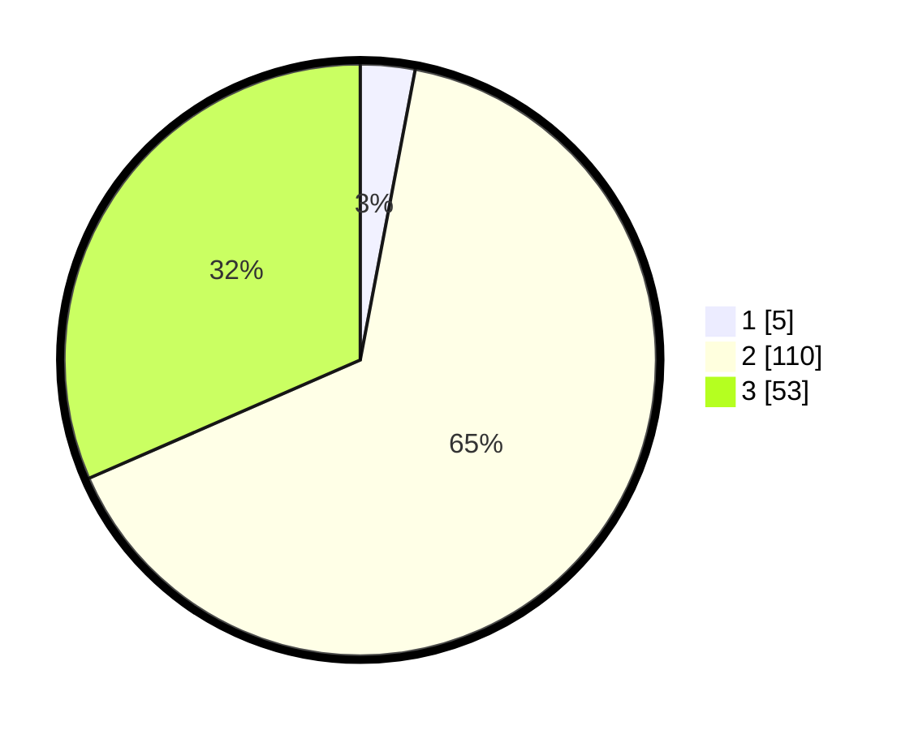

# Hasil

## Grafik

## Tabel

| No. | Nama Paslon    | Suara | Suara (raw) | Persentase |
|:--- |:-------------- | -----:| -----------:| ----------:|
| 1   | ANIES MUHAIMIN | 5     | [5][p-1]    | 2,98       |
| 2   | PRABOWO GIBRAN | 110   | [110][p-2]  | 65,48      |
| 3   | GANJAR MAHFUD  | 53    | [53][p-3]   | 31,55      |

[p-1]: https://github.com/gigit-pemilu/pemilu-2024-53-nusa-tenggara-timur/blob/main/pilpres/hitung-suara/sub/53-nusa-tenggara-timur/sub/15-manggarai-barat/sub/05-komodo/sub/1024-wae-kelambu/sub/011-tps/sub/paslon-1.txt
[p-2]: https://github.com/gigit-pemilu/pemilu-2024-53-nusa-tenggara-timur/blob/main/pilpres/hitung-suara/sub/53-nusa-tenggara-timur/sub/15-manggarai-barat/sub/05-komodo/sub/1024-wae-kelambu/sub/011-tps/sub/paslon-2.txt
[p-3]: https://github.com/gigit-pemilu/pemilu-2024-53-nusa-tenggara-timur/blob/main/pilpres/hitung-suara/sub/53-nusa-tenggara-timur/sub/15-manggarai-barat/sub/05-komodo/sub/1024-wae-kelambu/sub/011-tps/sub/paslon-3.txt

## Foto C Plano

https://sirekap-obj-formc.kpu.go.id/bd8c/pemilu/ppwp/53/15/05/10/24/5315051024011-20240214-221501--e46dd3d4-afed-4820-b5e6-e0d2b6b19d74.jpg

https://sirekap-obj-formc.kpu.go.id/bd8c/pemilu/ppwp/53/15/05/10/24/5315051024011-20240214-231911--dbfbe017-81bd-48cd-85aa-41e5afcdd86c.jpg

https://sirekap-obj-formc.kpu.go.id/bd8c/pemilu/ppwp/53/15/05/10/24/5315051024011-20240214-231838--8cb9d7ab-fd46-4859-8d02-640a56705e9a.jpg

## Metadata

| Key        | Value               |
| ---------- | ------------------- |
| Time Stamp | 2024-02-15 15:00:29 |

