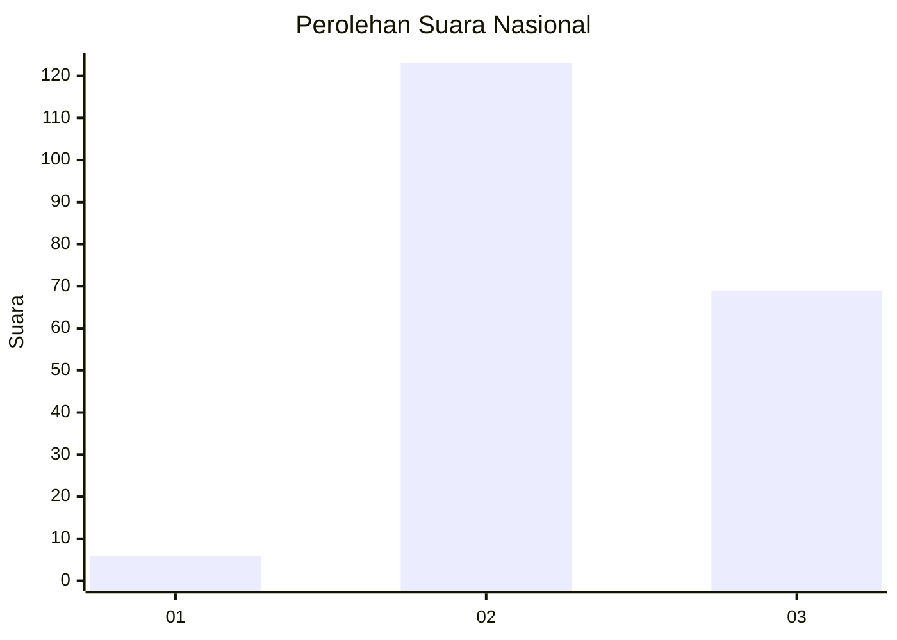
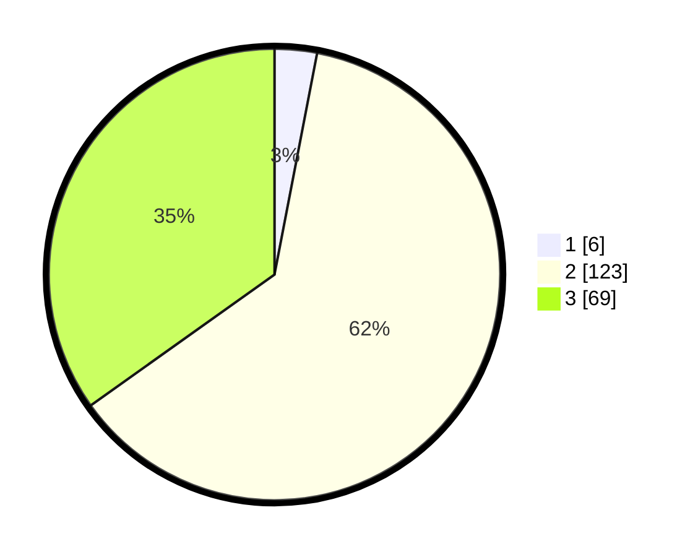

# Hasil

## Grafik

## Tabel

| No. | Nama Paslon    | Suara | Suara (raw) | Persentase |
|:--- |:-------------- | -----:| -----------:| ----------:|
| 1   | ANIES MUHAIMIN | 6     | [6][p-1]    | 3,03       |
| 2   | PRABOWO GIBRAN | 123   | [123][p-2]  | 62,12      |
| 3   | GANJAR MAHFUD  | 69    | [69][p-3]   | 34,85      |

[p-1]: https://github.com/gigit-pemilu/pemilu-2024/blob/main/pilpres/hitung-suara/sub/53-nusa-tenggara-timur/sub/15-manggarai-barat/sub/07-welak/sub/2001-golo-ronggot/sub/001-tps/sub/paslon-1.txt
[p-2]: https://github.com/gigit-pemilu/pemilu-2024/blob/main/pilpres/hitung-suara/sub/53-nusa-tenggara-timur/sub/15-manggarai-barat/sub/07-welak/sub/2001-golo-ronggot/sub/001-tps/sub/paslon-2.txt
[p-3]: https://github.com/gigit-pemilu/pemilu-2024/blob/main/pilpres/hitung-suara/sub/53-nusa-tenggara-timur/sub/15-manggarai-barat/sub/07-welak/sub/2001-golo-ronggot/sub/001-tps/sub/paslon-3.txt

## Foto C Plano

https://sirekap-obj-formc.kpu.go.id/0921/pemilu/ppwp/53/15/07/20/01/5315072001001-20240216-110400--6caecf5d-0794-4d6d-ae27-86ac7b6b4d97.jpg

https://sirekap-obj-formc.kpu.go.id/0921/pemilu/ppwp/53/15/07/20/01/5315072001001-20240215-043439--793f75c0-08db-48fe-887d-cdc00c6f45d5.jpg

https://sirekap-obj-formc.kpu.go.id/0921/pemilu/ppwp/53/15/07/20/01/5315072001001-20240214-155810--a50bd738-5bb7-4272-9d82-d50b54a9af44.jpg

## Metadata

| Key        | Value               |
| ---------- | ------------------- |
| Time Stamp | 2024-02-16 12:51:22 |

