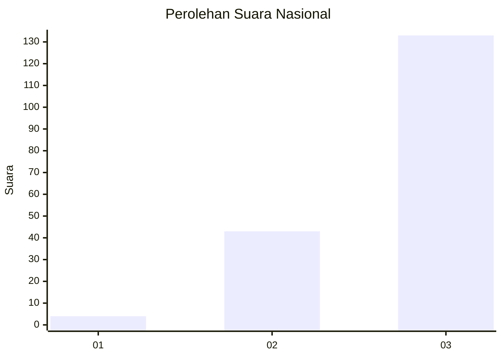
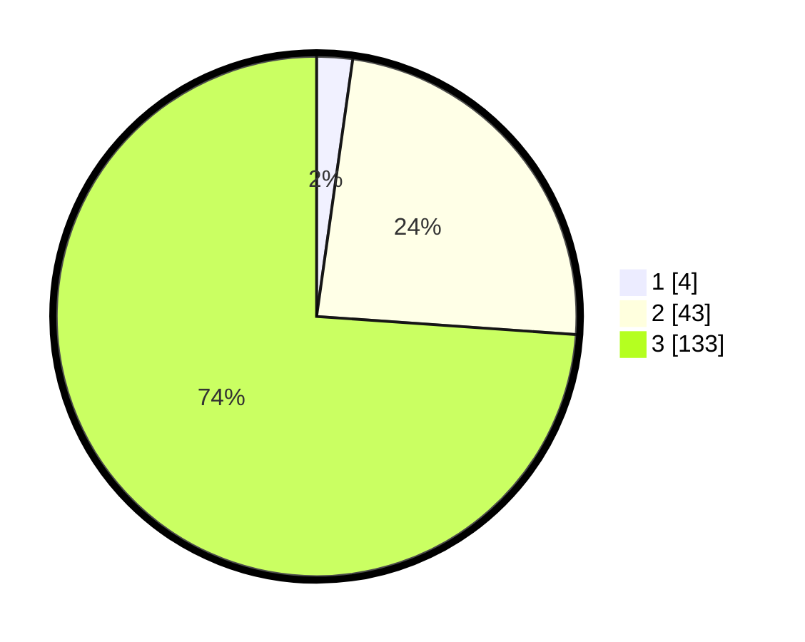

# Hasil

## Grafik

## Tabel

| No. | Nama Paslon    | Suara | Suara (raw) | Persentase |
|:--- |:-------------- | -----:| -----------:| ----------:|
| 1   | ANIES MUHAIMIN | 4     | [4][p-1]    | 2,22       |
| 2   | PRABOWO GIBRAN | 43    | [43][p-2]   | 23,89      |
| 3   | GANJAR MAHFUD  | 133   | [133][p-3]  | 73,89      |

[p-1]: https://github.com/gigit-pemilu/pemilu-2024/blob/main/pilpres/hitung-suara/sub/53-nusa-tenggara-timur/sub/15-manggarai-barat/sub/07-welak/sub/2002-semang/sub/005-tps/sub/paslon-1.txt
[p-2]: https://github.com/gigit-pemilu/pemilu-2024/blob/main/pilpres/hitung-suara/sub/53-nusa-tenggara-timur/sub/15-manggarai-barat/sub/07-welak/sub/2002-semang/sub/005-tps/sub/paslon-2.txt
[p-3]: https://github.com/gigit-pemilu/pemilu-2024/blob/main/pilpres/hitung-suara/sub/53-nusa-tenggara-timur/sub/15-manggarai-barat/sub/07-welak/sub/2002-semang/sub/005-tps/sub/paslon-3.txt

## Foto C Plano

https://sirekap-obj-formc.kpu.go.id/f5d7/pemilu/ppwp/53/15/07/20/02/5315072002005-20240215-000215--a789f010-0e37-48e7-ad8b-ea3d9a42804f.jpg

https://sirekap-obj-formc.kpu.go.id/f5d7/pemilu/ppwp/53/15/07/20/02/5315072002005-20240215-000400--562068ac-b3e6-47ae-8ffd-16196a30c83d.jpg

https://sirekap-obj-formc.kpu.go.id/f5d7/pemilu/ppwp/53/15/07/20/02/5315072002005-20240215-000632--d7208c0f-575d-490d-835c-16ef9f657bd1.jpg

## Metadata

| Key        | Value               |
| ---------- | ------------------- |
| Time Stamp | 2024-02-15 18:00:26 |

